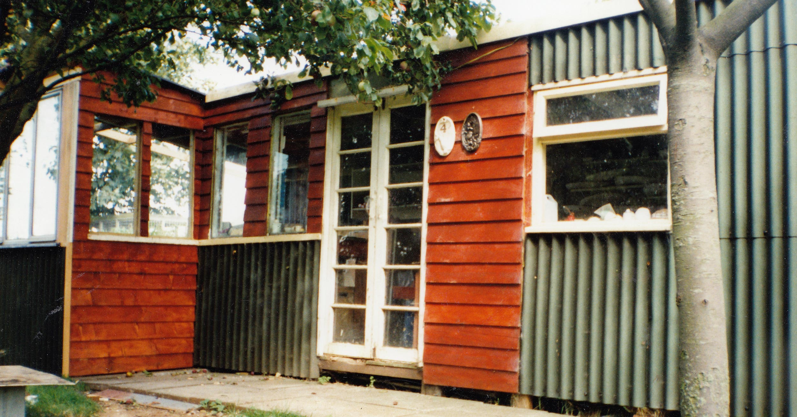
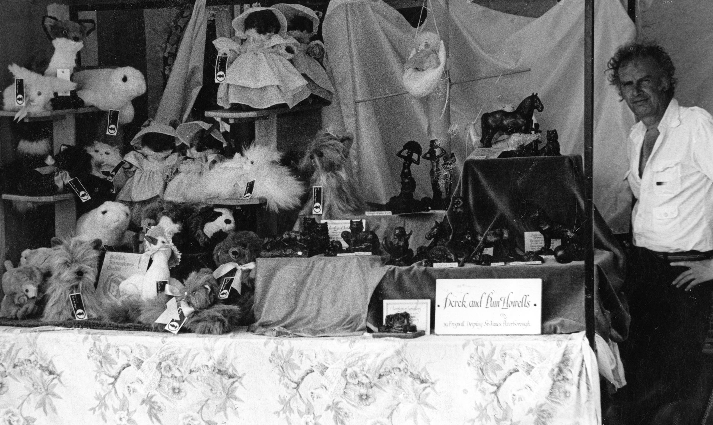

Derek was born at Saltmarsh Farm, Goldcliff and attended Nash School.  At the age of 14 he won the prestigious Hewertson Art Scholarship to Newport College of Art where he studied for his NDD, specialising in lettering, writing and illumination.

After completing his National Service he started his artistic career, entering the toy trade as a designer and model maker.  After 20 years in the industry he became freelance and worked for various companies as an artist, designer and sculptor.

{.img-screenshot}

Retiring in 2005, he decided to change course completely and started painting.  His paintings reflect his childhood; spent exploring the local countryside and sea wall, observing the wildlife and birds that inhabit these areas.