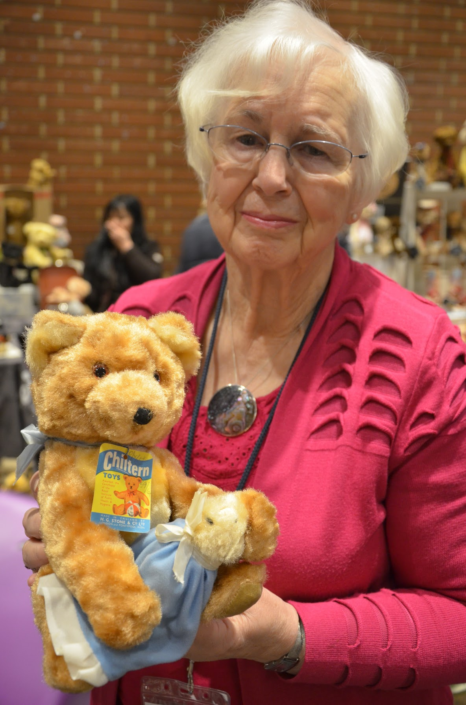

{.img-half-right}`If you go down to the woods today beware of a big surprise, ... For every bear that ever there was has gathered there for certain Because today's the day the teddy bears have their picnic.’

Sometimes in Frognall when Pam Howells was photographing her beautifully made bears, woodland animals and pandas you could be forgiven for thinking today was the day the bears were having their picnic! Many will know Frognall, the hamlet at the edge of Deeping St James, but not many know that this has long been an outpost of the very crème de la crème of the British toy making industry. The home of Derek and Pam Howells who attended the same art college at Newport and later met up again after Derek had completed his national service. Pam had taken a year out in industry working as an assistant to the designer at Chiltern Toys, Madeleine Biggs. After Madeleine left for South Africa, Pam was selected for this rQle and it was she who was asked her opinion as to whether Derek should be taken on as a plastics sculptor. Remembering his talents for calligraphy and seeing that he had had his jet black flowing locks cut, Pam gave his appointment the thumbs up.

Pam was taking to her role with great enthusiasm. She had never had a bear as a child but when ill at home for two years with rheumatic fever she had constructed one using an old dressing gown and paper clips. Now without these constraints her imagination could run wild and her first bear wearing a red jacket was sitting on a bike with his feet on pedals that actually went round. Very collectable, Pam regretted not keeping the original sample but when she discovered there was one in an antiques shop in Japan for sale, Pam thought that a swop could be done. Little did she imagine that she would soon receive the little bear in a box with all his labels on from the other side of the world as a present! The bear on a bike was so successful that a rabbit on a scooter followed and then a dog on a boat and Pam's career was launched!

The couple moved to Peterborough with Derek's job with Dunbee Combex Marx where he modelled dolls heads, bodies and toys and Pam left work to bring up their two children, Melanie and Leigh. However the pleasure of creating her bears called and soon she was freelancing and in the early seventies started making soft toys from a workshop in Crowland with her friend and fellow Frognolain, Ann Shamma who cut out all the patterns while Pam sewed. From their little

studio they also sold jewellery and crafts from local makers. Derek would make the wooden joints for the bears, but there were times when mohair was scarce, and synthetic fabric had to be used. Hand blown glass eyes came from Austria for the collectors bears and mohair could change hands for as much as £140-5 a metre.

Pam's work soon received the acclaim it deserved and her often pretty and charming bears were found at Conventions all over the world as well as at the prestigious Kensington Bear Fair in the UK. The bears were exported to the USA, Japan and in Europe and at home were stocked in all the bear shops of note; Teddy Bears of Witney, The Bear Shop in Elm Hill,  Norwich and closer to home in Stamford and Bourne. Pam remembers that on one occasion the John Lewis buyer wanted 350 nightdress cases of each of her designs; bear, badger, otter but this would have been one step too far even for the two busy rumpelstiltskins in Crowland! Dressed mice were making their way out of Pam's workshop before Brambly Hedge was a stroke of ink on the page of Jill Barklem's books but as soon as the Bramley Hedge themed shop was opened in London, it was Pam Howells who supplied the mice. Standing geese, some with straw hats, girls with bonnets and a basket, were a favourite of Christopher the brother of the Marquess of Bath who, one
Christmas gave one to each of his friends, delivered to Longleat by Derek. Of course it was only natural that Pam should meet the creator of the most famous bear of all, Michael Bond, the author of the Paddington books!

Pam would work on several bears at a time but as she gradually pieced them together so each of them would develop their own personality and each would be her favourite as they came into being. Inspiration would be found in antique lace that could be fashioned into collars, victorian dresses, the poem by Eugene Field the 'nets of silver and gold have we, said Wynken, Blynken and Nod.'

After he left Combex, Derek became a regular at Peterborough Craft market and his house plaques graced all the best houses. In his own studio he continued to sculpt for industry, the mould for Janet Reger soap, a number of items for Pastimes and lie was a Mickey Mouse approved modeller memorably producing two very large Mickey Mouses for Mothercare.

Bringing fairytales to life has been the lifetimes work of Pam and Derek and what a wonderful legacy it is! In the words of Eugene Field, 'so shut your eyes while Mommy sings of the wondeful sights that be and you shall see all the beautiful things as you rock in that misty sea.'

