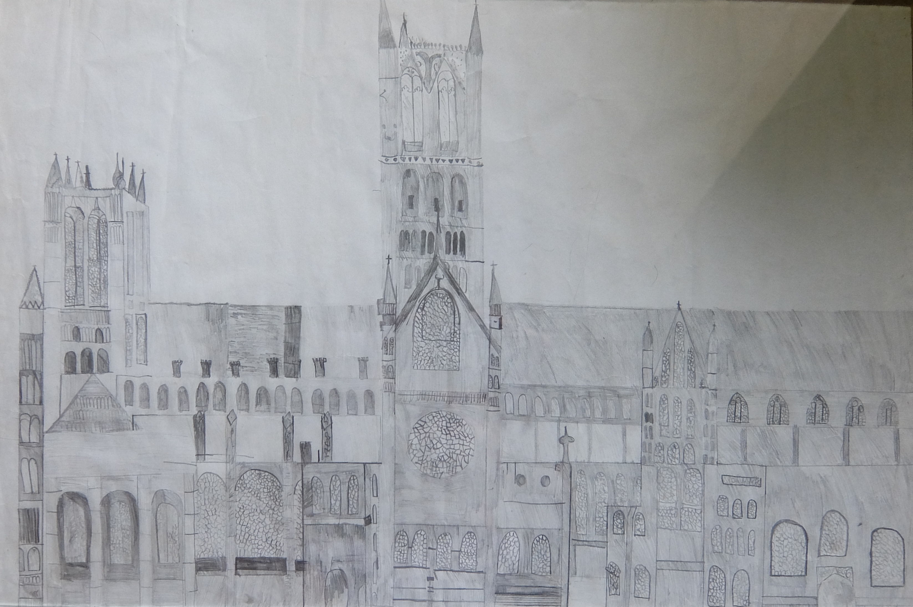
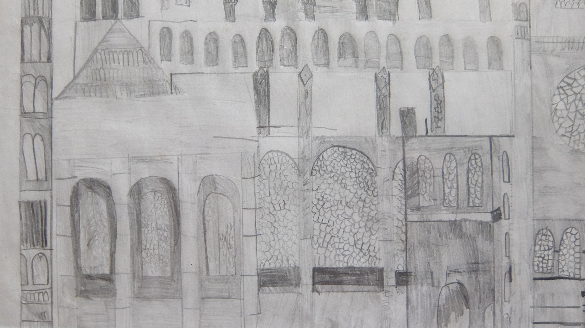
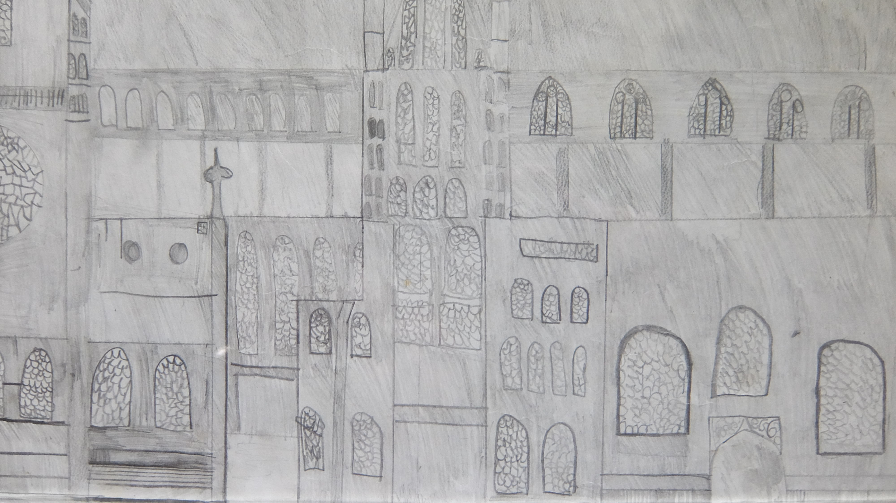
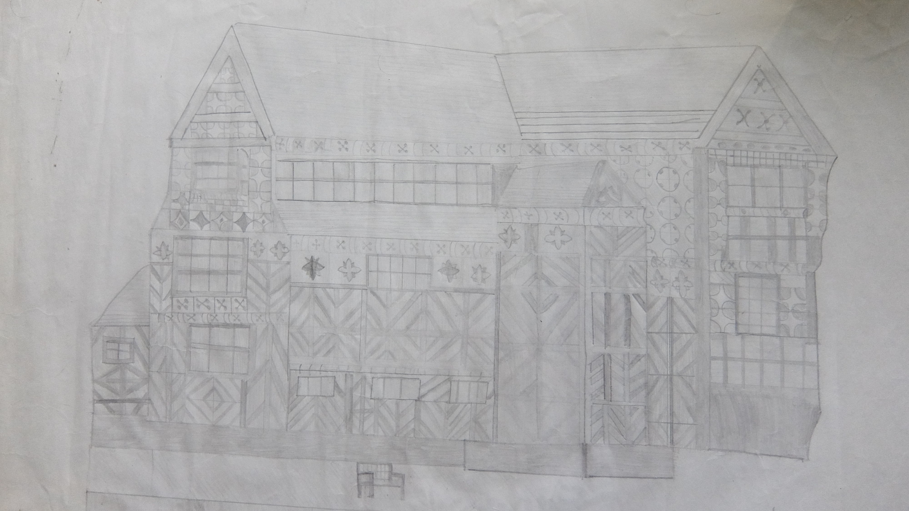

When I was in primary school, about aged 8 or 9, I became quite obsessed with pencil drawings of architecture.  In my mind they were much, much better than they are looking back at them.  But I admire the amount of work I put into them.

===

###Lincoln Cathedral

### Town house in Stratford

