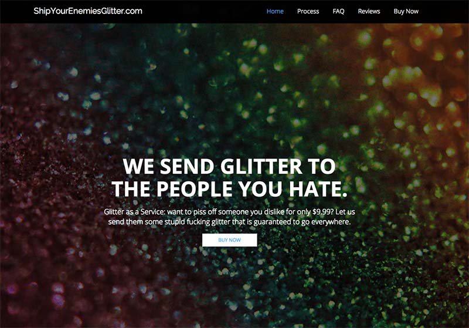
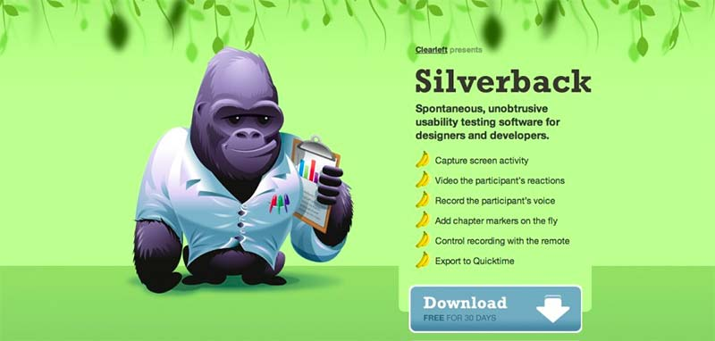
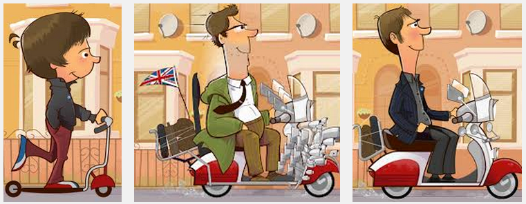
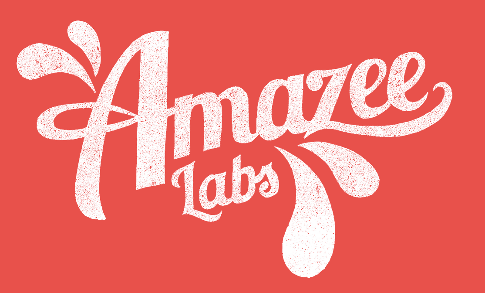
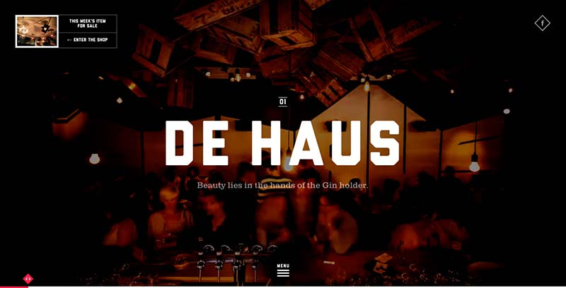

Over the last couple of years I’ve heard many people bemoan the fact that a lot of websites 'are all starting to look the same'. There’s a certain amount of truth in this.

===

As we find the sweet spot for solving responsive problems, and take on design patterns adopted by huge, successful companies like Apple and Google, many designers become influenced by certain solutions and styles. In short, many sites are sharing the same personality, and fewer and fewer have a unique charm or charisma.

These influences then bleed into templates being implemented by the likes of WordPress, Squarespace, ‘Site of the Day’ type inspiration sites, and frameworks examples and before you know it there are shared personalities spreading like a virus around the globe.

Whether it’s the proliferation of parallax sites, full screen video backgrounds, blurry image banners, the use of frameworks like Bootstrap or flat iconography, these ideas do tend to make sites resemble each other in one way or another.

So how can any site ever hope to stand out in the exponentially growing web, and more importantly, ever hope to be remembered?

<h3>Brand</h3>

The name and brand of your site can of course help enormously to establish character and make your site memorable. If you’ve managed to grab a great brand name and domain, you’ve gone a long way towards being less forgettable. If your URL is pqnrk-fshn8r.hk you are probably going to have a harder time being remembered let alone pronounced.

<h3>Concept</h3>

A very memorable idea that is currently in the news – ‘Ship Your Enemies Glitter’ – is one of those superbly simple ideas that raises a smile, whilst also being an unforgettable concept.  Unfortunately for the people behind it, it seems that it’s a concept that’s much easier to think of than implement at the kind of scale it quickly reached.

*Image 1: Ship your enemies glitter web site*

<h3>Implementation</h3>

A tried and tested method to make your site memorable is to be one of the first to successfully implement a new technique or concept and to have that passed around in a viral “look at this!” manner. Easier said than done of course.

Memorable examples include the concept behind CSS Zen Garden, horizontal scaling parallax on Silverback, the branding and vertical parallax ideas used by the Nike Better World site (now replaced), the unique awarding winning approach of the gov.uk site, and one of the first large responsive builds; the Boston Globe.

*Image 2: The original Silverback website implemented a browser resizing parallax effect that was unique back in the day.*

<h3>Illustration</h3>

On my personal site I’ve tried to make things a little more unique and memorable by using my own illustrations. These also feature myself doing unusual things with ’creatures’ such as an alien wearing underpants and an octopus painting. Hopefully, if nothing else, it’s memorable.

There are of course many illustrative site around the web, that stay lodged in the memory. Andrew Clarke’s scooter guy was highly original in terms of the illustration and the way it responded to different widths, as are the apes on the current Stuff and Nonsense website.

*Image 3: Andy Clarke's Scooter Guy*

The Mailchimp chimp also formed part of a highly successful brand identifier for a great email marketing service. Of course, the illustration wasn’t instrumental to the success of Mailchimp, but I’m sure it helped to cement the awareness of the service whilst it was becoming established.

<h3>Lettering</h3>

The work of Jessica Hische and Mike Kus have been a great inspiration to many web designers looking to create sites with strong lettering and typographic patterns that stand out and project personality beyond the usual corporate uniformity. Most of Mike’s work is generally filled to the brim with charisma. Unfortunately, corporate brand guidelines often stand in the way of including interesting, personality-filled lettering choices in new designs, but maybe it’s time more corporate sites used creative uses of lettering to differentiate themselves online.

*Image 4: Designed by Mike Kus for Amazee labs*

<h3>Animation</h3>

Sites that employ animation effects and movement can add a great deal to the user experience and help it stand apart if they are done well.

 
*Image 5: De Haus is a highly dynamic animated site.*

Of course, this is an extreme ‘shop window’ type of site design, not appropriate for many. But smaller pieces of simple animation or movement, such as rollover and transition effects can add a lot of personality to how a site is perceived and remembered.

On the Headscape site we have employed a transition effect to our responsive viewer that offers a pleasing user experience as well as aiding comprehension of the concept being demonstrated.

<h3>Conclusion</h3>

Obviously it’s hard to do anything truly unique, but it’s not so hard to give your site more personality. Simply exploring different colour schemes could set a site apart from so many generic looking blue/grey/minimal websites. Using a photographer to explore consistent, creative, photographic ideas rather than reaching for generic stock photography or employing an illustrator to add a little soul to your online presence can make a massive difference to your final product.

Following the herd, looking at your competitors and copying what they do is the safe and easy path. But your site will be lost in the masses and is less likely to ever be remembered.

Find something unique from your business and add it to your site. Make your web presence stand out from that ever growing crowd.

