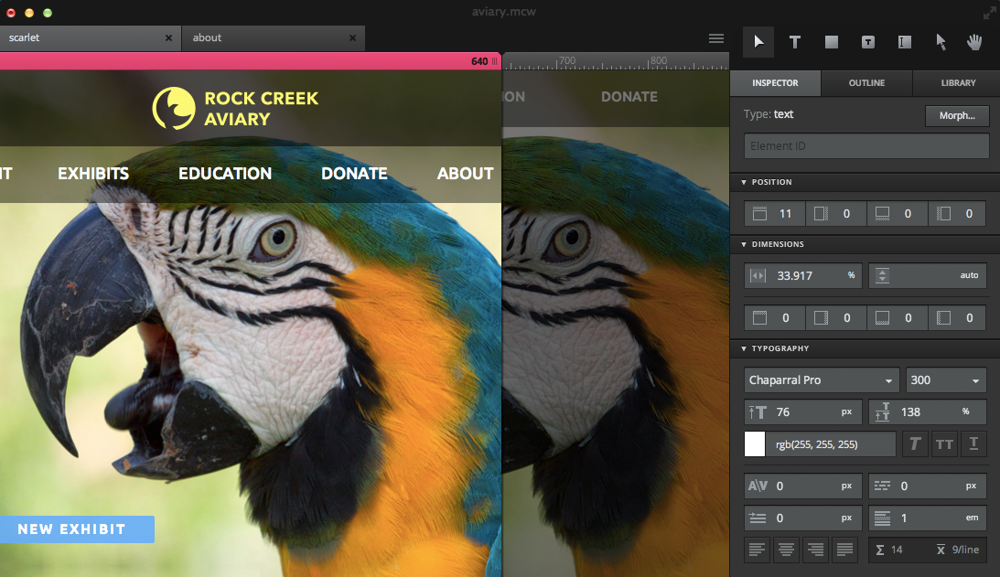

Co-what tools? I hear you ask.   Ok, so I invented that word to categorise software such as <a href="https://webflow.com" target="new">Webflow</a>, <a href="http://tv.adobe.com/product/edge-reflow" target="new">Adobe Reflow</a> and <a href="http://macaw.co" target="new">Macaw</a> (not available yet) as I didn't know what to collectively call them.  These new tools, and more like them, are slowly edging their way into the web designers' world and would really like to revolutionise how we think and design for the web.   

Codesign tools promise web designers the benefits of designing layouts with **code** in the browser with the visual and tangible immediacy, inspiration and ease of use of bitmap and vector **design** tools such as Photoshop and Fireworks. Codesign tools, right?  

<blockquote>"Stop writing code. Start drawing it."  <small>- as the Macaw website puts it.</small></blockquote>

We may not want to use their resulting code (yet), but we can use these new kids on the block as more intelligent and informed design tools.   

 
*Image 1: Adobe Reflow - Available as part of Adobe's Creative Cloud subscription*

#### Not just pictures

In 2013 I have been more aware than ever that when I sit designing web pages, I am in fact drawing pictures of websites.  This feels more and more ridiculous as time goes on, especially when I find myself drawing pictures of forms which aren't just boring, but almost painful to produce.  Sure, these pictures have their basis in reality from my experience of building web sites over many years, but they are still just pictures.  Like most pictures they don't change shape responsively and are merely an 'artists impression' of one particular optimistic reality, i.e. the perfect browser.   

### Real web tools

Design with a codesign tool such as Reflow, is based upon drawing divs onto an actual browser, moving and styling them with real css, and creating real web page elements in the same space as the final product, i.e. a web rendering engine.   Designing a drop shadow is not a bitmap simulation of how a drop shadow will be applied using a browser, it's the actual shadow.  In a browser.  You get the point.   

These tools are mostly for the basic layout and structure of our web design work.  They won't be replacing packages required to create artwork to place within our pages any time soon.   Yet they encourage us to think about design more in terms of simple HTML elements and what is available through code than about fancy patterns or effects in our traditional packages.  In an age of 'flat' and minimal design aesthetics this approach makes more sense than ever.   

 
*Image 2: Webflow - a monthly subscription web app available now.*

### Real web fonts

Most of the clients I work with arrive with a branding document that includes guidelines for a particular font.  One of the first things I have to do for most projects is get hold of this font for my local file system and then try to discover if a web font is available anywhere.   

Sometimes there are problems getting a system font because of licensing costs/problems, and other times a web version of the font is not available so a lookalike font has to be found, which doesn't have a system font available etc.   Such cases create a headache for using the font locally in traditional design software, not to mention the fact that anti-aliasing can often look different in different packages (Fireworks can be very hit or miss) to actual browser engines.  More than once I have had to make explicit excuses for font rendering not being realistic in the static design claiming "it will look crisper in the browser" etc.   

Reflow and other codesign tools use web fonts rather than local system fonts not available to the browser.  This is generally a better approach, discouraging the use of non-web fonts and therefore 'graphic text' (pictures of type) whilst encouraging creative use and experimentation with available web fonts.    At the moment, Reflow offers Edge Web Fonts (free!), and Typekit fonts (not so free!) but I'm hopeful Google fonts and others will be available some time soon.   Webflow allows Google fonts as well as Typekit, and hopefully Macaw will give even more options.   

Designing with real fonts in an actual rendering engine gives everyone involved a much better idea of what on-screen typography is going to look like and experimentation will be much more realistic.   

### Informed Construction

In Fireworks and Photoshop I am free to design the most unrealistic layout without worrying too much about the build. Using a codesign tool  I'm  much more inclined to think about how a layout will be achieved without the actual pain of coding it - constantly being aware of the structure of my design,  the containers and complexity required for the build.   

This is an excellent process for the non-coder or lapsed coder (like myself) as it helps familiarise some of the actual design challenges involved in creating a particular design which can only help lead to a better solution.   To a non-coder, this new design process should be so instructive that they can learn the architecture of their craft simply from designing layout in a more intelligent manner.   

 
*Image 3: Macaw*

<h3>Thinking responsively</h3>

When I'm designing in bitmap editing packages the tendency - even after 2 or 3 years of  responsive design is to start thinking at the desktop width. There are good reasons for this, as this is what most clients still expect to see first and what they currently understand best.   Even though design of narrow width/low bandwidth versions are always in my mind, elements still get overlooked until further into the design process - when there inevitably has to be some fast thinking or a quick compromise.   

Reflow and Webflow have been designed around creating page layouts at different widths, and therefore encourage this way of thinking from the start to the end of the design process.  

<h3>Taking the plunge</h3>

I recently attempted to start a new project using Reflow rather than Fireworks.  Unfortunately It didn't go very well as I was under a very tight deadline (with an Agile workflow).   This is always the problem with any new tool or process, trying to change takes time and we become bungling buffoons for while.  We have to work through the learning curve to discover the benefits.   

I still haven't used Reflow or Webflow enough to build up sufficient speed, but I've already seen areas where they can speed up the workflow massively, especially with repeating elements, tabular data or properly resizing content elements. (i.e. you put more text in a box and it expands by itself, rather than having to redraw the box and move all the content below it down the page manually!)

<h3>Summary</h3>

These tools have me quite excited, and I can't wait to see how they develop further.  Yes, we will still be designing our 'art' elements in design packages for now, but in terms of laying out the foundations of responsive web pages for demonstrating design thinking or simply wireframing/prototyping, I think this is the future.  Who knows, maybe one day one of these codesign tools will be the only tool that a web designer really needs.

<h3>Update!</h3>

Since writing this post, I've come across a few more tools thanks to <a href="http://www.andrewford.co.nz/rapid-prototyping-tools-fr/ ">Andrew Ford's site</a>.   Most notable of those that I have tried is <a href="http://www.froont.com" target="new">Froont</a>. 

  
*Image 4: Froont - another monthly subscription web app available now.*

Froont seems to be very similar in concept and execution to Webflow, so definitely worth a look - although the pricing model seems more limited and expensive.  How these monthly subscription web services stack up against Adobe Reflow as it continues to be developed and included as part of Adobe's Creative Cloud suite remains to be seen.

