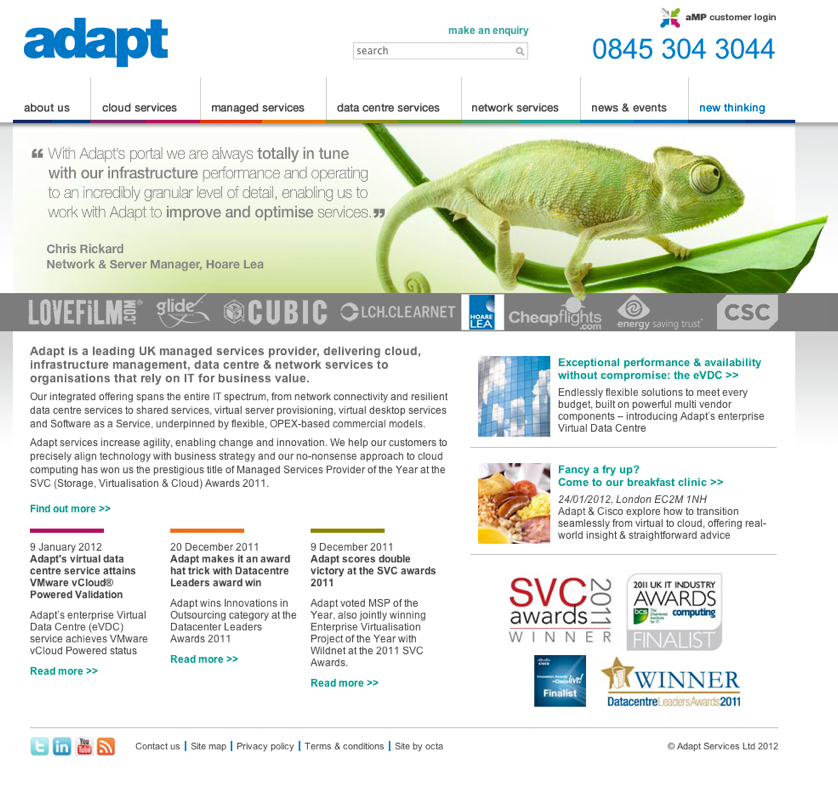
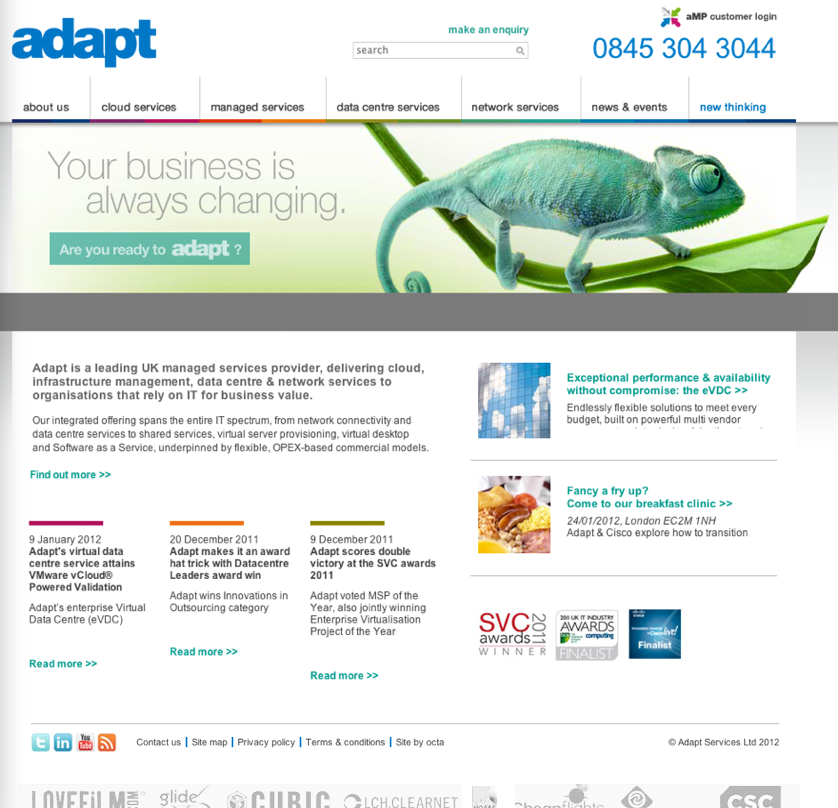

Some companies just don’t know how quickly they can ruin the look and feel of their own website simply by spewing out far too much copy.

===

Whilst looking for some reference sites for a current design project, I came upon this site for Adapt Plc:

Generally, it’s not completely terrible. But I couldn’t help myself and had to spend 10 minutes making it nicer. Basically simplifying and removing the copy (not rewriting I hasten to add, which is what it needs), generally cutting the crap and increasing the white space. Really. No one is going to read all that crap.

I’m not sure why the site owners can’t see this themselves. I guess it’s because the site has no formal design ownership and is in the vulnerable phase between initial design and redevelopment -when finally it has been completely trashed and everyone decides it needs redesigning from scratch.

I would say that it was a lot further from that point than it currently feels it is. It just needs some love and attention from a designer. Not the CEO/VP/CMO.
