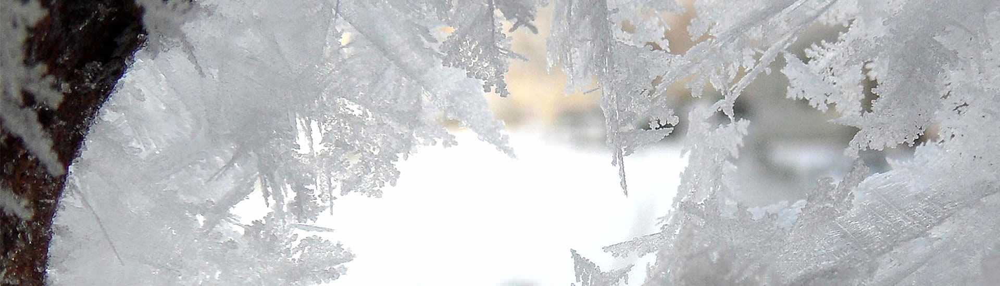
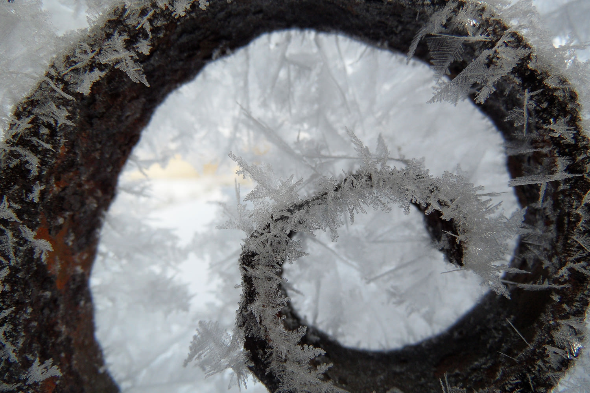
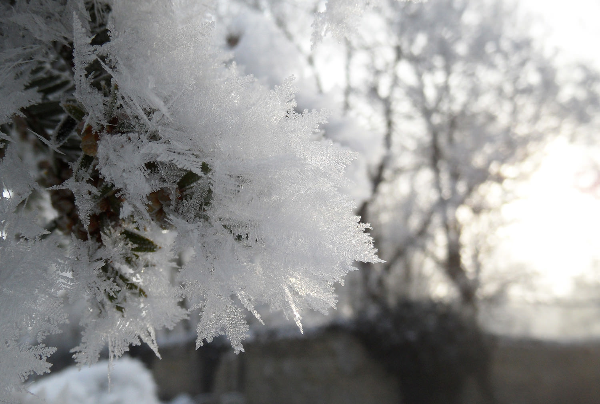
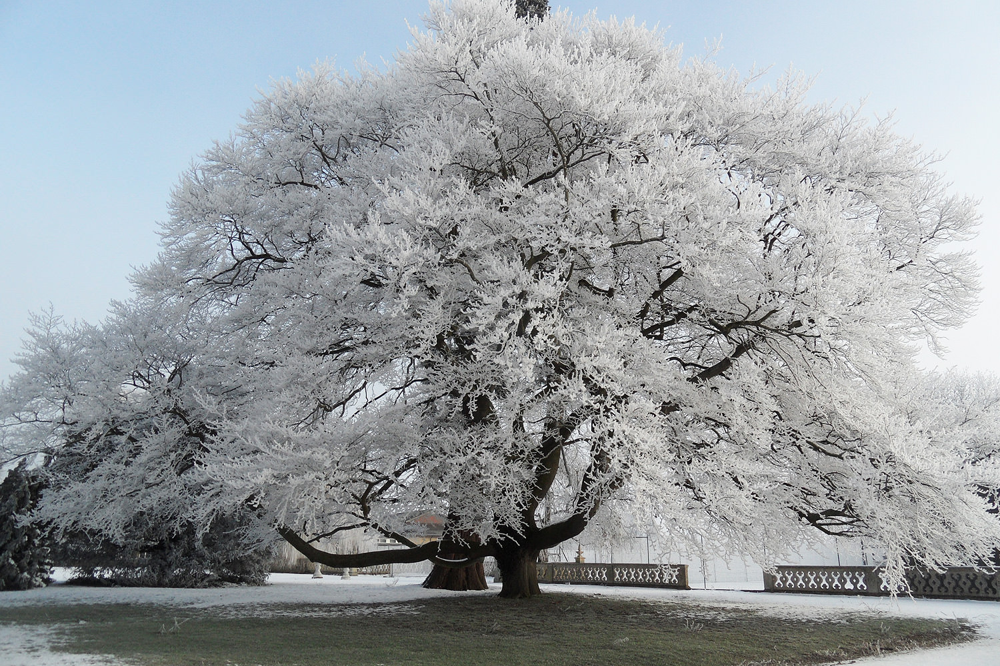
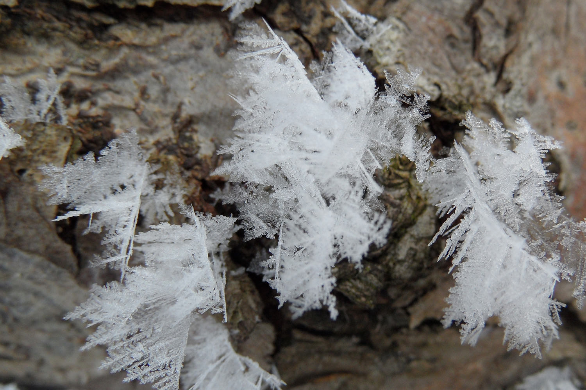
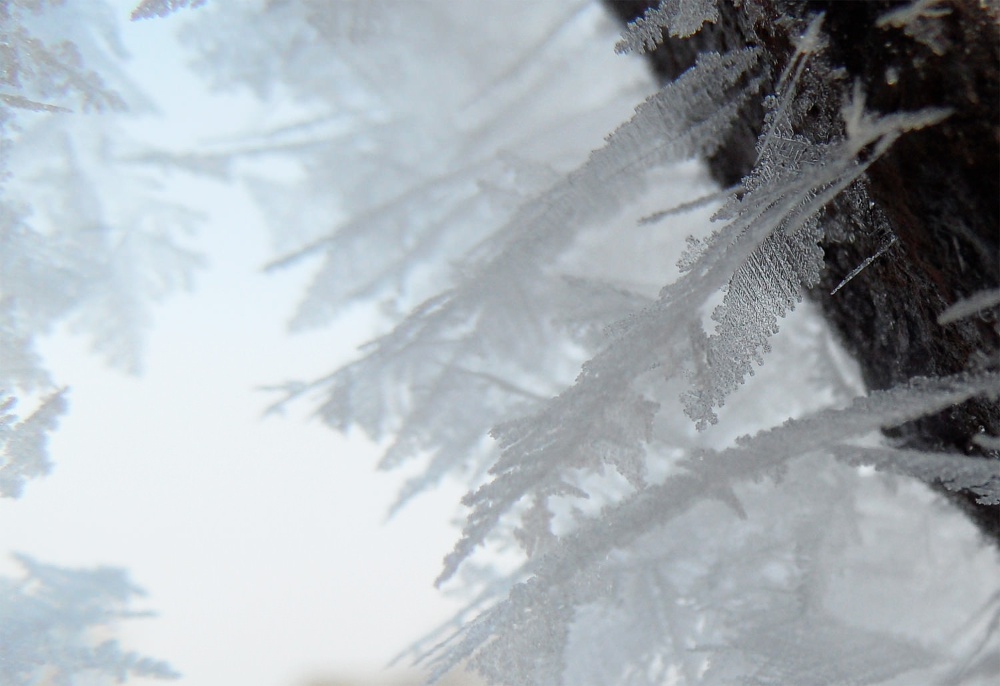
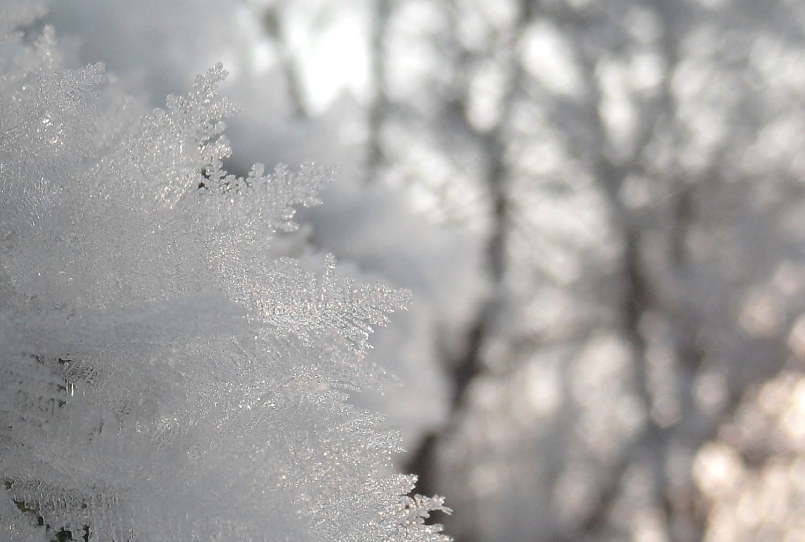
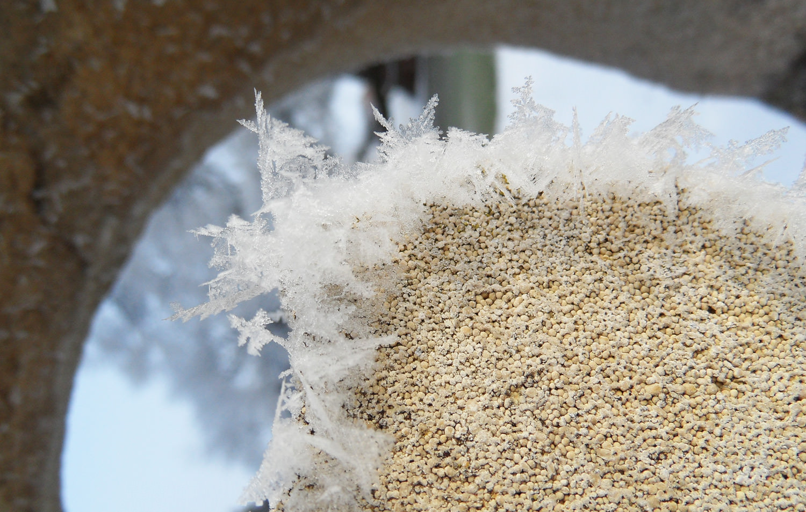

On a very icy February morning (-13) in Cambridgeshire, freezing fog (a 'Hoar' frost) left amazing ice crystals on stones, trees and iron gates. Unfortunately I didn’t have a ‘proper’ camera, just my pocket compact, but as they say the best camera is the one you have with you etc.

===

{.img-screenshot}
{.img-screenshot}
{.img-screenshot}
{.img-screenshot}
{.img-screenshot}
{.img-screenshot}
{.img-screenshot}
{.img-screenshot}