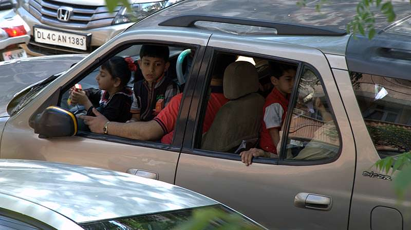

I haven't actually driven in Delhi, and I'm rather glad to hear that if I rented a car it would come equipped with a state-of-the-art driver. I wouldn't be allowed onto the streets alone. Driving here looks exhausting mentally and physically and has its own rules based on what I've realised are two founding principles.

Firstly, if there is a gap, fill it.

This is the fundamental law of driving here from what I have witnessed. With great precision drivers fill every available inch of road with a vehicle of some description. This of course seems like utter chaos to the polite British driver, but oddly enough it seems to actually work. If everyone here drove like the British I think the roads would grind to a halt fairly quickly. The gap filling approach seems to work very much like grains of sand through an hour glass, the flow continues fairly rapidly even through the narrowest of channels and more importantly it never seems to stop. Sticking to lanes may be orderly but it's not such an efficient use of road. Although it seems much less tiring to me.

The second principle of driving here is to learn to honk the horn properly. If you have the slightest doubt the person in front knows you are about to squeeze past them, honk. If they are about to cut you up honk twice. Sounding the horn is used as a warning of intention as it should be, but here it is used continuously to guide and communicate between the grains of sand. No one seems to get angry either, all seems fairly calm even when it involves vocalising intent though open windows and the intense heat.

{.img-screenshot}

The roads look nothing less than a death trap. They are many, many accidents just waiting to happen. I haven't looked at the statistics and I'm not about to until I am safely away, but these jostling grains of sand include multiple pillion passengers without helmets, moped passengers carrying five metre copper pipes, swarms of  Tuk-tuk drivers weaving in and out, toddlers standing on parents laps in the front seats of cars (I think back to all the worry of making sure the baby rock-a-tot car seats were safely secured), ten year olds clinging onto the back of lorries, and rickshaw pedlars pulling across oncoming 'lanes' of traffic with up to nine children on them.

Additionally, as well as negotiating the immediate traffic around them all drivers have to simultaneously contend with an onslaught of random jay walkers and stray dogs cutting across the flow.
Roundabouts are especially interesting. I don't think there is a concept of giving way exclusively, more of a meshing and intertwining as everyone gives way to everyone else and goes for the gap.
Fundamentally, I guess roads here are simply considered through crowd mentality. In the same way we don't naturally form orderly queues as we flood through busy pedestrian areas, drivers don't form orderly lines on roads. This is an artificial construct we have invented elsewhere to keep order. Also, what seems crazy to me is met with good humour here. As I cursed the apparent stupidity of a guy on a motorbike trying to drive though the shoulder to shoulder busyness of a winding bazaar, on comers laughed and jeered at him for having a tough time (and being a fool too probably).

India is, of course, a very spiritual country and Ganesh, the elephant god, adorns many Tuk-tuk cabs. The 'remover of obstacles', as he is known, is a very fitting choice.

You only have to look as far as Delhi's roads to see that faith in a divine power is alive and well in the Indian subcontinent.

