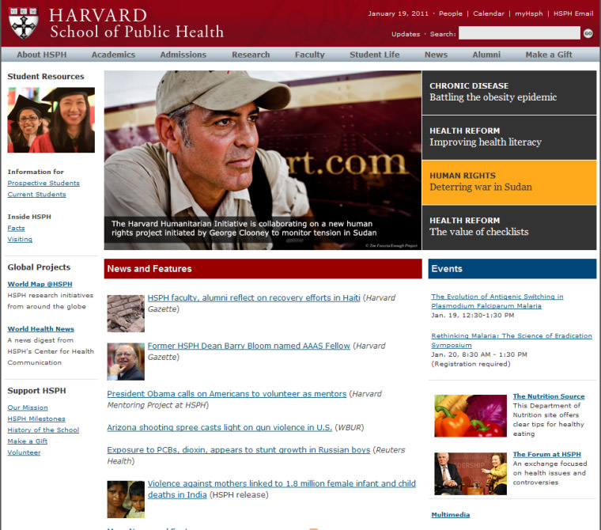

Recently I've been reviewing University websites and over the last few weeks I've noticed a bit of a trend, which amuses me more and more as I see it crop up over and over again.  It isn't the exclusive problem of University sites, and I'm fairly sure the blame lays somewhere between stock image libraries, web designers being uninspired, and content creators being unimaginative.  In fact, I'm very guilty of this crime too.

A picture speaks a thousand words, so here's the basic problem:

Did you spot it?  Did you notice anything, a common theme perhaps?

Well, I'm calling it Happy Face Syndrome, and it's the visual equivalent of Steve Krug's 'Happy Talk'.

Meaningless, happy smiley people, which do nothing for your site.   Ok, that's not always true; faces make your site look human, friendly, approachable.  But let's be sensible about it.  If I was going to University, I think I'd rather see what the place looked like.  If I'm going to buy a laptop, I don't want pictures of the happy people who bought laptops, I want to see the laptop please.

Oh look, here'a another...

and another...

and another...

and... sigh... another.

Just stop it.   Show us what you've got.  You've got students, yes - we got that.  What's the campus like?  What's your part of the world like?  What sets you apart from the competition? What's your culture like?  Just stop it with all the Happy Face people please.   

Oh, and things aren't much better across the Atlantic either:

But they have George Clooney rather than Ainsley Harriott, and according to the screen-shot above they have vegetables too.  From my observations, I'm not entirely sure I believe that.

So, next time you find yourself reaching for the stock image library, and find yourself browsing pages of sparkly white teeth and cheesy grins, just stop and think.  Is there another image which would add more meaning, more worth to this piece of information?  Like Happy Talk, Happy Face Syndrome must die.

