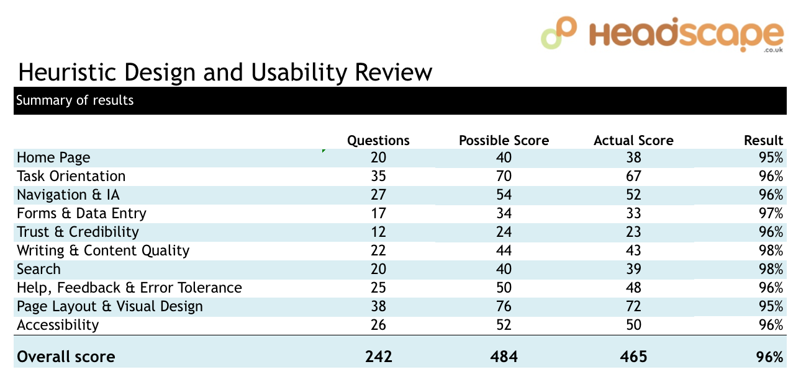
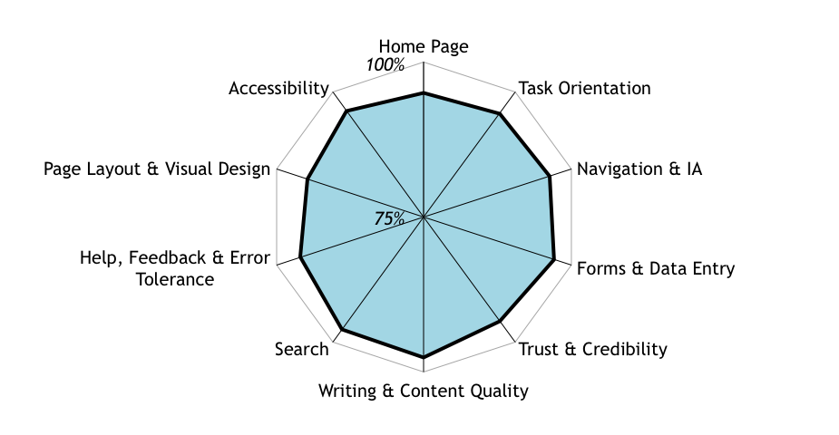
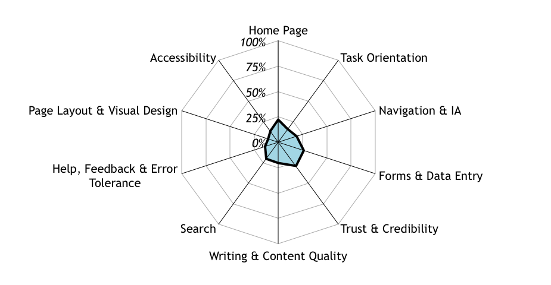
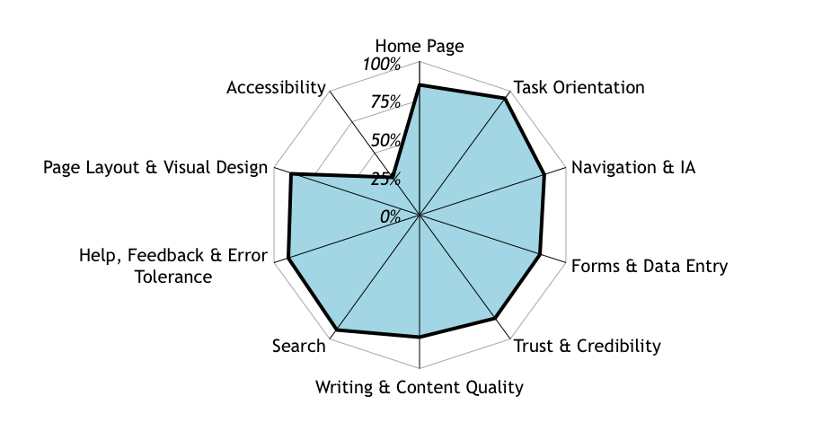
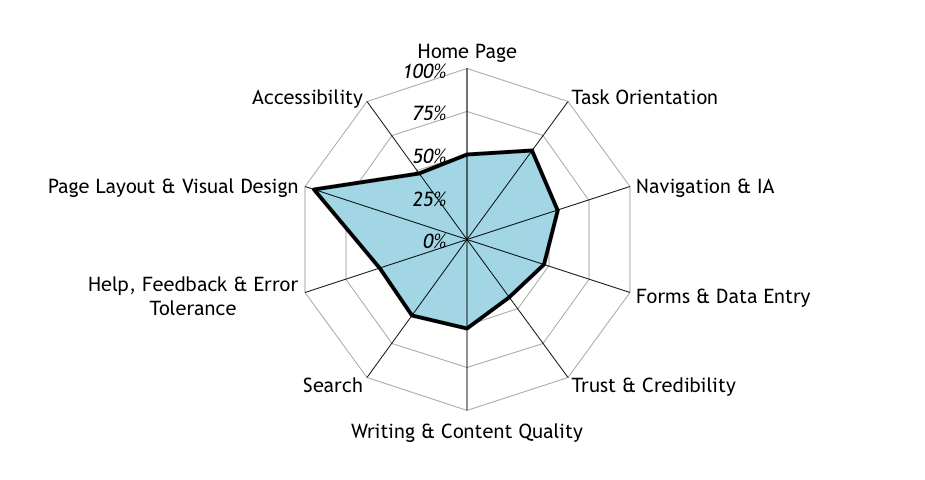
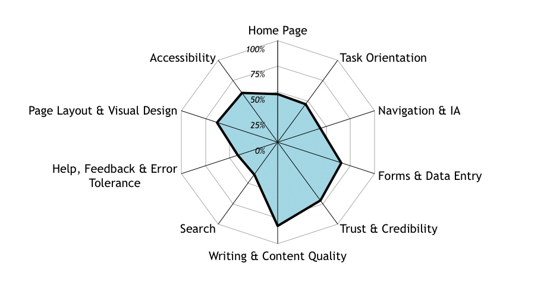
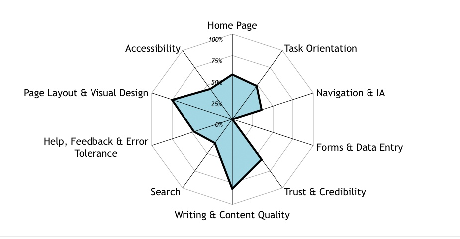
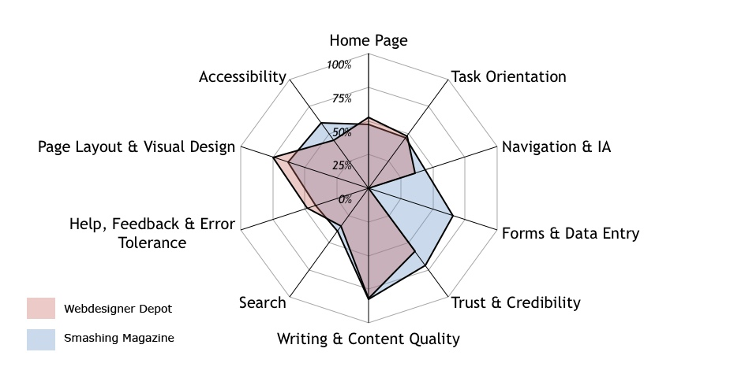

We are all reviewers.  We probably do many website reviews each day and without even realising, many of us are experts. We don't realise because the whole process is over in moments.

===

That's how it is.  We use web sites.  We judge web sites.  Even if we don't realise we are doing it we are making judgements of trust, credibility, competency, reliability, design, and style within seconds of first arriving at a web page.  After looking around a bit we also have a pretty good feel for the user experience and usability.

### Consultancy Reviews

For many years at Headscape we've undertaken formal web site reviews for clients, offering recommendations for any redesign or redevelopment work that is necessary as part of our consultancy process.

Snap judgments may be useful and unavoidable, but when it comes to performing a professional website review we need to be a little more organised and thorough to develop a review methodology.  It also pays in terms of time and effort to be formulaic and consistent in our approach between reviews as there are so many things to look at when considering a web site.

To make this easier, I’ve devised a set of heuristics to score a site, together with a simple method to quickly visualise where the weaknesses are.

### Heuristics

A heuristic is just a fancy word for a measurement of something that can't readily be quantified, i.e.,  there are no actual numbers to judge whether thing A is better or worse than thing B.  In a 100m sprint, the winner is easily defined with actual data.  In the pairs ice dance final the winner is judged based on a set of technical and artistic criteria to achieve a set of scores.

### All that glitters is not gold

We may be swayed by something that looks good.  But we all know that beauty is only skin deep.  As with everything that glitters, it's the job of a site reviewer to poke about and see if we really have struck gold.

Conversely, some sites which could be judged harshly for their graphic design are successful beyond measure - I'm looking at you Amazon and Ebay,  even Google.  They aren't much to look at, but functionally they do their job well and have evolved over the years to precisely meet their customers needs.

As a designer, the sites I am asked to redesign are generally looking better and better. It is getting to the stage where I can find myself questioning the need for a redesign at all. But usually it's not immediately obvious in the visuals, layout, or the code where the problem lay.  Sometimes a site is just wrong for the client's brand, or the experience of accomplishing tasks is simply unpleasant. Sometimes, the site just doesn’t work.

You can't tell by looking, you need to dig deeper by really using the site, setting yourself tasks and trying things out to experience what is really going on.  It can often take a bit of work to realise just how much a site needs rethinking, redesigning  and redeveloping.

### Metrics for success

The success of many sites may be measured by some metric; be it number of sales, uploads, downloads, clicks, comments or sign-ups etc. However, just because a site is successful in terms of sales there may well be other factors at play; i.e. the site may be successful despite itself because of excellent marketing, popularity in other mediums; being an existing household name (such as a high street stores) or the site may be successful simply due to sheer hard work with search engine optimisation or banner targeting, it could even have just got lucky or be so unique that it’s the only option.

But there are many more websites which have no quantifiable metrics at all, no criteria for determining how good or bad they actually are.  Judging these sites is more difficult and requires a bit more leg work.

### A many layered cake

When poking about a website in detail there are many layers to explore, above and below the surface including;

  * Task Orientation and Site Functionality
  * Navigation and Information Architecture
  * Forms and data entry
  * Trust and Credibility
  * Writing and Content Quality
  * Search
  * Help, feedback and error tolerance
  * Page Layout and Visual/Aesthetic Design
  * Accessibility and technical design

Taking these broad categories we can devise a list of questions to explore each and get to the heart of the site.  This formalises the exercise and ensures the same thought process can be repeated for next time.  It also acts as a memory checklist which means  nothing will be forgotten each time.  So for example, when looking at the design of the site my questions include;

"Standard elements (such as page titles, site navigation, page navigation, privacy policy , etc.) are easy to locate."

"There is a good balance between information density and use of white space"  

"The site has a consistent, clearly recognisable look and feel that will engage users"

In the category of Accessibility,  there are questions such as these:

"Is there sufficient colour contrast across the site to make all content accessible?"

"Does the site work comfortable at lower resolutions (1024X768) ? "  

"Does the CSS file validate favourably using W3C validation services?"

In the category of written copy questions such as these;

"Pages are simple to scan on screen, broken up with headings and sub-headings and short paragraphs"

"Acronyms and abbreviations are defined when first used"  

"The site uses maps, diagrams, graphs, flow charts and other visuals in preference to wordy blocks of text"

### Depth

Although relatively easy to conduct, performing a heuristic review is not a quick task. But we can decide just how much depth we want to go into with these heuristics, and how many we need to get a feel for a site.   The more heuristic measures we use, the longer the process takes, the fewer we use then of course the less informative.  It's a matter of striking a balance for your own time allowances and selecting the heuristics which best get the the heart of each category.

### Devising a scoring system

To get a ‘yardstick' score for each of the heuristics,  I give a simple score; 0 points if the question is not able to be answered positively, 1 point if its half way there, and 2 points if it does the job.  So in the above examples, if there are a couple of Acronyms being defined on some sections but none in others, then the heuristic would only score 1 point.

These points can be totalled across each category and give a numerical idea of what's going on across the site.

### Visualisation

Representing this data more visually helps to quickly identify problem areas and comparing sites is made much simpler.

Radar diagrams are perfect for this site analysis.  What's great about them is the fact they give a recognisable shape depending on the performance scores.  A more circular the shape of the radar the more balanced the score, the spikier the radar the more variation. The size of the radar plot within the axes of course indicates the percentage score itself, and identifies good and bad areas as shown in the examples below:

A radar plot showing a site that performs well across all heuristic categories.

A radar plots showing poor performance across all heuristic categories.

Left:  A radar plot showing a site performing in all areas but one.

Right:  A radar plot showing a site performing badly in all areas but one.

### Competitor Reviews

By combining the heuristic results of different sites we can create a visual comparison of competitor sites in a market segment.   This is particularly good for getting a feel across the competition of which sites are failing or succeeding in particular respects.   Analysis across multiple sites can of course take a lot of work, so it's a good idea to strip down your heuristics to the essential to make it at all feasible.

###A Direct Comparison

As a real world example, below is a comparison of 2 similar websites; Smashing Magazine and Webdesigner Depot. We can see that both are lacking a little in most of the categories apart from Writing and Content quality, which is what we may expect as they are content rich blog sites. (Please note I work for neither website and stand as an impartial bystander! )

Both websites score a little higher in their page layout and visual design, but have generally quite weak home pages as they take the form of a traditional, basic blog format. Their calls to action score quite poorly (other than advertising!). Navigation scores marginally better on Smashing Magazine as it has top tabs to distinguish major content areas rather than the navigation being almost completely lost below advertising in the right-hand column, as on Webdesigner Depot. Smashing Magazine scores slightly higher on Accessibility for a number of small heuristics, such as the clarity of the text content, spacing, and contrast.

Webdesigner Depot falls behind a little on trust and credibility scoring because of little details like the basic link to an email address in the footer, rather than the well considered contact form on Smashing Mag, and also for the very brief copy in the ‘about us’ section. However, Webdesigner Depot picks up slightly more points for its colourful impact in the Visual Design category. Of course, just like the presentation scores in ice dancing, any process used to score website aesthetics or design will always be subjective, so it’s a good idea to have a wide range of questions to score different aspects of design.

Figure 5 - Smashing Magazine Heuristic Analysis

Figure 6 - Webdesigner Depot Heuristic Analysis - Note that Web Designer’s Depot scored 0 for Forms and Data Entry category as it does not really utilise or require forms input.  By default it therefore scores 0, and can either be ignored or removed altogether if so wished.

For extra clarity we can overlay one radar plot onto another to emphasise the differences in the heuristic measurements;

Figure 7 Figure 7 - Overlaying two radar diagrams to enhance visualisation

###Conclusion

When reviewing a website, subjective snap judgements are unwise. We only do a site justice with a detailed test drive. We need to perform tasks and look in detail at different components above and below the surface. Heuristic scoring is a useful process to help us quantify and visualise a site’s quality, when other measures are not appropriate or available. This formalised process, reveals any problem areas, whilst initiating targeted discussion at the start of any redevelopment work.