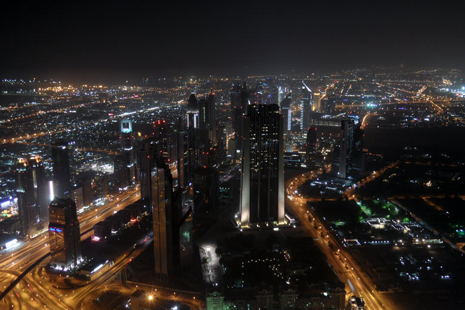
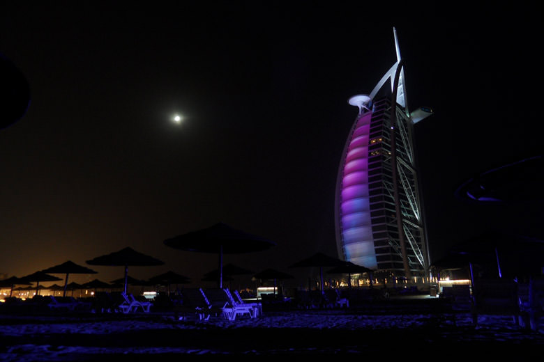
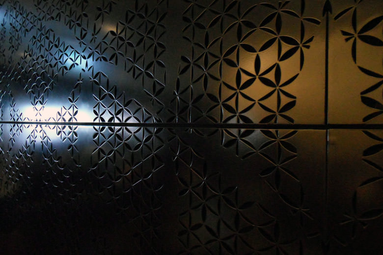
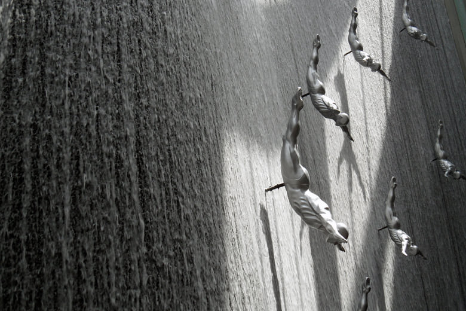
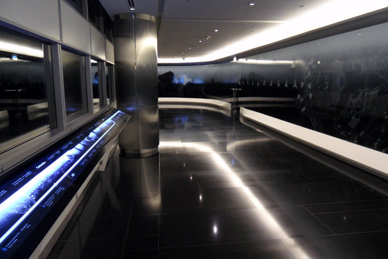
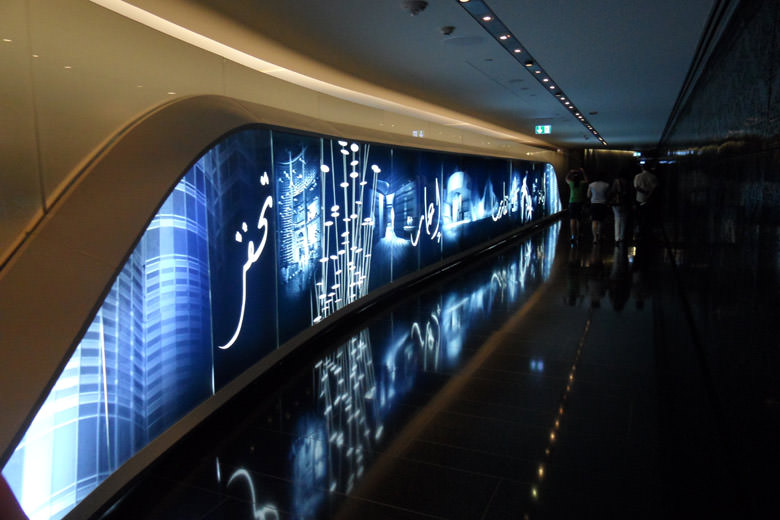
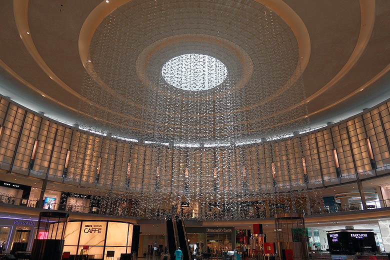
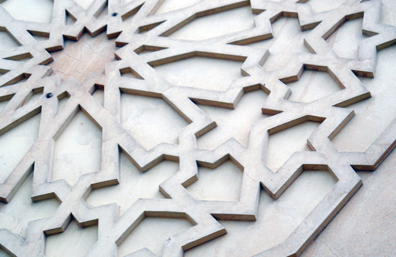
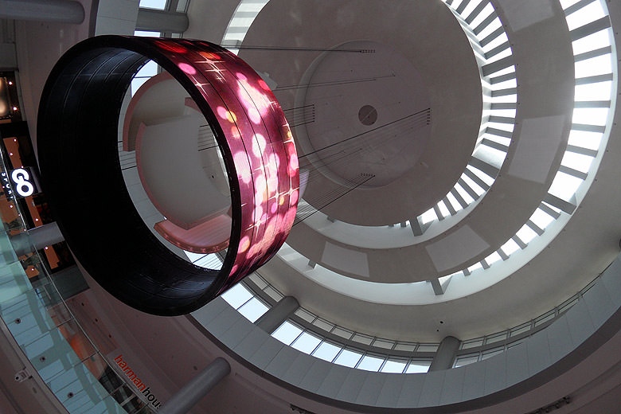
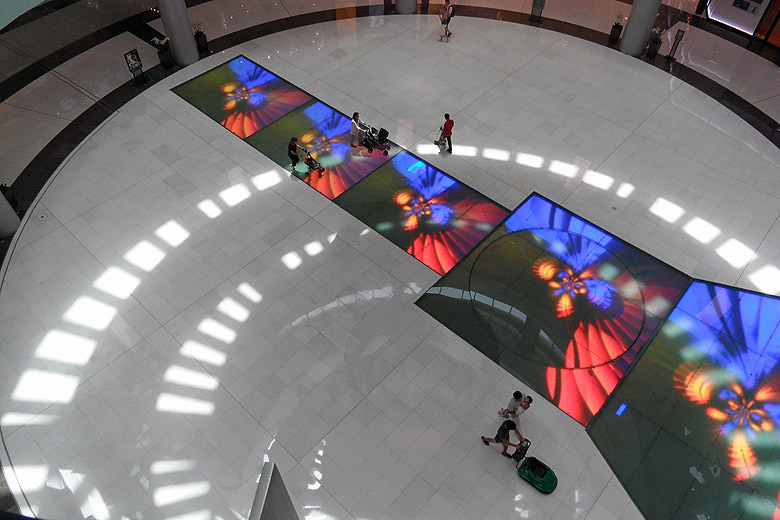

Dubai is an architects’ playground – a showcase of design and construction achievements, with each building trying to stand out from the crowd.

===

But it’s not just the architecture. It’s also the design work of the interiors, and the surroundings of these building projects all blended together with the Arabian culture that makes it an exciting place to be. The city is full of colour, wild shapes, pattterns and a myriad of creative ideas. Oh, it’s also hot. Very very very hot in fact.

Here’s just a quick inspirational taster.

{.img-screenshot}
{.img-screenshot}
{.img-screenshot}
{.img-screenshot}
{.img-screenshot}
{.img-screenshot}
{.img-screenshot}
{.img-screenshot}
{.img-screenshot}
{.img-screenshot}
{.img-screenshot}
