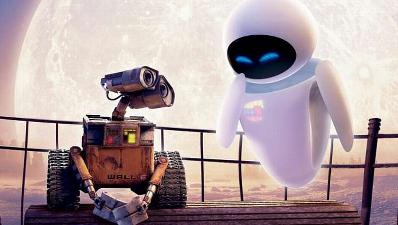
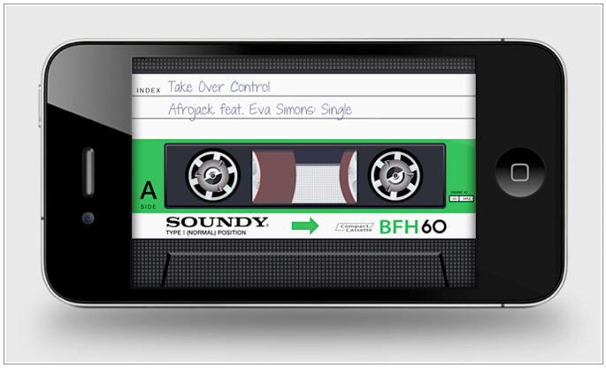
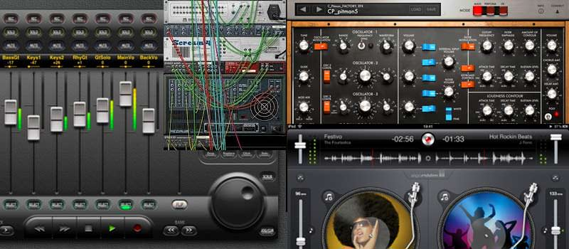
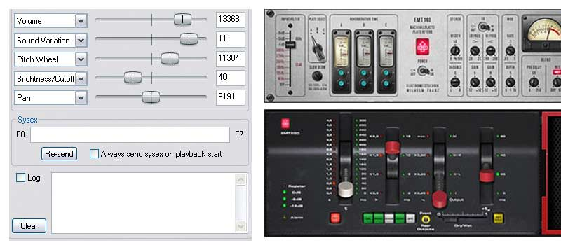
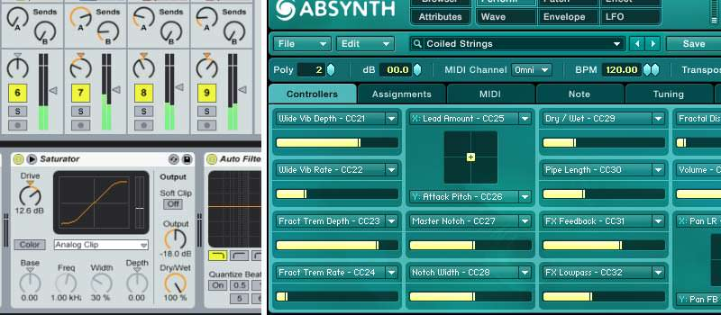

There has been endless chatter in recent months about the changing trends of visual design in web and application interfaces and in particular the death of skeuomorphism.

While in the past I have myself ranted about <a href="26-01-10_NoMoreAnalogueMetaphors.html">'tired analogue metaphors' </a> (I didn't know the word skeuomorphic even existed back then) part of me is now a little sad to see my wishes becoming a wide reaching design trend.

### Design trends

What I find slightly odd is the fact that everyone seems to suddenly and  mockingly loathe any visual reference to analogue counterparts.  When the iPhone first appeared nobody seemed to have any problem at all and such design was hailed as beautiful.  Since Microsoft created the Windows 8 tiled interface, group consciousness seems to have changed and everyone now wants clean and simple interfaces with tiles preferably.

*Image 1:  Wall-E and Eve.  Character Vs Clarity?*

So much so that even Saint Johny Ives is now 'rumoured' to be heading a like-minded change to the Apple iOS interface design.  (I do find it ironic that Apple are now the ones playing catch up with Microsoft after the reverse has felt like the norm).  But that's the way it goes of course,  visual trends like any other come and go and influences fleetingly change our tastes and desires.  We get tired of stuff and we want new, shiny, different stuff.

### Turning wheels

The trouble is I find it a little sad that we might be losing some of the charm.  Maybe I was alone, but I slightly mourned the loss of the turning tape deck wheels in the iOS podcast app when they were removed.   I remember buying an app called 'Air Cassette'  purely because it was all about the visual metaphor of a c60 cassette tape.  Of course that's simply a generational thing as I have fond memories of cassette tape (whilst conveniently choosing to forget the appalling sound quality and the time spent repairing the damned things after my tape deck ate them).

*Image 2:  Air Cassette on an iPhone.  It looked great, and heck - it was fun!  The tape level even changed as you got further through the music.  Epic.*

Yes, so maybe the little turning tape wheels of a tape deck are an outdated concept, but they did at least add a bit of visual richness, interest, charm and dare I say it, fun. 

### The audio world

 In areas like audio production analogue metaphors have always been rife.  Recreations of knobs, sliders and buttons are everywhere and add to the pleasure of using the software.

So much so, that I believe the quality of the rendering of the visual interface has often steered the perceived quality of the software as a whole - whatever it sounded like.  

*Image 3:  In the world of digital audio, skeuomorphism has always been at the heart of interface design.  Reason with it's swinging patch wires was a delight to use.*

### Eye candy

In the audio world, eye candy has alway been greeted with much delight.  Beautifully rendered meters with swinging needles and shiny 70's machined buttons that even catch the light correctly being hailed as sumptuous and gorgeous.   

<blockquote>Skeuomorphism was used to make you feel like you actually owned the real life object, not just the algorithm.</blockquote>

These interfaces were often appropriate as much of the software was a direct 'virtual' digital representation of an actual real life instrument.  The aim was to reproduce and emulate classic synthesisers or other studio equipment - i.e boxes of knobs and sliders you could never actually have or even encounter in the real world (as they were too expensive, rare, or unreliable).   

 'Analogue sounding' has always been an aural holy grail of audio producers, and so emulation of the physical analogue world has accompanied the algorithms of analogue style audio processing directly.  In essence, skeuomorphism was used to make you feel like you actually owned the real life object, you owned a thing, not just the algorithm.

*Image 4:  The extremes of interface design of audio plugins.  Eye candy has always been the delighter, the more analogue the better.*

### Striking a balance.

There is a balance of course, much of the audio software I have used is way over the top graphically and every new audio plugin has a different rendering style and therefore a new visual language to learn.  New trends have appeared over the years from companies like Ableton and Native Instruments, however, which are still visually attractive, but most definitely 'flatter'.   Whether they have any charm or personality is subjective of course.

*Image 5:  Ableton Live (left) and Native Instruments Absynth (right) are creating flat and attractive interfaces that are still interesting and pleasurable to use - without intense levels of skeuomorphic rendering.*

Skeuomorphism doesn't seem to be going anywhere in the audio world.  A quick look at the latest batch of software and plugins shows it is alive and well and in some cases getting more extreme.  I for one am pleased that at least one area retains a bit of graphical richness and variety and tiled flatness is not dominating it just yet.

### Ojectification and new challenges

So interface design that makes you feel like you have an actual real world thing in your pocket seems to be on the wane.   We won't have lined notepads, leather desk diaries, pens, airbrushes, tape players or beautiful recording microphones in our pockets any longer.   At least for a while.  In the mean time we will have much simpler flat concepts of tasks that I'm sure will work in exactly the same way, but perhaps lack some of the charm? 

In particular I am interested to see how St. Johny tackles the Voice Memo application.  Without the skeuomorphism here, what exactly is left to work with, and just how visually interesting will it still be?  (My money is on a live oscilloscope display rather than the massive picture of a mic? - though not skeuomorphic of course!)

Time will tell, but I predict with full confidence that in five years time people will be cooing over the new 'ooh look it's like kinda' 3D' design trend, and round and round we will go.   

