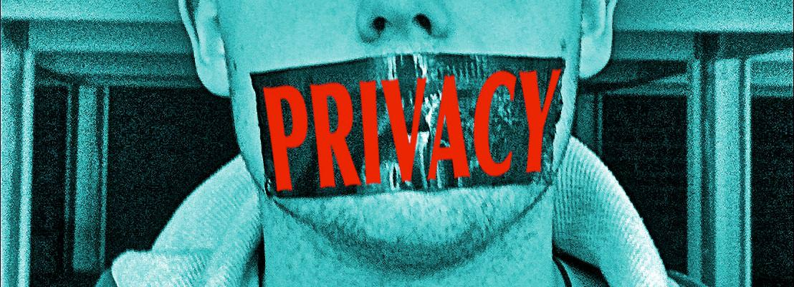

Last night I listened to <a href="http://unfinished.bz" target="new">Unfinished Business</a>, the weekly web business podcast from <a href="http://unfinished.bz/#presenters" target="new">Andy Clarke and Anna Debenham</a>.  They were discussing privacy, non-disclosure agreements and client confidentiality. This got me thinking about the few occasions where I have made mistakes about disclosure - things that either didn't cross my mind at the time as being a problem or I simply thought were too trivial to worry about

The first was a really simple case of Instagramming a non specific scene from a wire-framing workshop session.  In a bid to add more 'on the job' type images to the selection of images we have at our disposal to make reports and web pages more visually engaging, I thought it was a good idea to start grabbing images of the invisible parts of the design process.  I was very surprised when I was contacted by the client, disgruntled that on my photo, part of their wireframe was visible.  I hasten to add that there were no logos visible, nor was the content in any way discernible or linked to them, but still the client was not happy.  The mistake here was not the photo itself, but making it public whilst working on the session.  I was more than happy to delete the tweet and Instagram image and really wasn't prepared to argue the issue.

On another occasion I produced a demo for a pitch to demonstrate how a particular technique could work on the client site.  We didn't win the pitch in the end, but not wanting to have completely wasted my time on the demo I thought it might make an interesting blog post.  This time, I made the mistake of leaving the client logo on the design, and soon enough was contacted and asked to take the post down.  I had foolishly thought that a) my post would be of no interest to anyone but a handful of designers, b) that no-one  would look for it or come across it anyway and c) as it used no other collateral of the institution other than their public logo it was fine.  On this occasion I didn't remove the post, but simply created a quick new logo as the post was more about the visual idea than anything to do with the institution.

The most recent occasion I was asked to remove something was after adding a speculative design concept to my site.  I was quite proud of the result, and although the design was not used, I decided it was pretty and I could safely add it to my portfolio (and I had signed nothing during the design process).  Once again I considered the chances of it ever being looked at by anyone who cared as negligible.  Wrong.  I was contacted by the potential client less than a month later saying that my concept was appearing as the number 1 Google Image result when searching on the company name.  This was confusing potential customers and diluting the brand.   

So the simple lessons I have learned are:

* Never post photos from workshop sessions.  It's  not worth it, and probably not very interesting to anyone else anyway.
* However, never assume that your blog/portfolio will not be interesting to someone, somewhere. It's the internet after all.
* Don't mention client names on any work that's not public elsewhere and don't name images with client names.  Google is not always your friend, so get better acquainted with your robots.txt file.
* Just because you haven't signed an NDA doesn't mean you are free to use anything you've created without potentially upsetting people.  Even with permission from the client contact involved, it doesn't mean that the permission extends higher into the client organisation.
* If in doubt, don't do it.  Just use your common sense.
* Humans make mistakes. We live and learn.