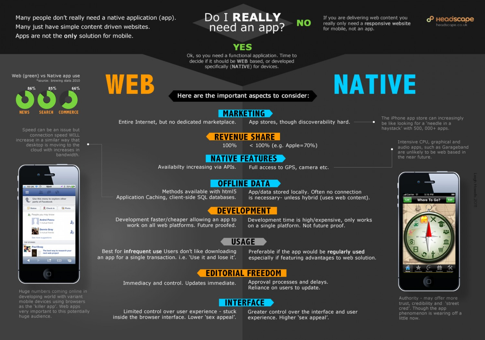

I made a pretty infographic to illustrate a blog post on Boagworld; [The whole web is confused by mobile](http://boagworld.com/business-strategy/the-whole-web-is-confused-by-mobile/).

===

I'm really keen on infographics at the moment. There are far too many words around and I feel the need to try and make some visual sense of all the complex, wordy ideas. With more time this would have had more graphical ideas for the categories. As it stands it is little more than an annotated table, but a quite pretty one.

