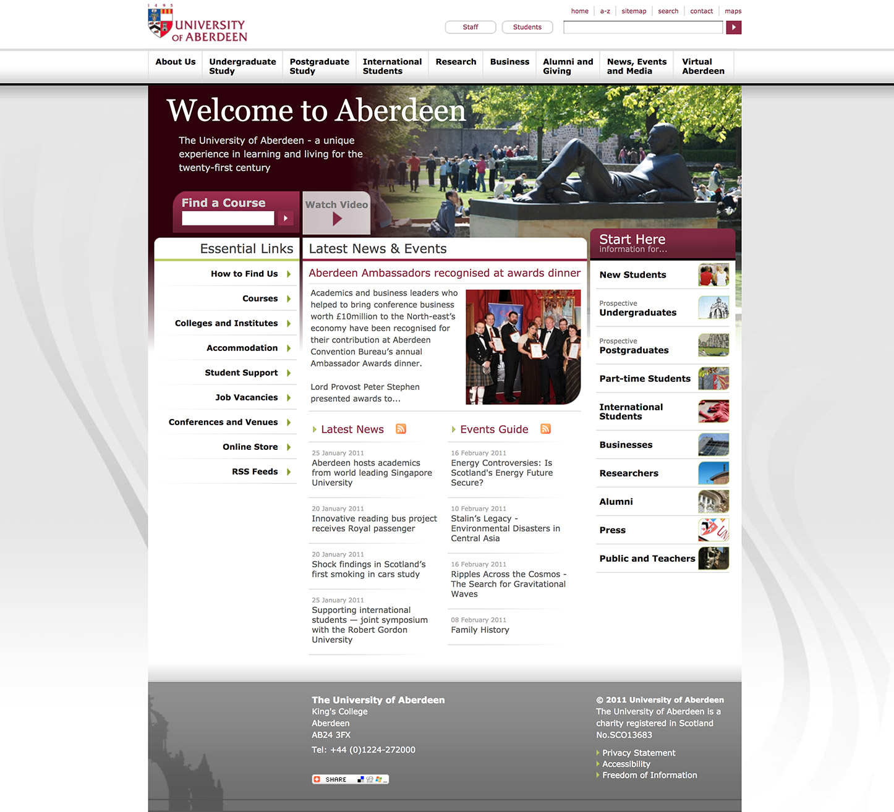
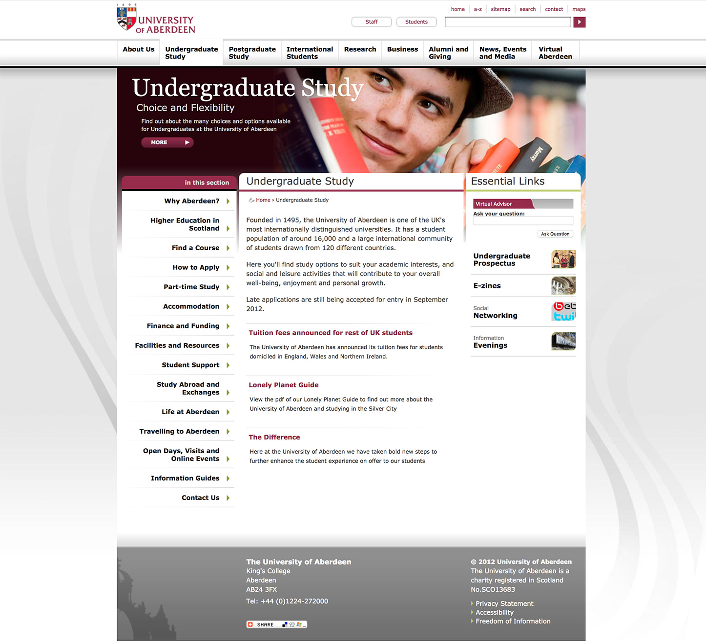
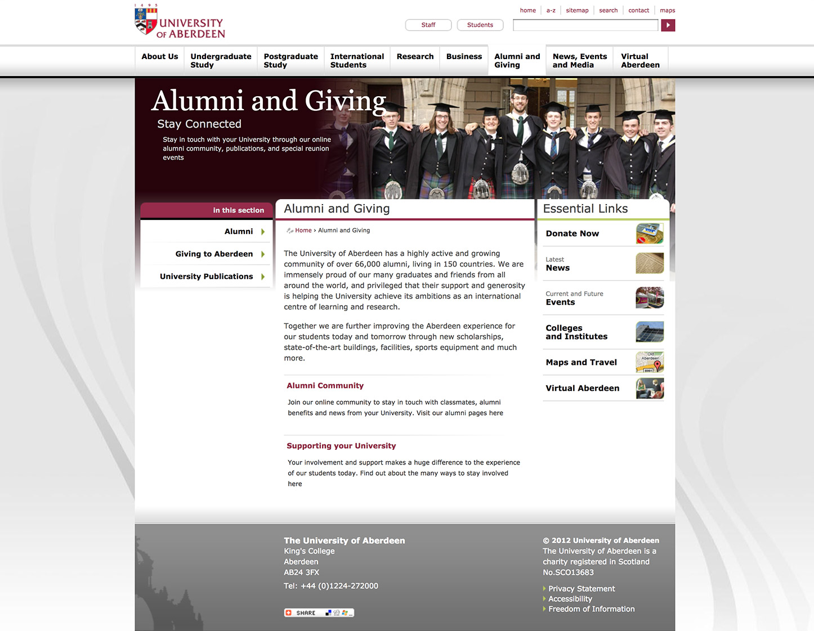

The University of Aberdeen is a public research university in Aberdeen, Scotland.  I undertook a major redesign project to give the University a fresh new look and feel.

===

### The Challenge

The find a design direction that was right for the many stakeholders of the University going forwards. I took some of the inspiration of recent buildings and interior refurbishments to create a set of mood-boards embracing the new but staying grounded in the history of the institution.

* Mood-boards
* Design mockups
* Final designs across a set of page types

#### - Home Page -

#### - Landing Page -

#### - Content Page -