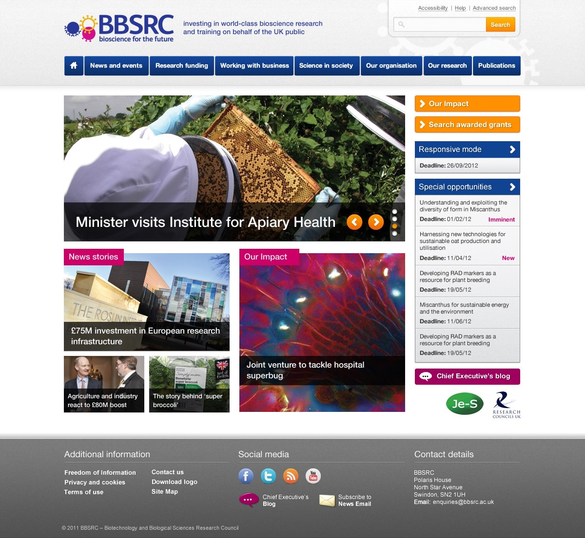
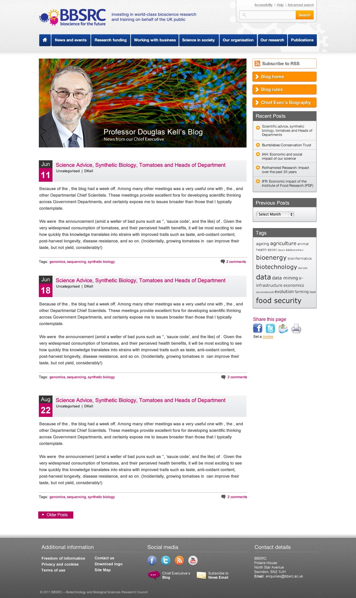
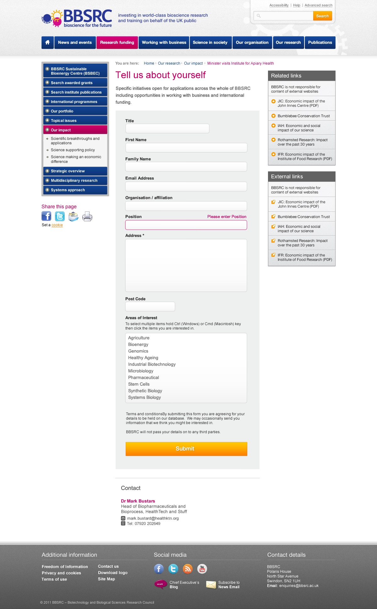
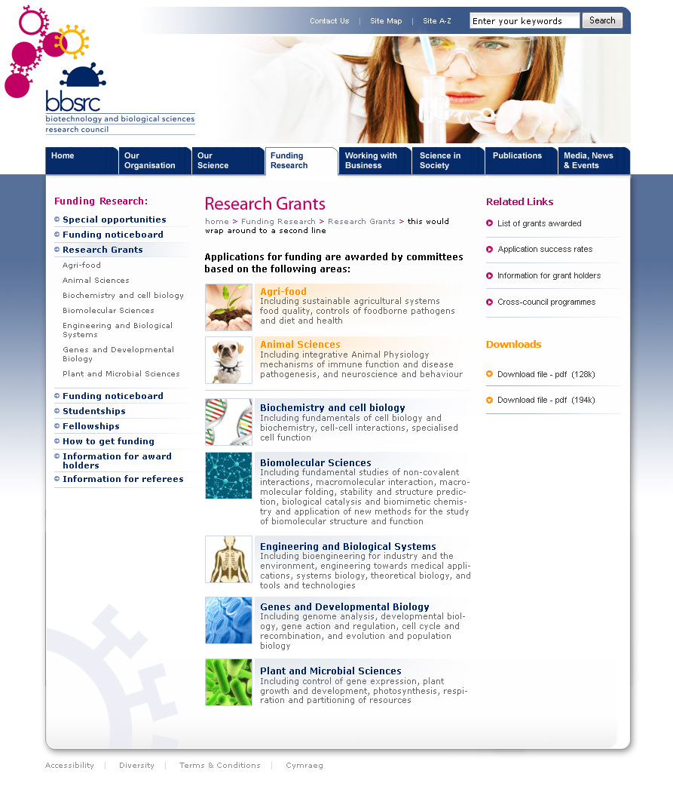
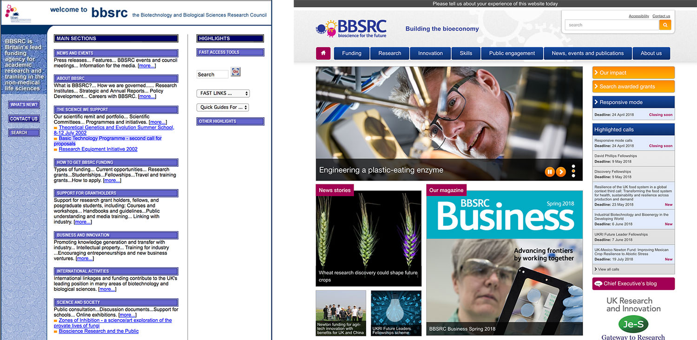

Following a re-branding exercise, I redesigned the website for Biotechnology and Biological Sciences Research Council.

===

### The Challenge

My original design was in around 2002 and updated a few years later to address some of the shortcomings and to rebuild with new web technologies of the time. The challenge was to make the site look academic, yet approachable and not too 'stuffy'.

### Design Work

{.img-screenshot}
#### -  Home Page -

{.img-screenshot}
#### - Publication -

{.img-screenshot}
#### - Form! -

{.img-screenshot}
#### - Original Home Page, c.2002 -

{.img-screenshot}
#### - Before and after -
