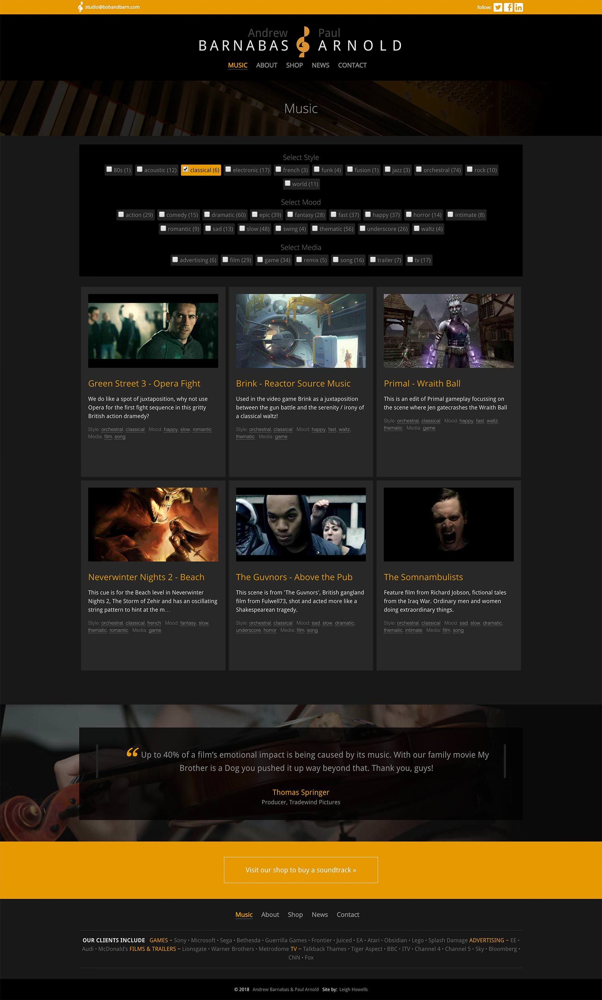

A pair of talented composers in Cambridge, UK, <a href="http://www.bobandbarn.com" target="_blank">Bob and Barn's website</a> offers a showcase of their best work.   It's primary goal is to present latest work and news together with a full database of their music clips filterable by mood, style and media type.

===

### The Challenge

The main challenge of this site then was to build a powerful facetted filter system based upon a 3 category taxonomy - which allowed easy management in a simple CMS.  It also required intelligent related music links based on similar taxonomies which could be manually bypassed if required.

The old site was slow, unresponsive and built upon a custom CMS, which was difficult to use and non-intuitive.  There were also too many front-end elements making use of Flash rather than HTML.

### Site look and feel

Still very much working in games soundtracks, there was a desire to keep things looking dark, and a little more 'gamey'.  The unusual name and quirky logo were tamed down, instead opting for bolder use of orchestral images, visuals felt to be much more representative of the style of soundtracks they
 now work on.  Essentially they wanted to add a bit of 'class' whilst remaining 'gamey' and retaining a fried Egg logo. A challenging set of criteria.

### Statamic static site generator

In order to achieve a fast, responsive site and to keep full control of the code being used, I opted to use Statamic site generator.  Statamic uses markdown and php to create site pages on the fly.  Unlike systems such as Docpad or Jekyll, Statamic does not require the entire site to be regenerated each time a file is added, instead new pages can simply be added and the application adds the page to listings and anywhere else it may be referenced seamlessly.  

### Admin

Statamic also uses a very user friendly and easy to configure admin system to allow site updates and administration.  Though it of does not have the power of Wordpress or Drupal, for example, its simple approach means there is less to go wrong, better security and less likelihood for code bloat
through unnecessary plugins or modules.

The Statamic CMS allows management of audio clips, shop items, case studies, news, quotes and taxonomy but is stripped right back to keep to the core requirements of the site.

### Design Work

* Visual design and aesthetics
* Page template designs
* Design work in HTML/CSS/JS
* Front-end coding
* Back-end code/integration
* CMS design using Statamic

### Final Product

{.img-screenshot}
#### - Home Page -

{.img-screenshot}
#### - Facetted Audio Library -

{.img-screenshot}
#### - Composition Details -

<a href="http://www.bobandbarn.com" target="new">Current live site</a>
