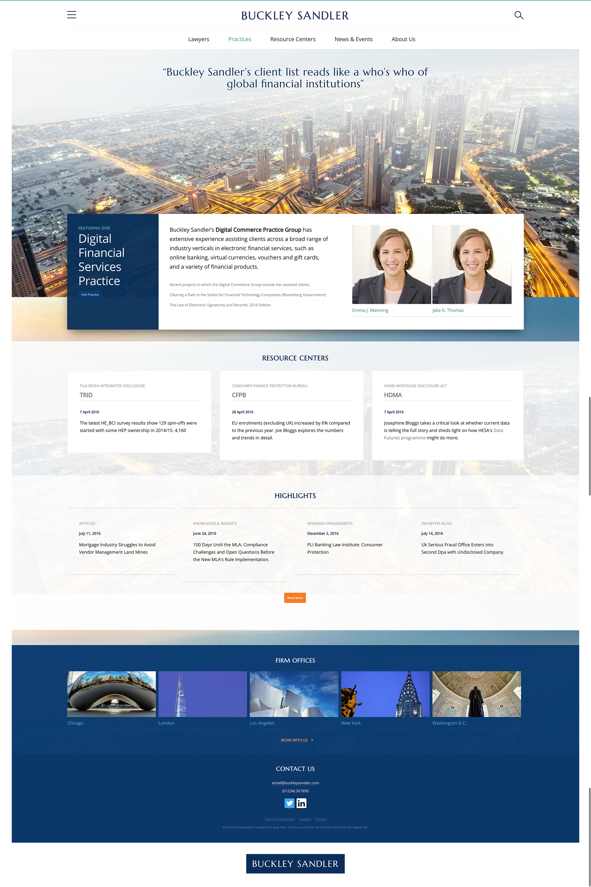

<a href="http://www.buckleysandler.com" target="_blank">BuckleySandler</a> is a large American Law firm based in Washington DC.

===

### The Challenge

The old site was small, unresponsive, cluttered, badly planned and unmanageable.  The challenge was to establish Buckley Sandler as a big player in a crowded law sector, to stand out from the crowd whilst staying true to the core principles of the firm.  There are many nuances of law firm type, and
the visual design had to steer clear of looking like the type of firm they are not.   The challenge was to understand the character of the firm and design appropriately.

As part of the design work for the site IA and look and feel, I also undertook a <a href="#">rebranding exercise</a>.

### Design Work

* Initial 4 day workshop in Washington, DC.  Stakeholder interviews ran in parallel to IA workshop, brand character, user journeys, wire-framing, and <a href="/articles/reception-area">design aesthetics exercises</a>.
* Mood-boards
* HTML Wire-frame prototype
* Key page design mock-ups
* HTML Design prototype

{.img-screenshot}
#### - One of 5 mood boards -

Five mood boards were created to establish the right design direction and elements for further exploration.

{.img-screenshot}
#### - HTML Wire-frame prototype -

The HTML wire-frame prototype was a chance to test the navigability of the site, explore search concepts such as live filtering, and gather ideas of the variety and quantity of content types.

{.img-screenshot}
#### - Initial home page mock-up -

The initial page mock-up took ideas from the selected mood board direction, and together with new knowledge from the wire-frame prototype provided a starting point to iterate the site look and feel.

{.img-screenshot}
#### - Home page HTML design mockup -

The HTML prototype allowed further design development in the web environment, allowing initial experimentation with such elements as hover and selected states, static background images, random image loading, carousels and other functional elements before being production ready coded by developers.

### Final Design

Further minor design iterations continued right throughout the drupal integration stage, until everything worked cohesively together.  One major aspect of this was the development of a content rich attorney and practice carousel on the main home page banner.

{.img-screenshot}
#### - Home page -

{.img-screenshot}
#### - Bio page -

The bio pages were an important part of the design process. Attorneys consider these as their personal home pages or CVs, so they had to look bold, striking, yet at the same time elegant, professional and clear (whilst being easy to manage in the CMS).  They also have to contain a large amount of
content without looking overwhelming, so
mechanisms were sought to enable switching and hiding of lengthy content.

{.img-screenshot}
#### - Attorney landing page filter -

The live filter was a concept that came from experimentation at the HTML wire-frame stage allowing rapid attorney searching.  Presets were also created to allow quick filtering by job title.

{.img-screenshot}
#### - Blogs -

Additional micro-sites were brought into the main site, but allowances were made to give them a unique look and feel, whilst remaining clearly part of the main site - this allowed bold use of the secondary palette and typeface.