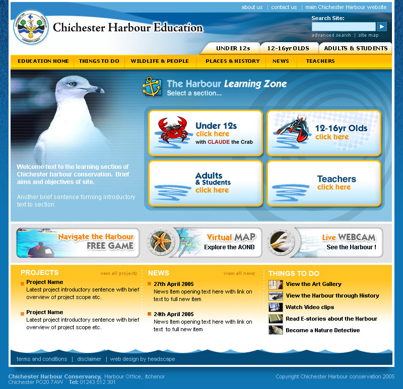
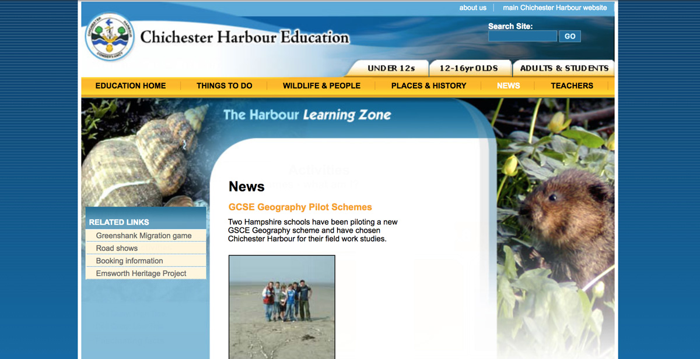
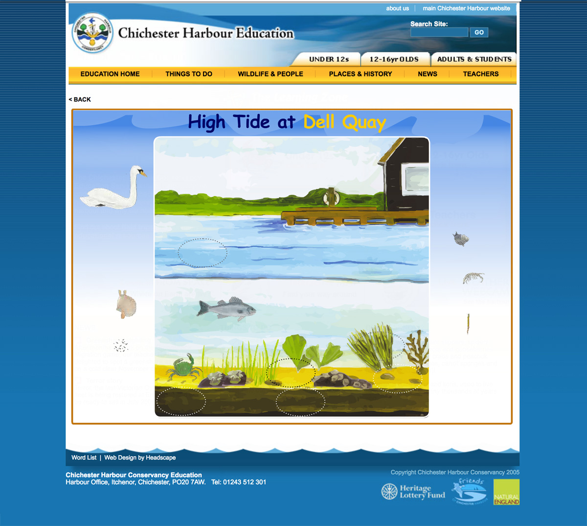
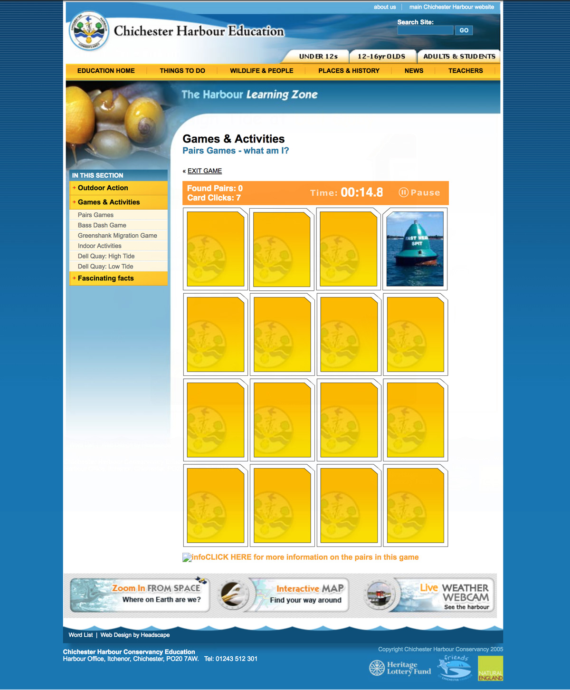

The Learning zone section of the Chichester Harbour conservation website.  This site for children was stacked full of interesting things to do and see, with games to play and lots to discover.

===

The site had to appeal to a wide range of ages and excite and capture the attention and interest of school children.  I created characters such as Claude the Crab to introduce the different sections and provide help.

{.img-screenshot}
#### - home page -

{.img-screenshot}
#### - news page -

{.img-screenshot}
#### - A match the habitat area game I developed -

{.img-screenshot}
#### - A match the pair game I developed -

<embed width="100%" height="900" src="pairs_whatami.swf" quality="high" pluginspage="http://www.macromedia.com/go/getflashplayer" type="application/x-shockwave-flash">

