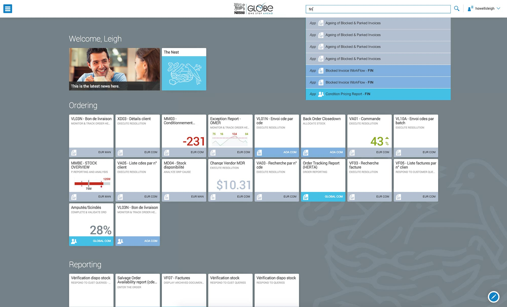
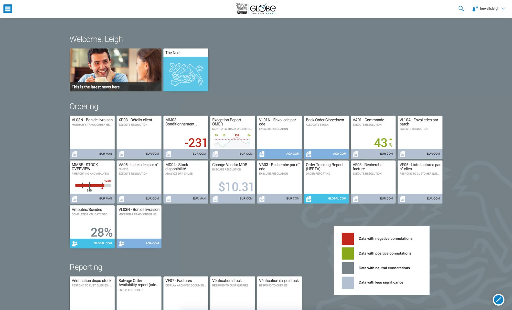
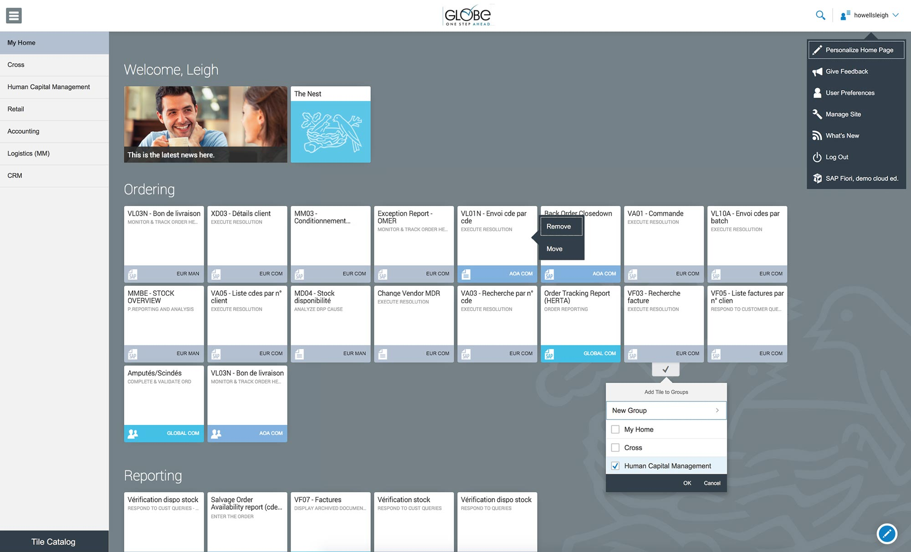
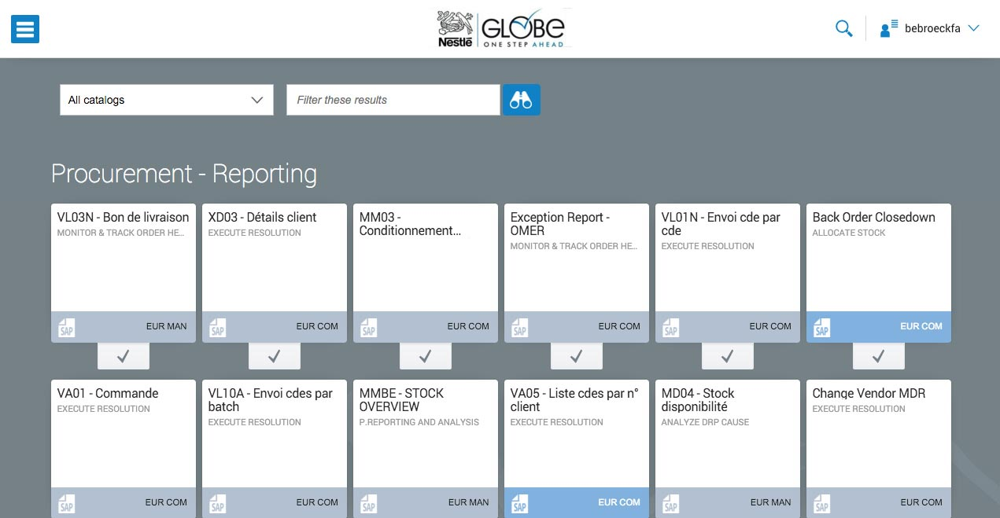

A bespoke SAP skin and component design system for an internal Nestlé application.

===

### The Challenge

Once and understanding of the SAP system was gained, the remainder of the challenge with this project was customising standard SAP tiles using meaning styles in a restricted sapce.  There were many constraints with the abilities of SAP and the approach of styling standard interfaces with a unified look and feel.

### The Design Process

* Kickoff meeting at Nestlé head-office near Geneva
* Static mockups were created of key screen concepts
* HTML/CSS design mock-ups were created to experiment with spacing
* Iconography was designed to supplement existing artwork

{.img-screenshot}
#### - Standard interface -

{.img-screenshot}
#### - with colour codes -

{.img-screenshot}
#### - drop-down, slide-in side menus and edit functions -

{.img-screenshot}
#### - SAP application -