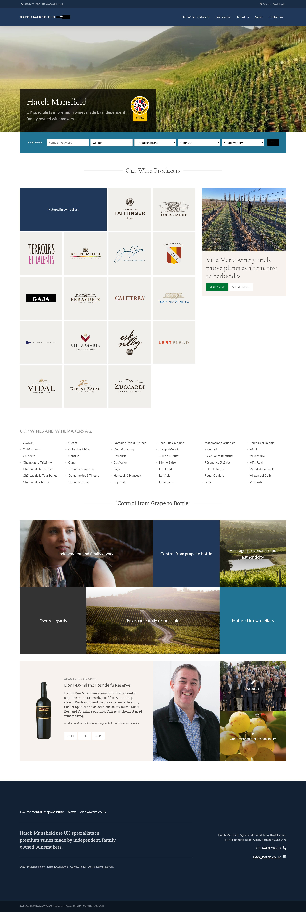
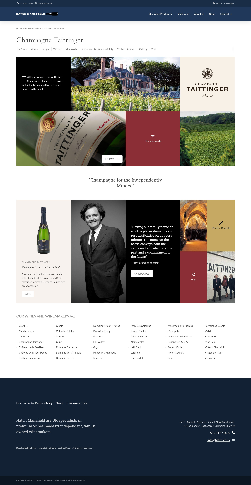
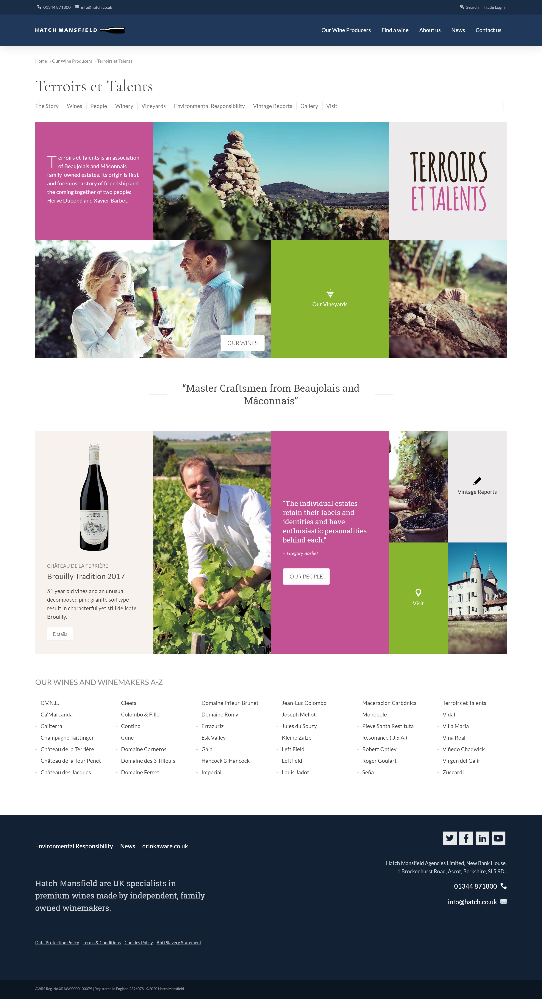

<blockquote>A modern site design reflecting a quality distributor selling brands required to retain their own premium identities.</blockquote>

<a href="http://www.hatchmansfield.com" target="_blank">Hatch Mansfield</a> are a UK distributor and specialist in premium wine. I helped to design and build a new website to reflect its growing portfolio of independent family owned wine producers. 

===

### What I did

* Key pages in low fidelity wireframes
* Higher Fidelity 'joined up' Wireframes in HTML/CSS/JS
* Mood-boards
* Flat graphic design mockups
* Full Design mockups in HTML/CSS/JS of key pages
* Art direction to front and backend developers during integration.

###Design challenges

One of the big design challenges was accommodating the identities of different  wine brands whilst still making them feel part of a Hatch Mansfield brand experience. Through extensive collaboration with Hatch I created a standardised layout for brand landing pages which could be customised with colour schemes, logos and images. The same palettes and imagery were carried through to underlying content rich pages, whilst the layout allows consistent navigation to these across all brands.

The solution was to use a grid based approach to allow large blocks of colour to tie in with each brands colours, together with photography.

###UX challenges

The greatest UX challenge was to present the ranges of wine from each individual producer, to clearly show wines produced under umbrella brands whilst differentiating from their sub-brand products nestled under their umbrella.

Our greatest UX challenge involved ensuring users could easily find product details filtering by multiple criteria – region, producer, grape, colour, taste  and more.  The solution was a comprehensive facetted filter to narrow the search using tick boxes. 

Screenshots taken from wine listing and wine detail pages.
