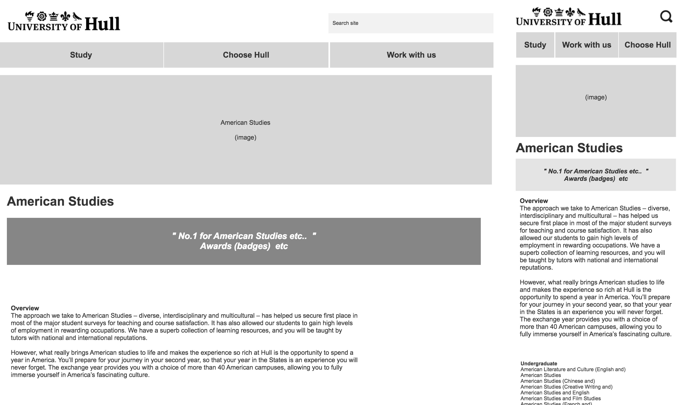
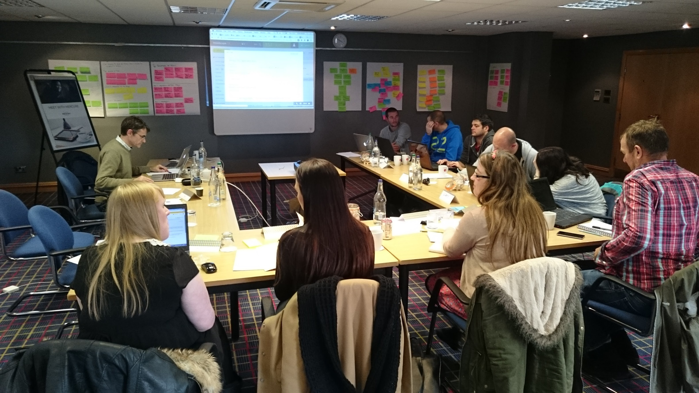
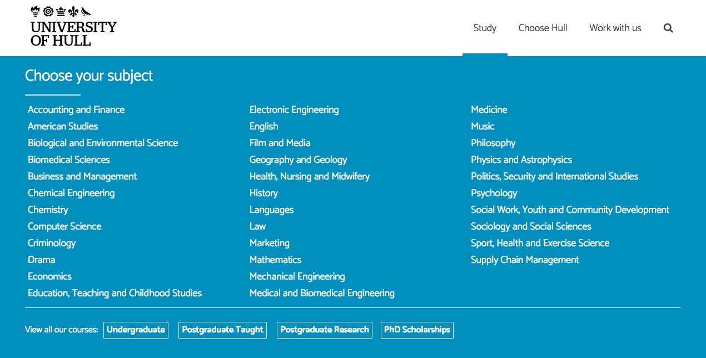

During the prototyping work we facilitated user testing sessions generating feedback into the design process. Hull’s new website, incorporating the information architecture and user experience designs developed through the prototyping work with Headscape, went live in 2016.

===

### The Challenge

To redevelop some of the main pages of the University of Hull, including the home page, top level landing pages, course pages and the application process itself.  We also re-worked the navigation process and menu systems to simply and focus.

#### - Workshop Wireframeing at mobile and desktop -

#### - 3 day workshop -

<q>Prototyping has been such a valuable experience in terms of processes and learning. It’s given us confidence in our user-centric design approach and enabled us to sell that in to our stakeholders.</q>

-- Anja Hazebroek, Director of Marketing & Communications, University of Hull

#### - The top level navigation we worked through -