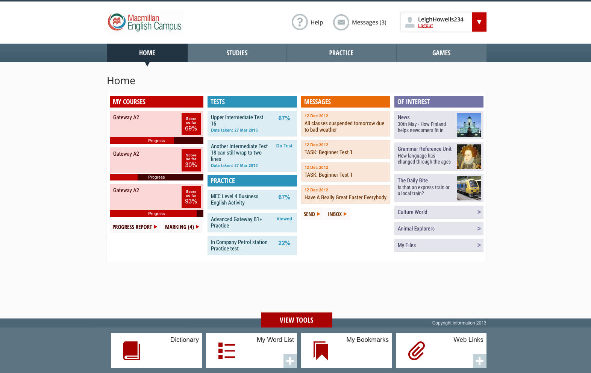
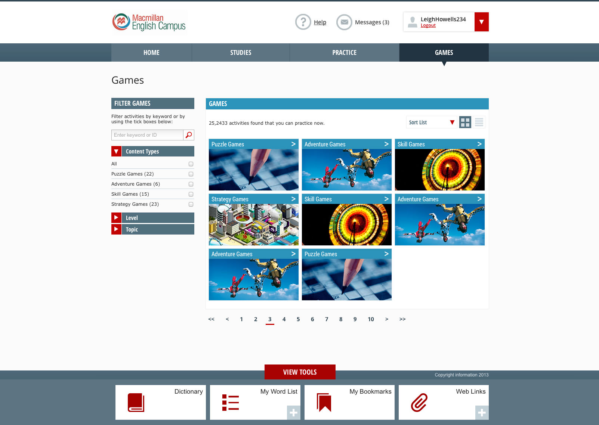
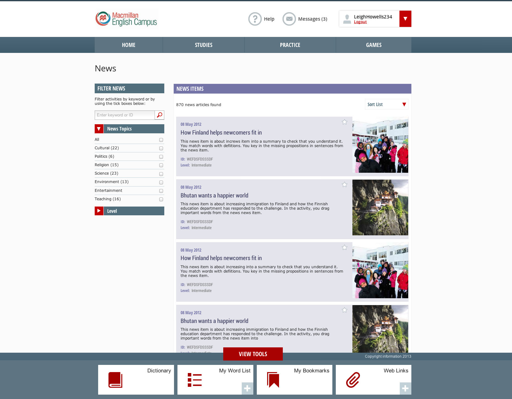

I worked for Macmillan Publishers on their Learning Management System called English Campus, a large web application.  As part of the project I worked as...

===

### Design Work
* Brand creation worshops
* Wire framing workshops
* Remote usability testing via telephone across the globe
* In-house training.
* Mood-boarding
* Visual design and aesthetics

### Final Product
#### Home Page

#### Content Page

#### Typical Mobile Widths

