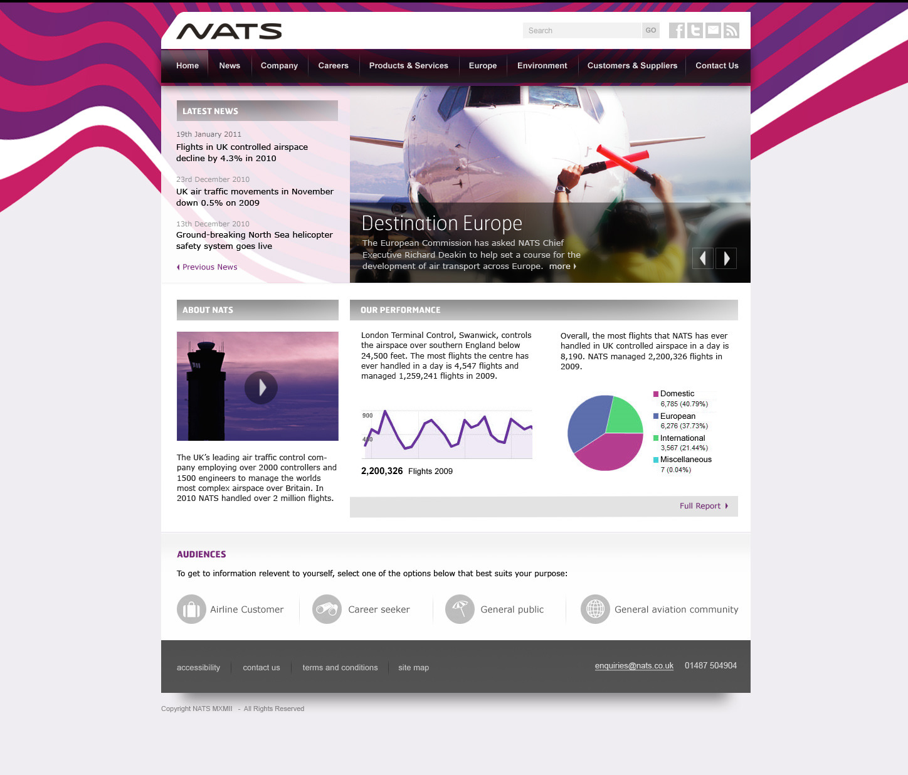
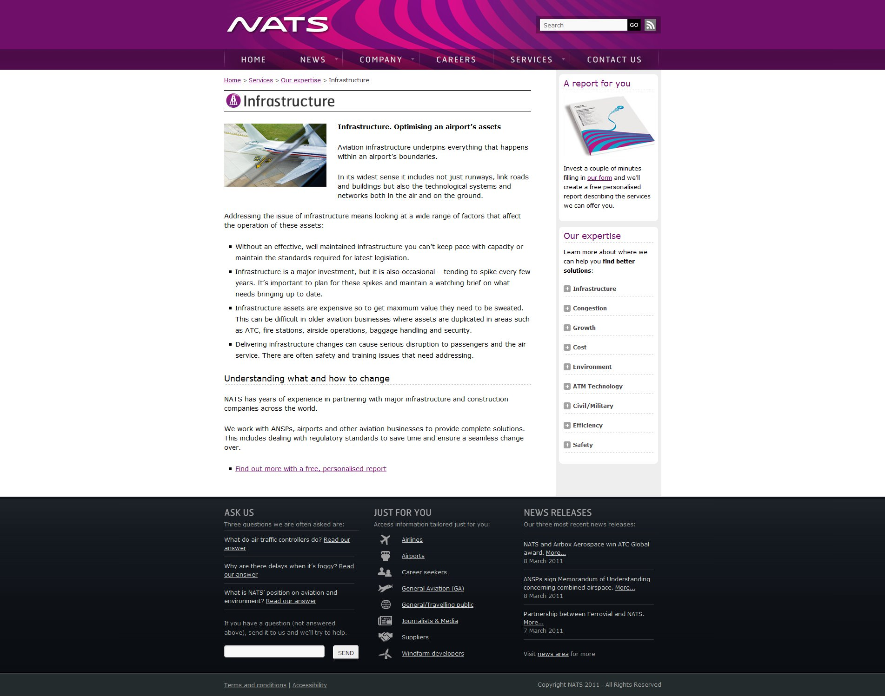
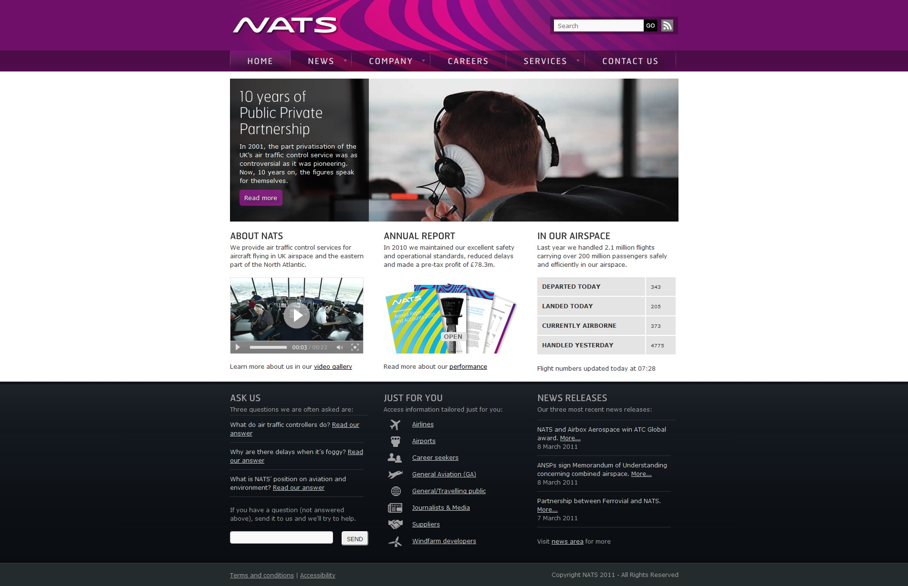
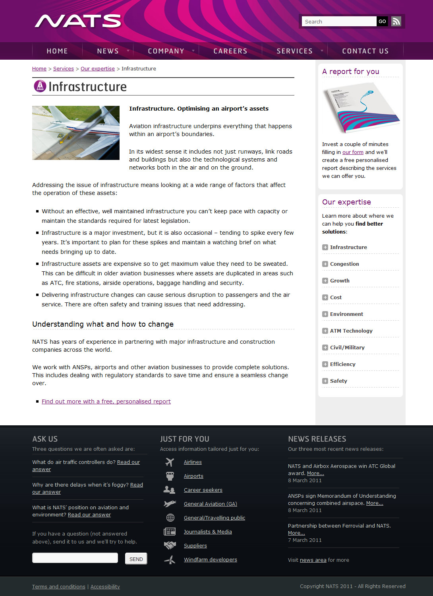
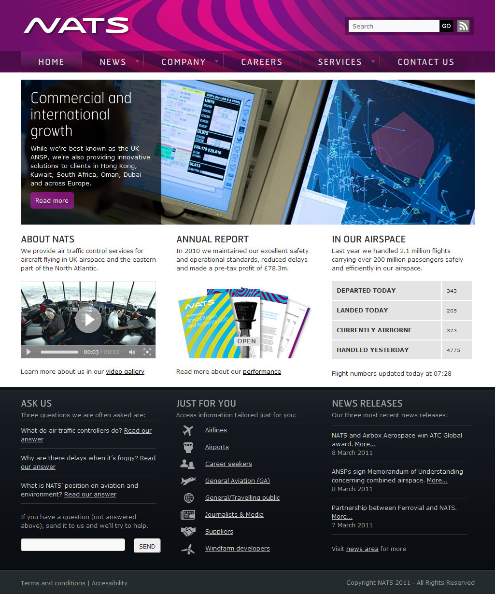
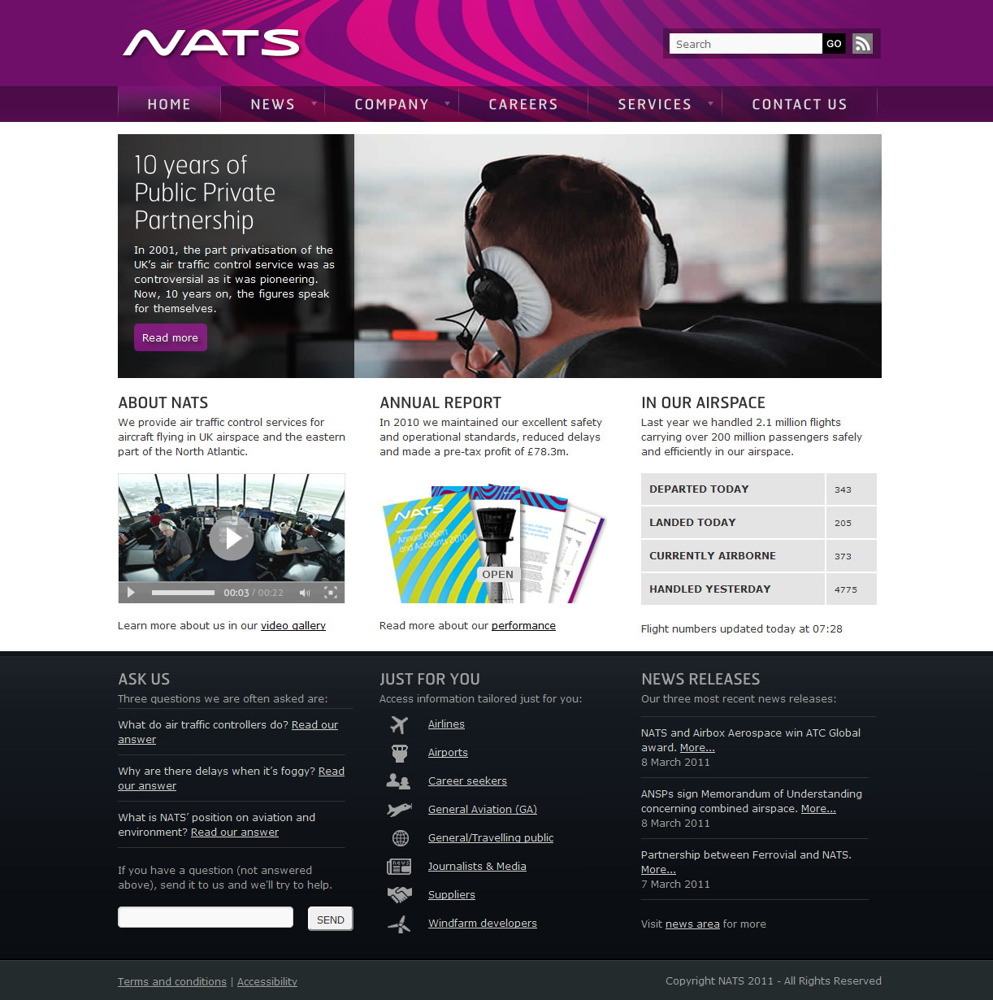
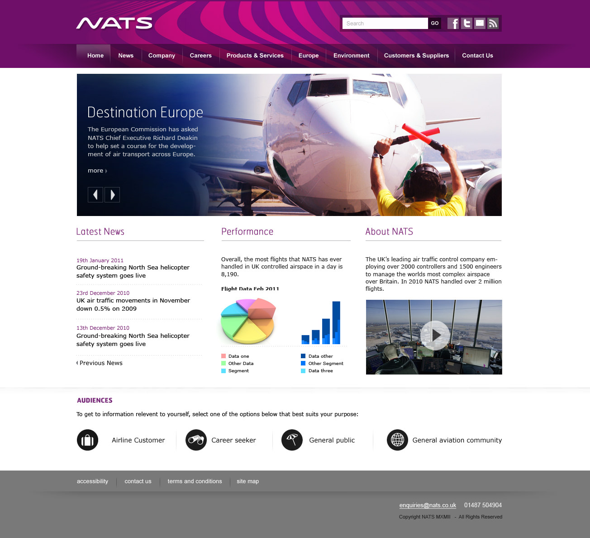
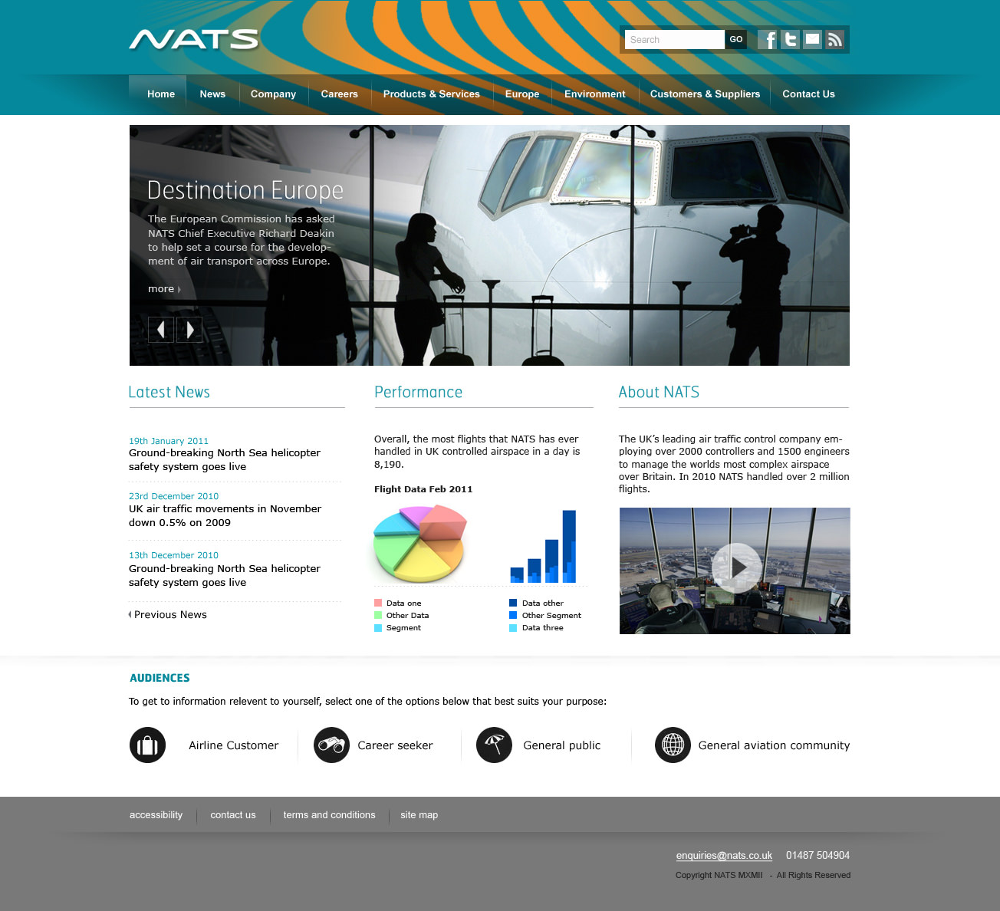
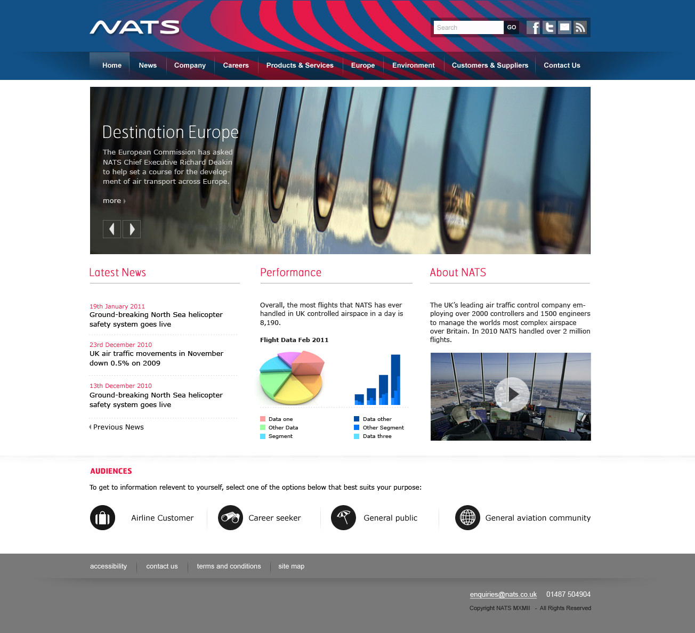

National Air Traffic Control Service

===

### The Challenge

To work with branding guidelines to redesign a previous iteration of the main site header to create a more practical solution and use greater browser width for higher impact.

Having designed their last site six or seven years ago, it was staring to look a little dated.  An updated layout, navigation and a new look at their brand stripes was required as well as some more up-to-date means of presenting information on the home page.

### Design Work

The result was a modern and dynamic website look which should be flexible enough to keep things look fresh for quite a few years.

* User interface design and content mapping.

{.img-screenshot}
#### - Original site header -

{.img-screenshot}
#### - Full width canvas -

{.img-screenshot}
#### - Home page -

{.img-screenshot}
#### - Content page -

{.img-screenshot}
#### - Home page variant -

{.img-screenshot}
#### - Home page variant -

{.img-screenshot}
#### - Home page variant -

{.img-screenshot}
#### - Home page variant -

{.img-screenshot}
#### - Home page variant -

