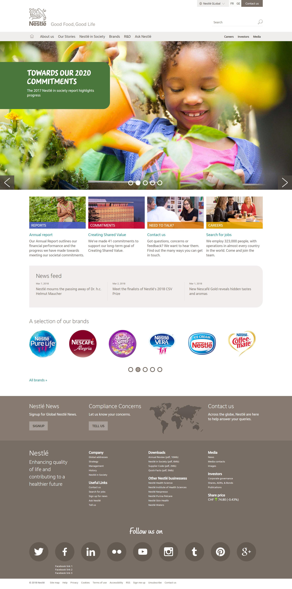
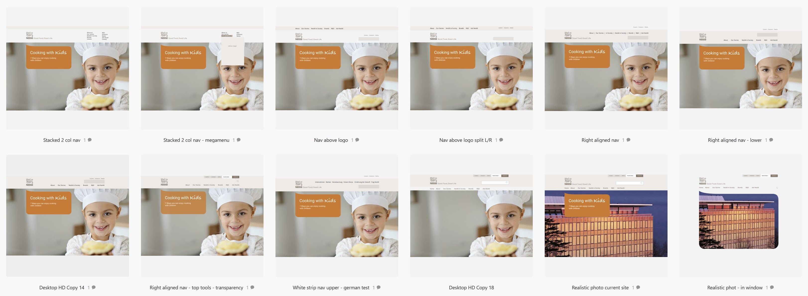
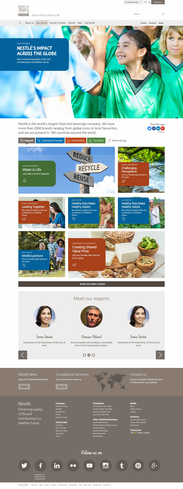
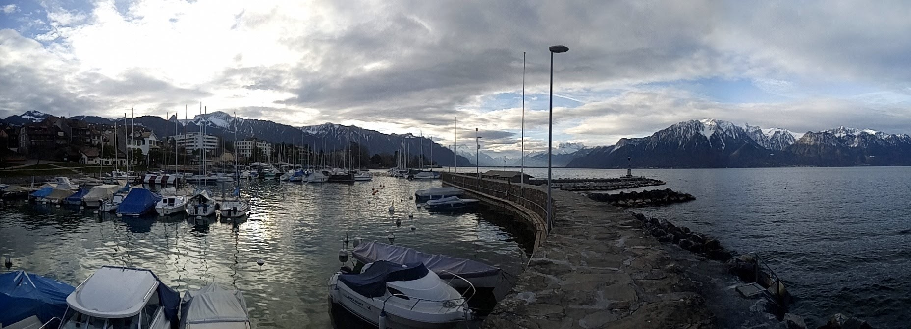
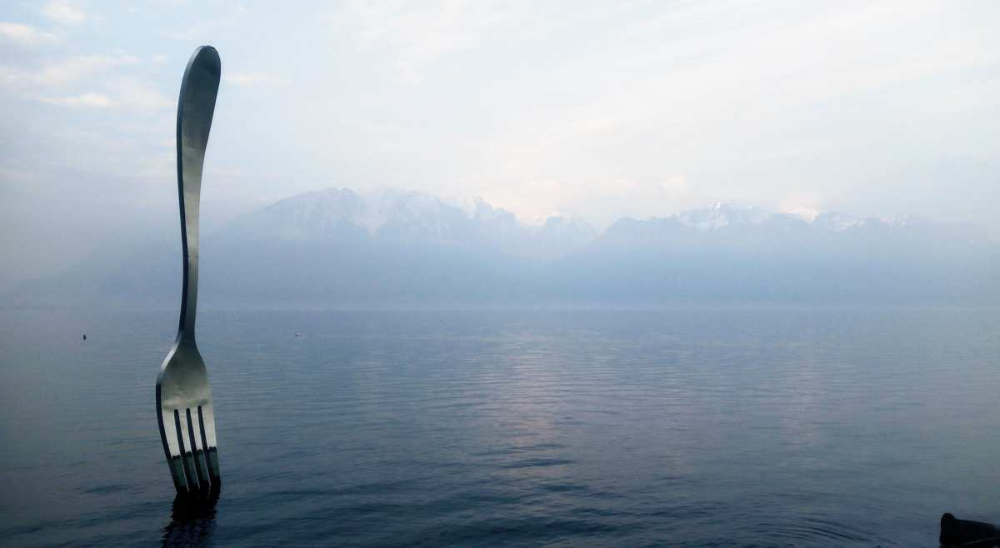

<blockquote>An updated responsive look and feel to bring the Nestle.com corporate site into alignment with new global branding.</blockquote>

<a href="http://www.nestle.com" target="_blank">Nestlé</a> is a Swiss multinational food and drink processing conglomerate. In 2018, I was tasked with redesigning their corporate site, with a strict adherence to new brand assets created by a third
 party branding agency.  
 
The corporate site had never been built in a truly responsive fashion including having a completely separate mobile site, not ideal from a management or maintenance perspective.

===

###What I did

* Flat graphic design mockups
* HTML/CSS concept mockups illustration layout innovation
* Navigation system in low fidelity wireframes
* Full Design mockups in HTML/CSS/JS of key pages
* Art direction to front and backend developers during integration.

###Design challenges

After much head srcatching, a couple of trips to the beautiful town of Vevey in Switzerland and endless experimentation I devised a solution where at narrower widths the conversational bubble could be achieved as a hamburger menu would be appropriate
 allowing space, and the speech bubble could expand using some exact placement of graphic masks to ensure the correct shape of the bubble was maintained.
 
 

Another huge challenge was the navigation, and the client's wish for an expanding 'mega-menu'. Not being a huge fan of such solutions personally and despite pushing back in the end I had to run with it and find the best way to achieve what was wanted. I
 noticed a lot of the desire for a mega menu was simply because other large global corporations were using them and there was a wish to be 'part of the gang'. This happens a lot in all industries, web teams seek to emulate what other successful companies are doing on their site whether or not something is actually a good idea for most users. Prototyping the menu and how it would work for both touch based users, such as Surface and iPad was crucial for demonstrating some of the complexities and compromises required of such a navigation system and how it would change from mobile to desktop.
   
###Working In-house
I worked at the Nestlé site for a week, a lot of that time spent rapidly prototyping and designing to present different levels of management with ideas as I went. This was an excellent way to get rapid feedback, decisions and iterations from decision makers in the same building. An example below was a rapid set of options for exploring and demonstrating navigation options and positioning on large feature pages.

I worked in browser for most of the design work, as much of the layout and ideas were to consider text flow and layout, still an issue for static design software. Variations were fast to render when experimenting with grid layouts and images to show
 variations and to illustrate any problems with narrower widths.
  
  
  
  Colour variables were important to show variations of colour use across different sections as there was a desire for colour coding.

What a location for client work. Vevey is fabulous any time of the year.

Nestle was one of my favourite projects in recent years, not just because of the location, but because of its unique challenges and a delightful client team who understood the issues of everything that was required. They took on board my push back on the need to consider web intrinsically as part of a corporate re-branding, which is so often given only cursory consideration. Branding agencies need to delve deeper into the restrictions they may be placing on web development when creating brand concepts. 

It's unfortunate that even now after decades of accessibility work online, it is rare to even get a palette of colours that work with accessibility guidelines and don't hinder those with visual impairments. 

Corporate spiral staircase, Nestlé