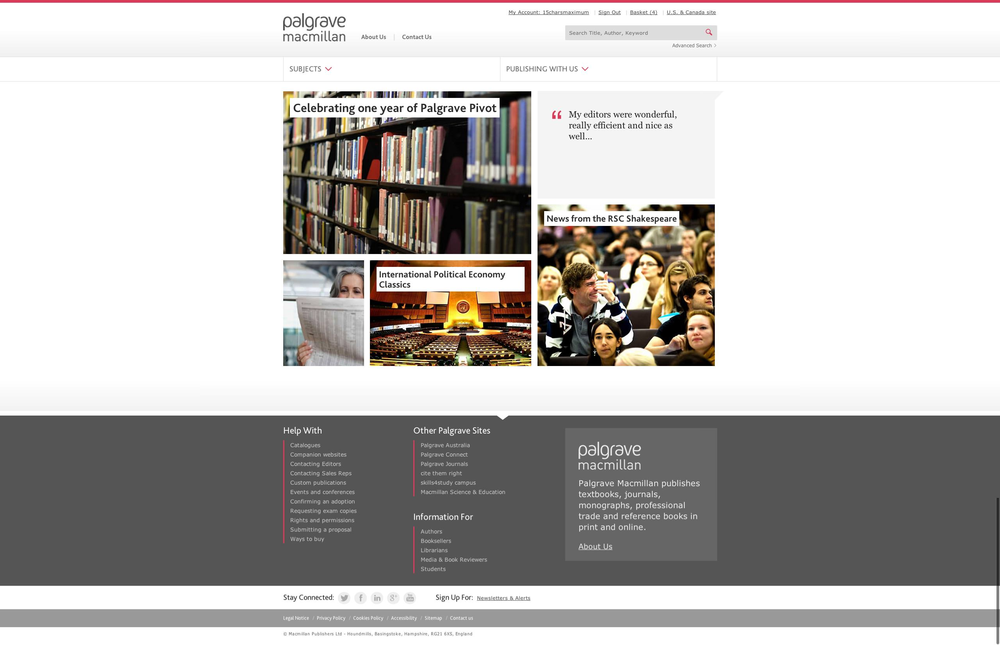
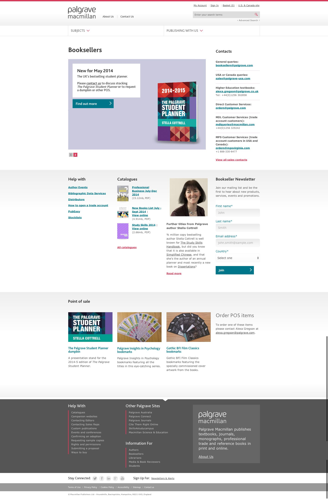
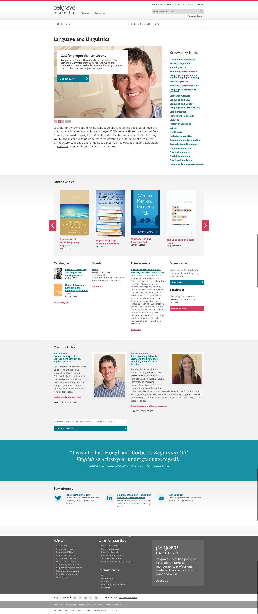
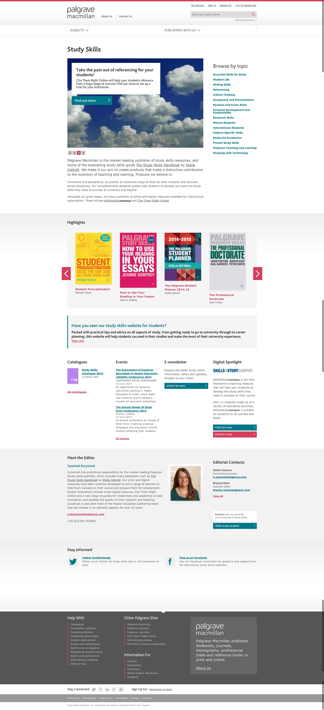
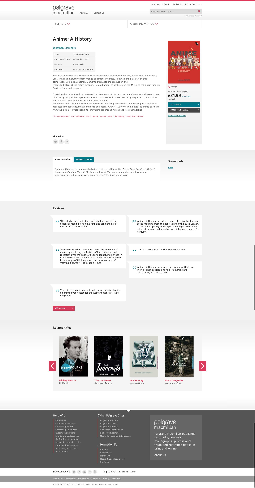
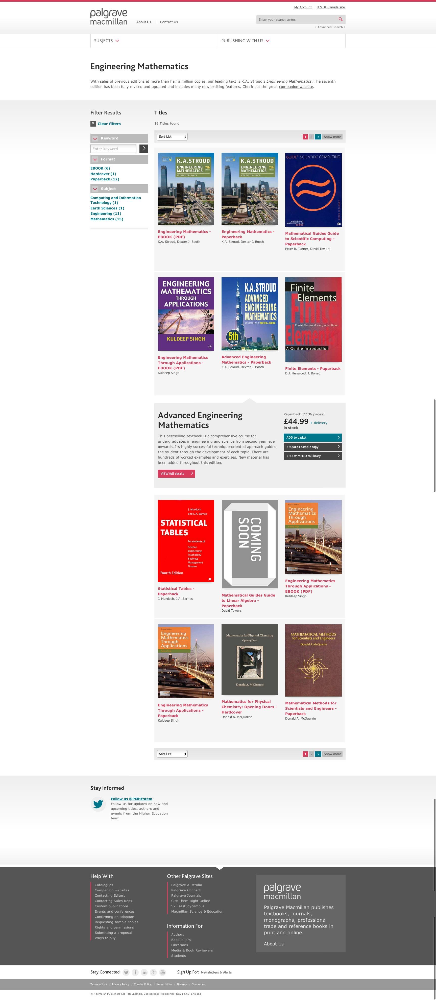

To design, create and build templates for a prestigious academic publisher with an diverse catalogue, complex dual product focus and large sets of specific information for different users. 

===

### The Challenge

The goal was to brand the site with a modern, understated look providing simplicity for users whatever the device they access from.  

### Design Work
* IA workshop
* Design/Wireframing workshop
* Wireframes and prototype
* Design and usability testing with remote users
* Moodboard exercise
* Visual design and aesthetics
* Page template design

### Final Product
#### Home Page Responsive Tiles

#### Specialist Audience Landing

#### Publication Category Macro

#### Publication Sub-category

#### Publication Detail 

#### Publication Listing
