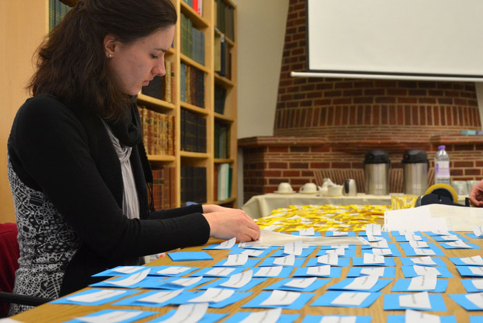
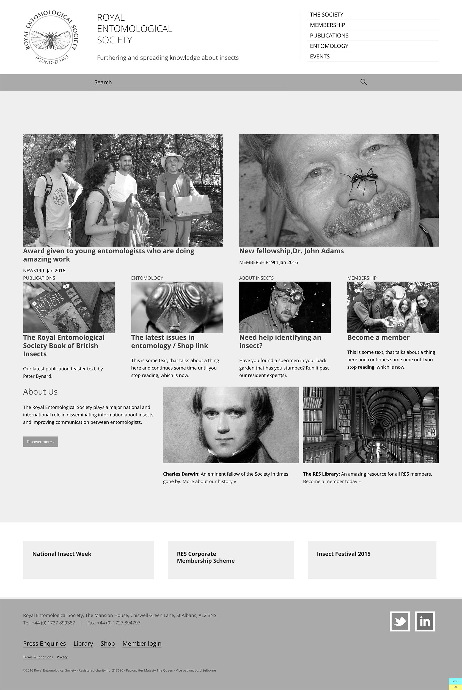
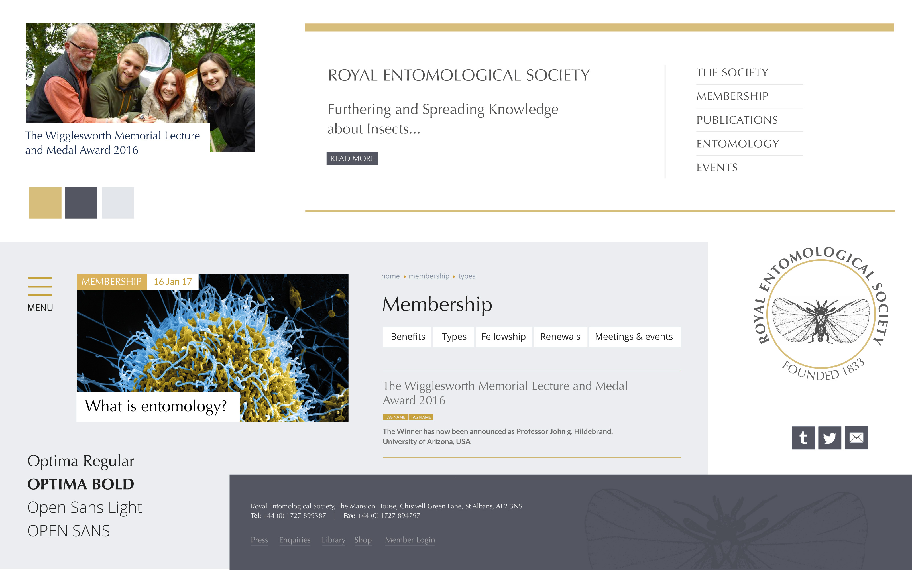
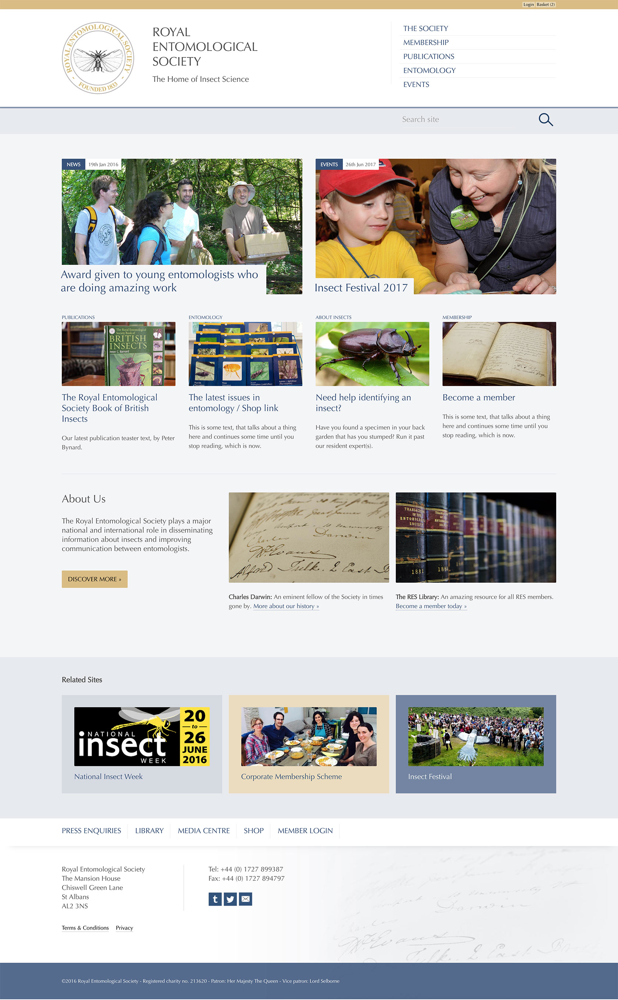
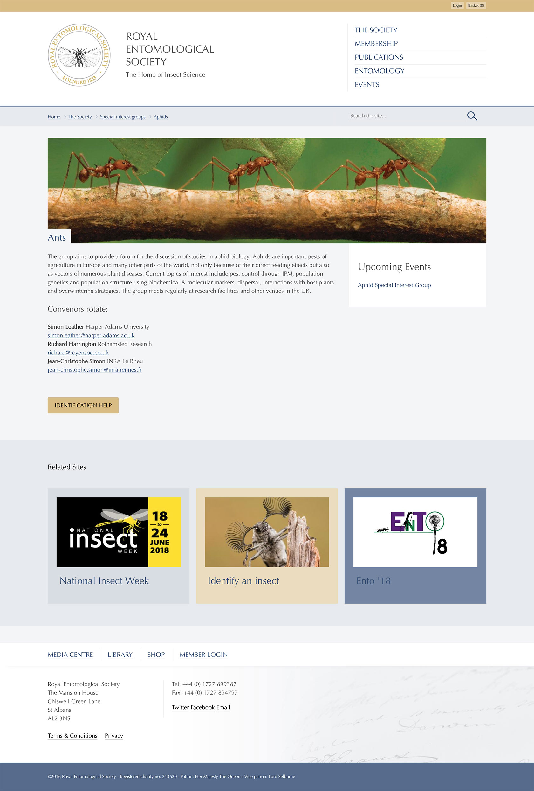
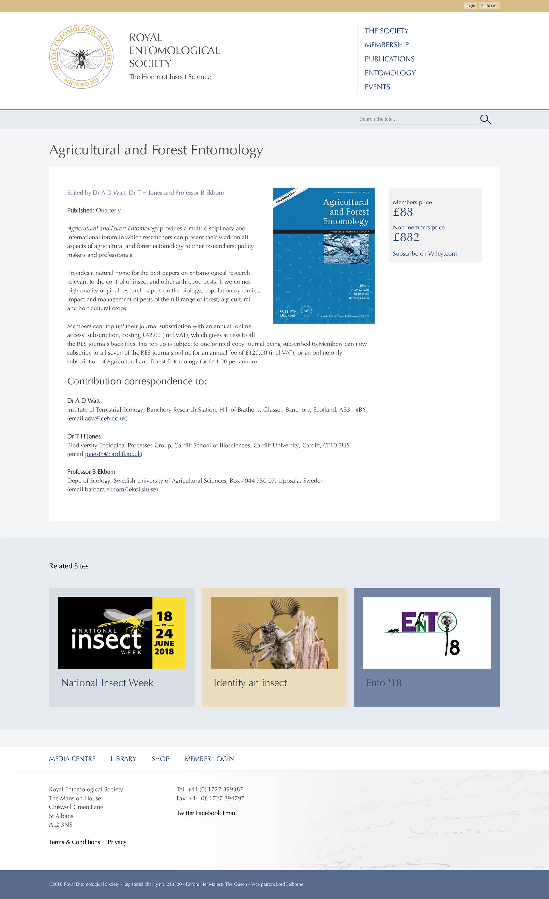
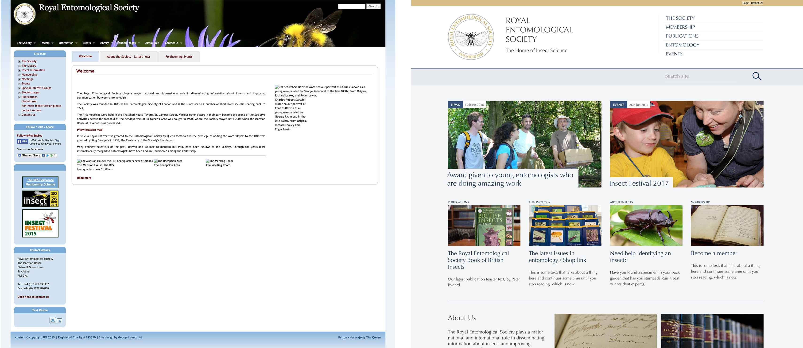

<blockquote>An established Royal Society brand re-imagined as a modern, simplified web presence embracing new ideas, standards and technologies.</blockquote>

<a href="http://www.royensoc.co.uk" target="_blank">The RES</a> is devoted to the promotion and development of entomological science, and the most eminent society related to insects in the UK, if not the world.

===

### The Challenge

The existing site was built on a custom platform by an enthusiastic entomologist member of the society.  It had become highly confused, and no task seemed intuitive or straightforward to accomplish.  The Society didn't really have much in the way of official branding to work with, and their eclectic printed material is present with wide variation and potential lack of cohesion.

 With no budget to redevelop the brand, one of the challenges was to work with the very traditional logo and try to bring it up-to-date, with some very conservative Society members guarding it closely.  The general look and feel needed to be sobre, authoritative, yet not stuffy in any way.

  A further challenge was to try to art direct the photographic assets, as many images were in different styles.  This was kick started with a photography day covering the head office, library, publications and e-commerce products.

### Design Work

* Workshop to establish IA, design direction.
* Wireframe prototype
* Moodboards
* Static design mockup
* HTML Design prototype

{.img-screenshot}
#### - Workshop exercises -

#### - Wireframe prototype -

{.img-screenshot}
#### - Mood board Direction -

{.img-screenshot}
#### - Home page -

{.img-screenshot}
#### - Content page -

{.img-screenshot}
#### - Publication shop -

{.img-screenshot .no-effect}
#### - The old and the new -

