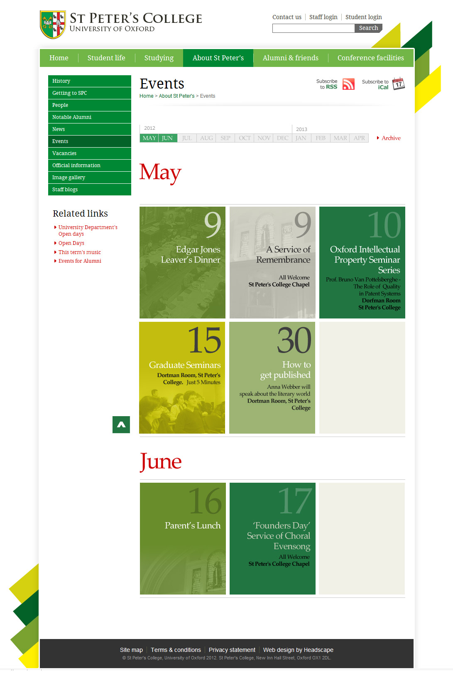

I was given the task of making an events section more interesting and visual, despite only a few upcoming events on the horizon.  

### The Challenge

Over the last 10 years I have created many events list style pages for various websites.  These are invariably lists, and they look like lists.  Some of the more interesting lists may have had the benefit of having an image to represent the event, but many were simply a title, date, location and description.

### The Design

For St Peter's College I created a simple block system that mimics the concept of the month view calendar, but without all of the white space that would be present if simply trying to emulate a traditional calendar view.  This handled multiple events per date simply by repetition of the block, and if images were not available a series of stock images or simple tasteful contrasting colour blanks were created to compliment the site palette.

