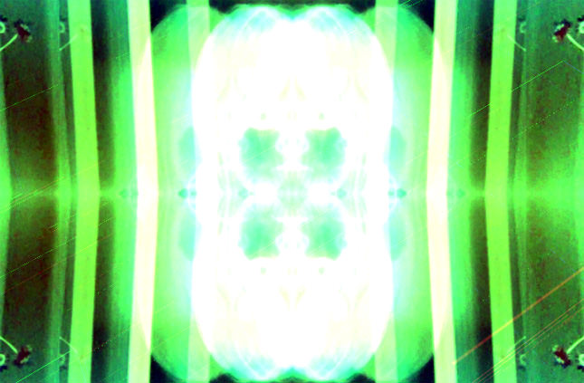

[embed title="Leigh Howells - Delusions" ogg="http://www.leighhowells.com/audio/delusions.mp3"]http://www.leighhowells.com/audio/delusions.mp3[/embed]

Somehow I am still managing to find time to create a 'tune of the week' and having a great deal of fun pushing myself to be creative in a limited time-frame. It's amazing how much time you can find between the work/life balance and staying up far too late.

This week started off as some summer jazz, but somehow mutated into some completely non-jazz  trance; with resonant synth, subtle piano and pounding bass lines.  I also explored some video ideas (see still below) which I'll add here later.

