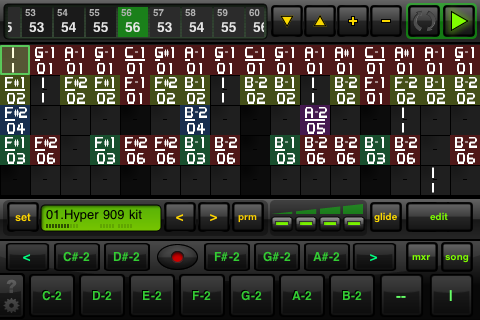

To kill a few hours on a night fight from JFK to Heathrow - I had a go at getting something approaching tuneful and not too cheesy from the iPhone music app iSequence. Straight from the iPhone via the apps WAV export, and converted to MP3.

===

Beep Street's app is made in the style of a step time sequencer, with horizontal tracks and blocks triggering sounds in the same way tracker apps work.  This approach is fast and works well on the iPhone touch screen, and iSequence is a fun and pretty powerful music sequencer (for a phone) as a result.  Other sequencer apps such as Xewton's 'Music Studio' though in many ways more powerful are ultimately so difficult to use in the confines of the iPhone screen that they simply stop being fun and become a bit of a slog. Well, this was the result, just before I fell asleep for a short couple of hours.
