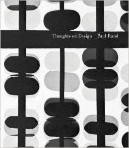

Paul Rand is a graphic design legend.  This book, however, is a bit rubbish.

===

No, of course one should not blaspheme against such Gods, but this book is a little bit lightweight. It's about a 20 minute read in total and is full of greyscale images of full colour graphics (as it was first written in 1947) with almost no explanation of what the design thinking was or what problems were solved.

What this book actually did was make me realise that not all of Paul Rand's work was that amazing.  Nice logos though.

[5/10]