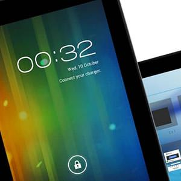

Got a cheapo Sumvision Voyager Android tablet yesterday. So far, it’s pretty great for the price. Just short of eighty quid (from Ebuyer.com) buys a 7″, 16Gb Flash + 1Gb RAM dual core tablet with quad core graphics.

===

I have an iPad 1, and wanted a cheap tablet just for testing Android browsers. Having used this for a couple of days this seems way faster than my original iPad – which has been slowly crippled with iOS updates, even though it’s not in the same league in terms of quality.

The screen is very responsive, bright with good colours, and looks great with video/photographic content. It’s not the sharpest for reading text, but that’s only to be expected with the relatively low resolution. Bumping up text sizes and all is fine. One slightly strange thing is the anti-reflective coating, which somehow gives a strange 3D effect in portrait orientation. There is also a slight issue I think with the aspect ratio of the screen – as in portrait the lower Android icons can end up overlapping with the time/notification area in the lower right.

Battery life isn’t amazing, but it’s adequate for a few hours depending on what you are doing. I guess it has a much cheaper battery pack than premium products. It doesn’t charge from USB either, which is a bit of a pain – but at least a mains adaptor is included.

The speaker is very poor. It’s also on the back, so if a case can be ever found for this then it’s only going to get worse. Although it’s fine for system sounds and notifications, trying to hear podcasts/video is very difficult (great for kids though if you don’t want to be disturbed – this could actually be a feature!). There’s also no bluetooth.

It does have a mic, but again it’s at the rear which is a bit of a stupid place for a mic. My iPhone headset mic doesn’t work either which is a shame, but I haven’t really tested the mic. It has worked using Google Voice, but you have to SPEAK UP. Headphones are provided, which don’t have a mic either so I guess there is no mic connector in the audio socket.

The processor/graphics are all very fast and so far everything flies along happily with no lag. I’ve never used Android before, and although it has some clear design issues, it’s far better than I imagined. Many of my favourite iOS apps are here – Flipbook / Evernote / iPlayer / Netflix / Zite / Spotify / Youtube and all work really well on the Voyager. I put a new launcher on the device as the default didn’t seem great, but that may have been my lack of understanding on how to modify it.
It’s not exactly feather weight, but it’s easy to hold in 1 hand for reading comfortably. Although there’s no metal in the construction, it feels solids and doesn’t creak or bend. The back is a very shiny black plastic which gets very greasy (maybe that’s just me?) Would love to know if anyone has found a perfect case for the size, being less mainstream it’s unlikely many third party products will appear any time soon.

All in all, a bit of a bargain for anyone wanting a fast, cheap Android tablet. Perfect for kids especially – but it would ideally need a bumper/case.

<a href="http://www.amazon.co.uk/gp/product/B00A4D33K2/ref=as_li_ss_tl?ie=UTF8&camp=1634&creative=19450&creativeASIN=B00A4D33K2&linkCode=as2&tag=leighhowcom-21">BUY IT</a>
