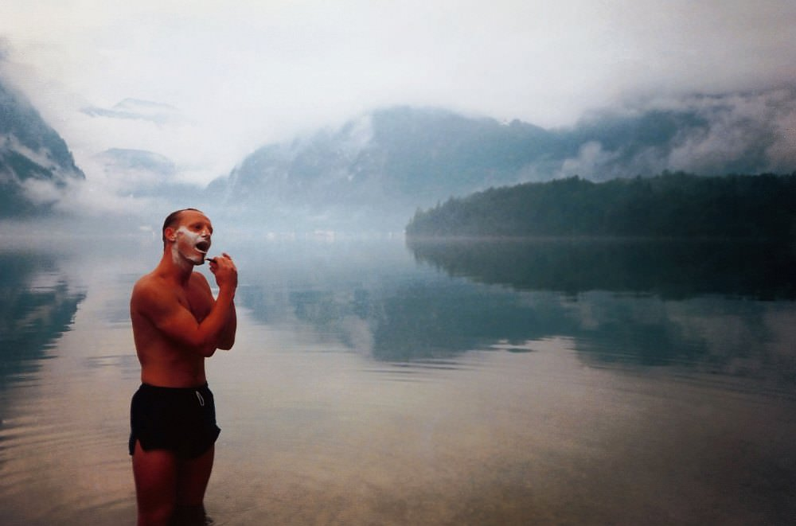

I found this photo a while ago behind another more recent photo in an old frame.  It was a poorly cared for 6X4,  faded and damaged with the negative long since lost. After spending ages cleaning is up as a digital image I now at least have some way of keeping it safe.

===

{.img-screenshot}

The photo of my friend Patrick, or 'Reg' as we call him was taken during a 3000 mile drive around Europe when I was 21.    We had been travelling all day into Austria from southern Germany and were forced to pitch our tents in a small public park next to a beautiful lake near a town called Obertraüm.  The weather in the evening as we set up camp was perfect, still and clear.   We hired a pedalo and went right out into the lake, which was so quiet and reflective.

I seem to remember meeting two pretty teenage girls who lived nearby.  We sat by a campfire and bored them with tales of our trip so far, most of which I'm sure they didn't understand.  My mind boggles now as they invited us four older men back to their house with their parents away.  We might not have been the decent young chaps we were, we could have been anyone with anything on our minds.  Some young girls can be very naive and irresponsible.

We spent the rest of the night back in our tents, and in the early hours the most enormous storm struck the valley.  Our tents were flooded and half blown away, we had to physically use our weight to hold them down.  One of the two tents was flatted so we spent the rest of the night all together in the remaining damp and cramped excuse for shelter.

The photo depicts the following morning when the storm had abated and left Obertraüm silent and still once more. We cleared and dried the tents and shaved in the lake preparing ourselves for the onward journey.
