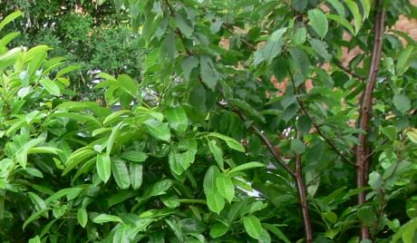

And so I return to the grey skies of England,  unhappy to have returned in some respects but relieved in others.   The usual familiar feelings of traveling abroad and returning home once more.

===

England may be as miserable as fuck sometimes, but it's certainly a luscious, green and 'pleasant' land.  After 11 days on a barren rock, with lots of very unnatural looking palm trees plonked here and there, with black ash taking the place of green grass in gardens,  it's like returning to the rain forest.

Suddenly my home also feels 10 times larger than it did 2 weeks ago.  We have been staying in a 3 room apartment which was  comfortable, but very, very small. I got used to the confined space it seems, so now it is quite luxurious to walk from room to room and use a staircase.   If anything can make you appreciate the things you have in life, it is to be deprived of them for a while.

Of course, I haven't learnt to fully appreciate darkness and rain.  But there is something about the temperature reaching 42 degrees centigrade in the shade and remaining 35 at night to make one appreciate what it means to be cool and hydrated.   It seems wherever I go there are freak weather conditions of some sort.  This time the Canary Islands had a heat wave.  Old men pondered whether they had ever know such hot winds in their 70 years on the island.   Forest regions on Gran Canaria burst into flames.   People died onf heat exhaustion.

I am also half deaf today.  I think I need to have my ears checked by a doctor as shortly after take-off last night I thought my right ear was going to explode.  A shooting pain pushed hard into my inner ear for about 15 seconds, but fortunately eased.   Both ears failed to 'pop' like they usually do and left me in a state of muted solitude.  It's got slightly better today, but not by much.   I think diving into the pool and diving repeatedly to the seabed may have forced water or something nasty  right down inside my ear.

Apart from my ears, I don't think I've enjoyed a holiday so much in over 10 years.   I certainly haven't relaxed as much for a long while.   I have reconsidered a few things in my life and think I have more idea of where I'm heading.  I've lost my way a bit since having kids, and more recently I've been wasting too much time on little escapes which sap my time energy and emotion.   It's time to refocus, take control once more and reshape my future.

Now I think about it.  The thing I miss the most though about being in Lanzarote is having to think about what to wear.   I took a case full of stuff, and spent 90% of my time in my swimming trunks and nothing else.  I wouldn't dream of going out in public in swim wear here, however hot it may become.
