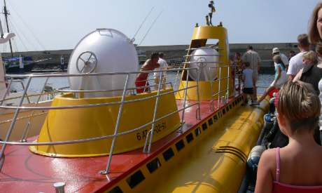

I can now say that I’ve been down in a submarine. Ok, so it was a small, tourist submarine, with no nuclear reactor and not a single torpedo. But it was still pretty cool.

The ‘dive’ went from Puerto del Carmen about 40 minutes north east from Playa Blanca which lies at the most southerly part of ths volcanic island. When we reached the harbour what surprised us the most was the incredible temperature difference. It was astonishing, we received the full ‘oven door’ effect stepping off the coach. The wind wasn’t cool like it is further south, but felt as though it was coming straight off the Sahara, measuring 41C by my thermometer.

In true exploitative tourist style the coach dropped us off with about 45 minutes waiting time at the Submarine Safari bar and shop. Of course there was little else to see and do there. True to form my kids found two useless pieces of crap to buy and we were forced to buy their refreshments. C’est la vie.

The submarine, ‘Funsub Tres’ is 18m long, 4m wide, 130tonnes, holds about 30 people and cost 2 million Euros. It also has a funky bright yellow and orange paint job. I would have imagined this was the perfect colour scheme to ward off the stupidest fish, but I guess after almost 17,000 dives they all got used to it, and know it also means food is coming.

Climbing down the ladders through the hatches was great fun and the inside was equipped for everyone to have a window seat. It was wide enough and light enough to not be claustrophobic, but still felt like a proper submarine.

As we left the harbour a small screen beneath each window showed the view from the sub’s conning tower so we could see where we were and when we were diving down. The dive was in three levels, 10m, 20m and 40m beneath the surface. There were thousands of fish in huge shoals together with a couple of shipwrecks where all the fish gathered and hid for safety from predators such as the barracuda.

The highlight of the dive was a giant sting ray which flanked the sides of the sub, helped by a scuba diver from the accompanying rescue boat above. More rays and sea bream, parrot fish and grey mullet were fed by the diver along side the sub which encouraged further fish to the windows.

From what I could see most people were spending more time fiddling with their cameras than actually looking out of the windows at the underwater world. I was guilty too, although most of my photographic efforts were doomed to failure with fidgeting children and hands all over the windows.

The end of such things is always a disappointment, I would have liked it to last five times longer and go much, much deeper. The mid Atlantic trench would have been fine by me, although maybe several thousand miles too far. I guess at such depths and pressure this little sub would also have crumpled like a paper cup, which may have spoilt the trip slightly.
