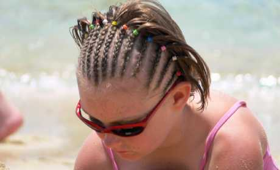

In the first couple of days in and around the beach we noticed a large number of young girls with different styles of hair braiding.  They looked great and at first I assumed they had very talented mothers and maybe it was a style preferred by locals. Then it became obvious that the four African women at the top of the beach were providing the service and must have been doing a great bit of business between them.

===

Seeing it as both pretty and practical I promised my daughter that next time we came down to the beach she could have hers done.

So yesterday morning as we strolled past the five star Princess hotel on the way to Playa Dorada we stopped at the lady holding the faded board depicting different styles. She seemed to be acting as linguist, dealer, marketing department and cash register.

Eleah chose a style and only at the point of almost no return, did I actually ask how much it was going to cost.

"Only twenty five Euros special offer, normally thirty" she said with a beautiful big smile.  I looked with despair at Elisa who seemed even more shocked than me that a few hair braids could cost as much as the senior stylist at the hair salon back home charges to cut both our kids hair.  I didn't enquire why it was a special offer today and why it was normally even more ludicrously expensive.  I had been expecting is to cost about 5 Euros at most, so I was genuinly stunned.

Without thinking I blurted out something about selling my kidneys, then for some reason - probably the growing disappointment in my daughter's eyes I offered the woman 20 Euros.  Although usually I don't agree with bartering, in hindsight this was a pathetic opening offer. Normally you should offer considerably less and work upwards, in this case I should have offered 10.

The dealer looked slightly amused that I was trying to barter and flatly refused to play the game.  I suddenly felt like I was trying to strike a deal at the fish counter at Waitrose and momentarily worried that I had offended her.

Elisa then had genuine reservations that perhaps Eleah should come back after her hair had been washed.  At which point, seeing she was about to lose us (I think she detected a look of relief in my eyes) the dealer lady said 20 Euros would be "no problemo".

Damn.  I really should have offered 10.
