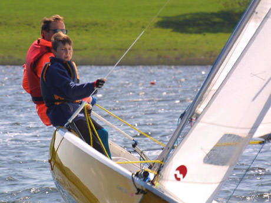

Yesterday we went sailing at Ferry Meadows in Peterborough.There had been promise of the hottest summer weekend of the year, but as we arrived at the water sports lake it looked grey, cold and windy.It eventually got better by about 2pm.

===

My wife, the kids and Grandma went out on the kayaks, whilst me and my father in-law hired the Comet Trio for a couple of hours.   It was a bit gusty, force 3 and I was certain we would have a little swim at least once, but things went well.   We forgot the camera once again, but we spent most of our time hanging over the side of the boat as in the Trio picture above (which isn't us), flying along with lots of spray with the wind in our hair (well ok, we had hats on but it sounds dramatic) and the sun in our eyes... through dark shades of course.

We had a lot of fun,  I almost flattened a windsurfer, and almost ran aground at one point.   We almost capsized at least twice with the unpredictable wind direction changes, but just managed to throw our combined weights in the right direction just at the right time.  I was so thirsty by the end that I forgot about everything else and bought and drank 2 bottles of Hydro Lucozade and drank them one after another... and was still thirsty.
