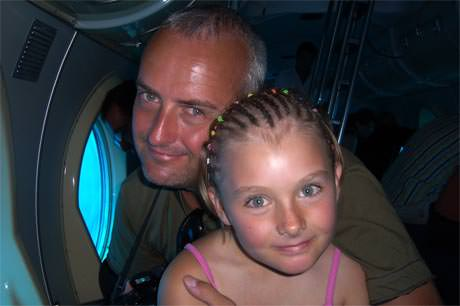

Being a father to a daughter is perhaps one the greatest journeys of discovery a man can undertake in his lifetime.

===

Since the first minutes of my daughter's life I have felt the fear, the joy, the amazement of being responsible for a precious new life.  Yet a daughter in particular is so much more complex for a father than a son.  Being a father to a girl challenges a man on several different levels.

I feel a bond so strong with my daughter as she is so much like me in many respects.  Yet alien of course as she is female. To watch a female version of yourself growing and developing into a fully functional human being is mind-blowing. To see a young girl starting to blossom is incredible, it changes a mans' view of the world.

For a start to find myself looking at what are probably 20-somethings in their skimpy bikinis round the pool now almost seems like an act of perversity as in only 13 years time, this will be my daughter in her prime.  I have to look away more and more as these are other father's little girls, grown big.  How would I handle men staring at my daughter?  Would I just accept it and feel pride that she was attractive.  Maybe I would just ignore it, or maybe I will just stop noticing such things when I get to such a stage/age.

More frightening still, is the fear of acknowledging anything even remotely sexual in your own flesh and blood.  I am sure it is similar to not finding your sister attractive as a teenager, but again this is unknown territory for a man.  It seems unthinkable to even write such a thing, but this is something I have pondered for years seeing other men with beautiful daughters.  I'm sure it will make perfect sense to me in a few years time.

At the moment my son is a mummy's boy and my daughter a bit of a daddy's girl, yet she is fiercely independent like me, private and creative. Of course as she gets older things will change, and she will get closer to her Mum through her teenage years and I guess me and my son will enjoy more together.  I'm hoping we will find the closest friendships possible with our children, not just falling into the roles of disciplinarians, cash machines and mentors.

It's a long voyage and I guess we don't get off until we say our final goodbyes. All being well with the natural order of things when that day comes we should all be ready for it, have everything packed and hearts and minds full of wonderful and loving memories.
