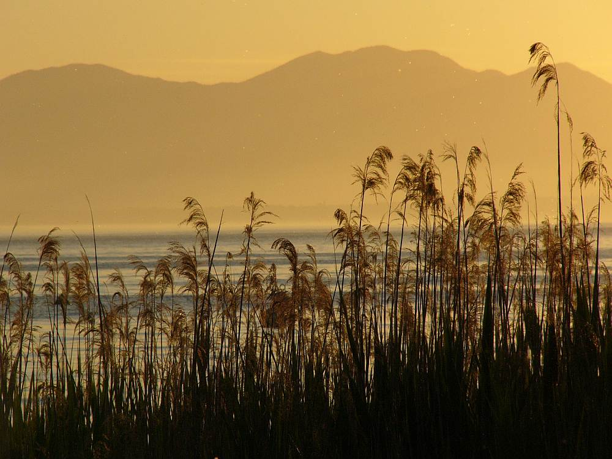
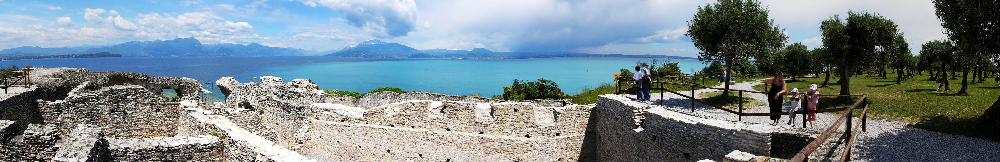

Last year whilst spending a week at Lazise on Lake Garda, I took a panorama photograph from Sermione point near the southern shore. I wanted to try and capture the amazing blue intensity of the lake and the ruins, the olive groves and distant snow capped mountains.

===

Lake Garda was a truly beautiful place, but the weather was a confused mixture not knowing whether it was going to be alpine or mediterranean next.

{.img-screenshot}

I had forgotten about the panorama image, as it's too large to do much with.  A bit too large for a frame (and it's strange dimensions) and it doesn't display well on screen without scrolling the image or being shown as a little narrow strip.
