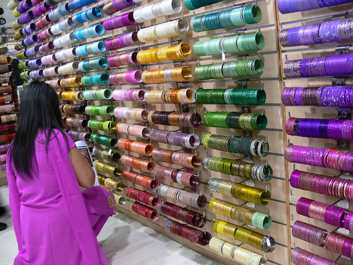
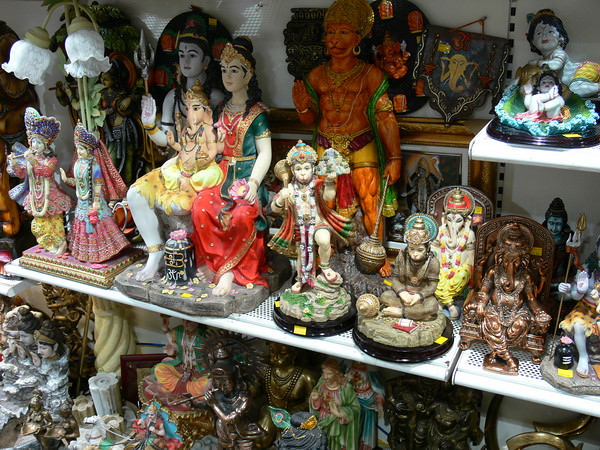
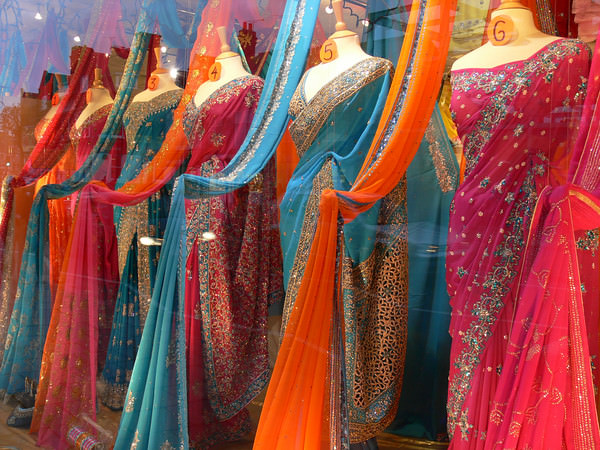
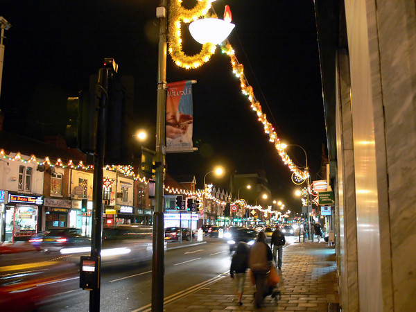

Today I went to the city of Leicester, about a 100 minute drive away, to see the Diwali lights and to taste a bit of Hindu life and its shopping experience. Diwali is the equivalent of Christmas to Hindus and is also know as the Festival of Light.

Belgrave Road in the North East of the city is the main Hindu and Seikh area and the shops here offer endless curiosities. Carolinet the rainee teacher along - who had been to Leicester recently and knew where all the most interesting shops were hidden.

Belgrave Road is about 1km long and all the shops on either side of the road are completely Asian owned. There are lots of clothes shops, mainly for women, wedding shops, Asian jewellery shops, specialist sweet shops, restaurants, music shops and lots of shops selling specialist religious Hindu sculptures, shrines and images.

Here you could buy any number of styles of Gods and Goddesses; Rama and Sita, Ganesh, Hanuman, Lakshmi, Shiva, Saraswathi, Siva, Murugu and Brahma. A lot of these are extremely colourful, I preferred the darker bronze sculptures and almost considered buying one. We went for a vegetarian Hindu buffet in a very nice restaurant once we finally reached the end of the road. The food was really fresh and tasty and not the same as regular Indian food you would find in other Indian restaurants up and down Britain.

By the time we finished our meal it was dark and all of the Diwali lights had been switched on. These were turned on earlier in the week as the actual Diwali day was the day before our visit. Normally there is a huge carnival, fireworks and street traders, but we couldn’t get there on a Friday evening in time to see it. Maybe we will plan this for next year. The lights were really just standard Christmas lights but with Diwali lanterns on the lamp posts.