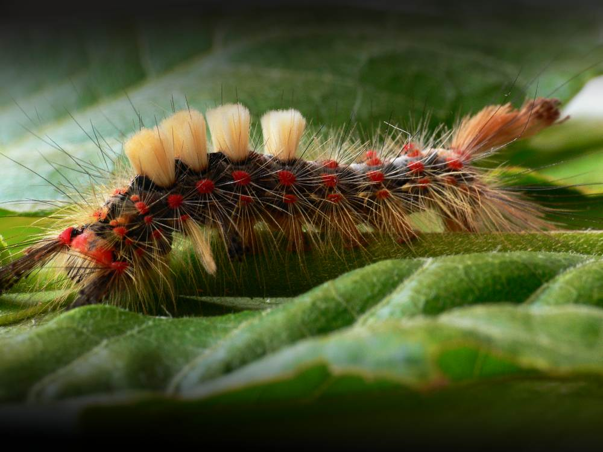
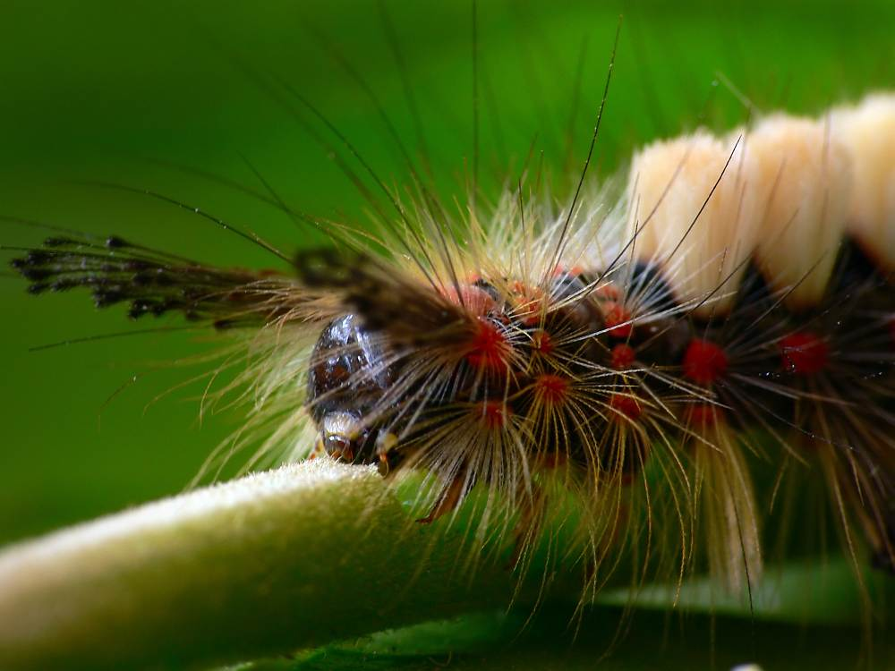
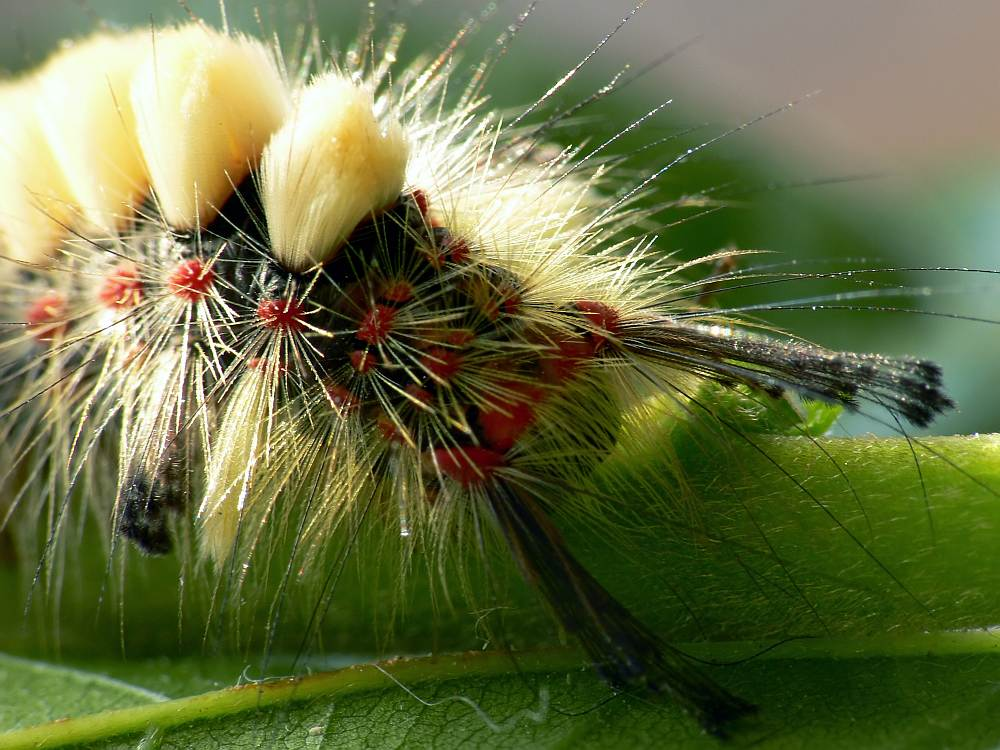

Yesterday I had a visitor to my office. I don’t get many, but when I do they don’t normally come in uninvited through the window.

===

{.img-screenshot}

It was about 3pm when I spotted something moving out of the corner of my eye. A small and brightly coloured caterpillar wiggled across my window sill and started to climb up my blinds. It was about 3cm long and a bit strange. Usually in nature if something is bright red it means ‘back off’ and I’m
glad I didn’t touch it as it can give you a nasty rash. It was a strange looking thing and once I had moved it about a bit and it stopped crawling it was hard to remember which end was which.

{.img-screenshot}

Normally I would have thrown it back out of the window, but it was the perfect opportunity to test out the macro lens I bought for my camera about a year ago. So I positioned it on a few leaves and tried to remember how to use the lens.

I managed to even film it eating at the above magnification which is a bit freaky.

I sat and watched it eat for a while then decided I should keep it safe in a jar with a load of leaves and see what it will turn into. At least this will keep it safe and stop it being eaten. It might even provide something slightly educational for the kids to watch. I will call it Cleo.

Unfortunately Cleo is a bit like so many Italian girls, beautiful and interesting whilst young but destined to be ugly and boring in adulthood. Cleo will turn into a White Tussock moth, which is brown… with brown markings. If she really is female she won’t even be that lucky as the female has no
wings. Very strange for a moth.

{.img-screenshot}

Unlike Italian girls Cleo won’t even be able to create a fantastic spaghetti sauce when she reaches adulthood. It’s a cruel, savage world.