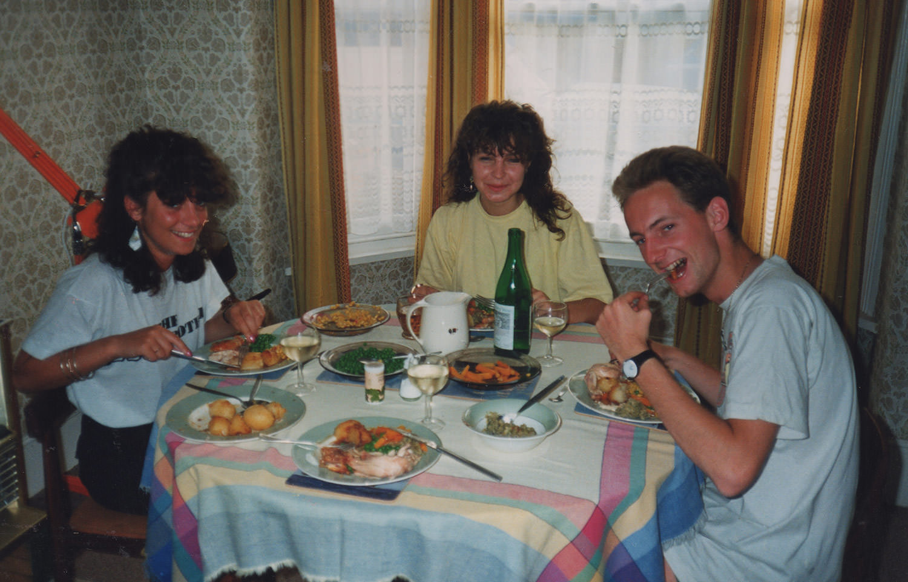

I generally don't like to look back in life.  I find it a self indulgent, unhelpful and slightly melancholy activity to dwell in the past. 

There are some threads, however, that waft around in the breeze of the day to day, and I wonder what happened to a person, thing or place.

My old university housemates in Portsmouth, where I lived from 1989 to 1991 are a case in point.  I lived with Keith, Annabel and Sue for 2 years at 174 Shearer Road, most of the time which was gloriously care free and happy.

===

Keith Derek Bishop, Susan Harris, Annabel Jeanne Langeveld, 1990(ish) at 174 Shearer Rd, Portsmouth

The end of my time at Portsmouth was all a bit of a mess though, there were some falling outs.  I'd like to blame the stress and relief of the final exams, the ensuing anti-climax and the worry about what came next. I'm never at my best when things are in the process of change. I don't know how to say goodbye to people, and to be honest I fear that I will become a blubbery mess of tears, so I have avoided a couple of important situations just because I didn't know how to handle them.

The truth is, I think I may have acted like a bit of a dick. Nothing massively dramatic, or terrible.  I was just thoughtless to those I considered to be my friends.  Then I didn't know how to resolve it.  Then life moved on.

174 Shearer Rd, Portsmouth, 2013.  It hasn't changed a bit.

As a result of my last week living in Portsmouth, I managed to lose touch with all three of them for over a decade.  I eventualy tracked Keith down on Facebook, so I'm pleased I know where he is and what he's doing.  But Sue and Annabel, I haven't a clue where they are or what they have been doing all these years.  I'm amazed they seem to be beyond the seaching powers of Google, but then married surnames change and trails go cold.

Annabel Jeanne Langeveld and her sister Claire Francoise Langeveld, 1990(ish).</caption>

Maybe if you are Annabel,Sue or Claire and you stumble upon this page at some point, you'll say hello.  I'd really love to hear from you.

Me after a day on the beach and Annabel, 1991(ish).  Just look at that wallpaper.</caption>
