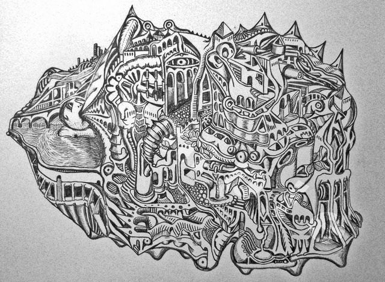

I thought I had a good idea of the creative abilities of my friend Luke.   We used to work together, but now we only really have an online friendship, which works well as we both enjoy the same sort of things.   He is a musician, song writer, designer, techie, keen photographer and all round creative geek like myself.

===

Some times people you think you know well come out and surprise you.   One thing I didn't know about him was how good he is at illustration, and has his own technical illustration style akin to M.C.Escher.

He has sold a few drawings on Ebay and I think it's time I bought one, or commissioned one for myself as I really like what he does.  I've suggested he does limited edition signed prints or something too.
