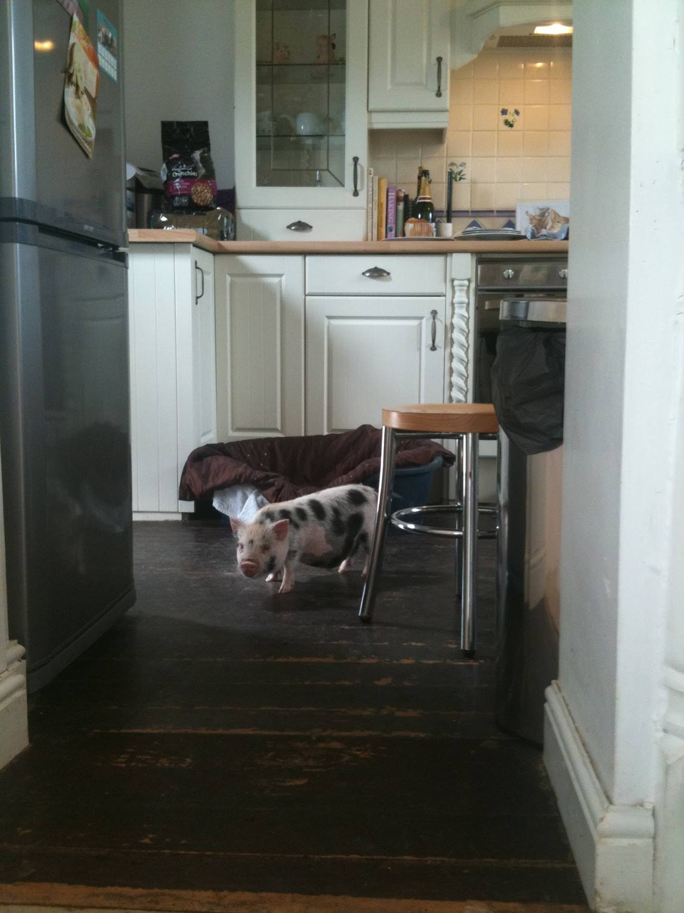
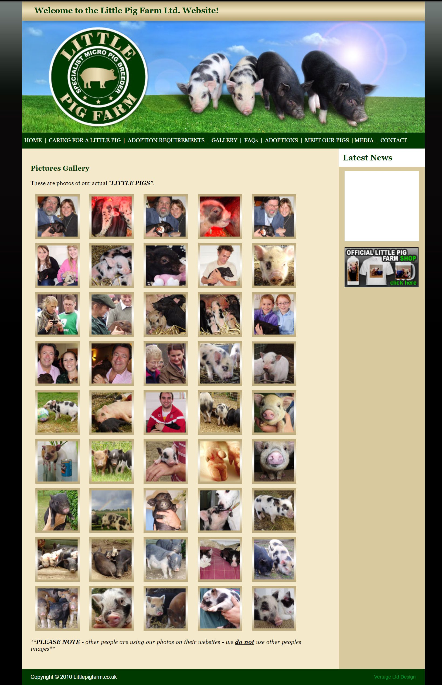
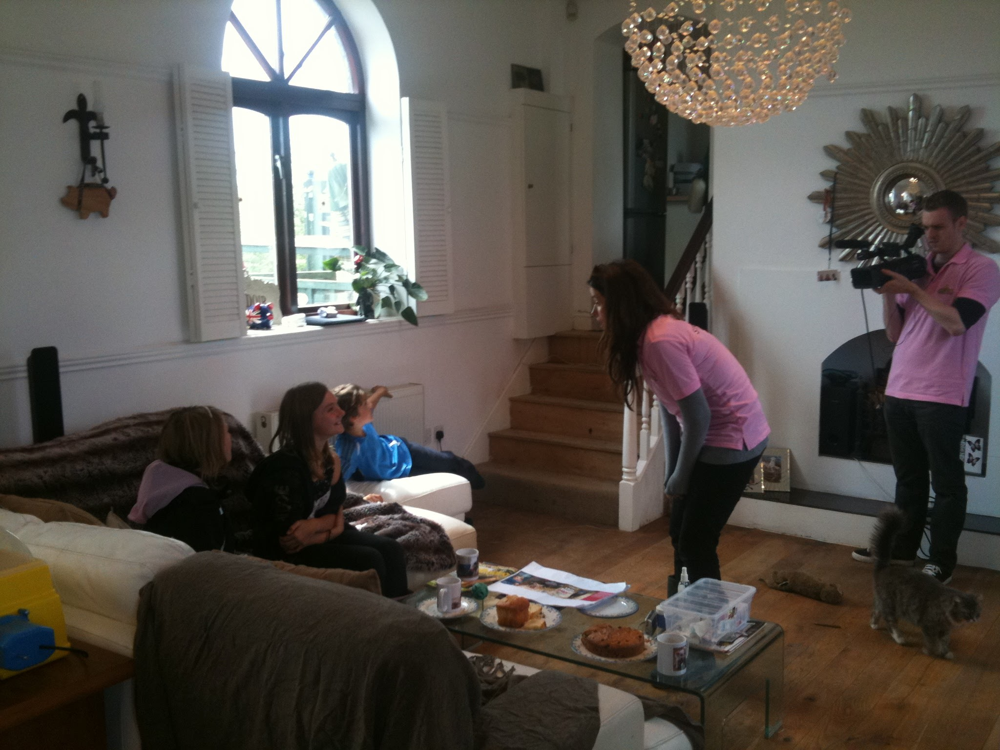
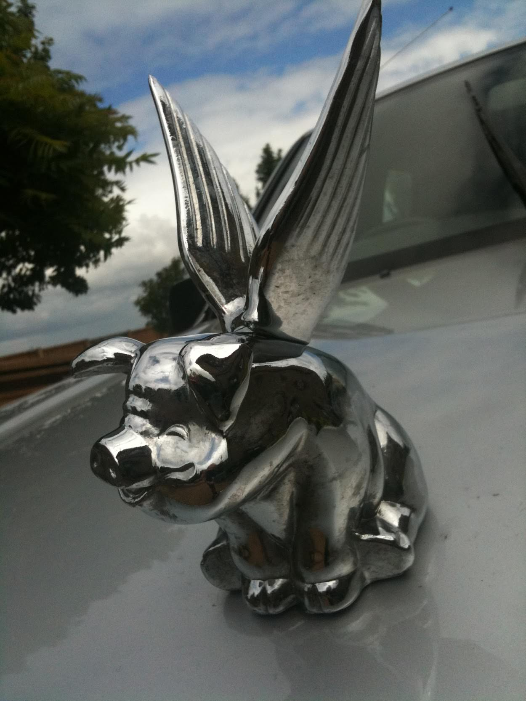
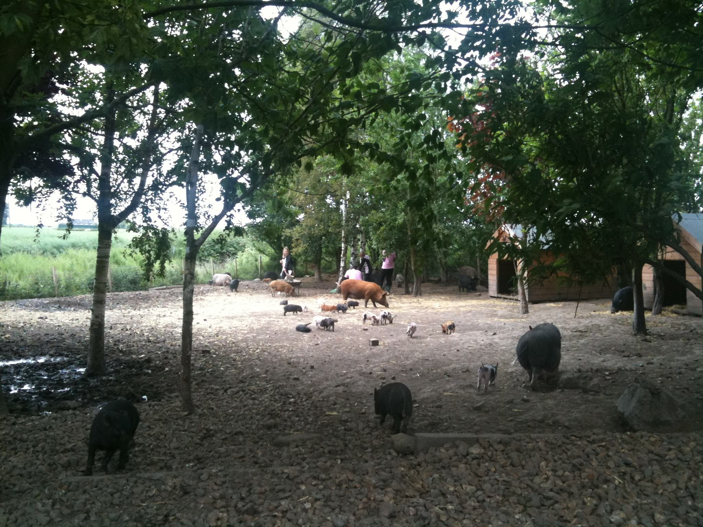

Had a fun time today at Little Pig Farm with Jane Croft, one of the few suppliers/breeders of micopigs in the UK.  She has a thriving and growing business bringing these small pigs from sty into the heart of the home.

===

<iframe width="100%" height="500" src="https://www.youtube.com/embed/jO2APyJ3K74" frameborder="0" allow="autoplay; encrypted-media" allowfullscreen></iframe>

She has 2 pigs living in the house, a fabulous though slightly subsiding converted pumping station in the wilds of the fens.  They sleep in the kitchen in a dog basket, have their own pig flap and have the run of the house as any other domestic animal would have.

#### - The old website before it all fell apart -

#### - Filming in the old Pumping Station -

#### - Yes, this was really on the car -

#### - The pig yard -

