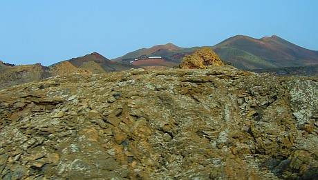

For our final night in Lanzarote we took an excursion into the Timanfaya National Park for a tour and barbecue cooked over a volcano.

===

The only building in Timanfaya, the volcanic restaurant of El Diablo (the devil) lays nestled high on the top a volcano known as known as Islote de Hilario. I think this translates as 'island of Hilario' and is the volcano summit on which an old hermit called Hilario, resident of the area, planted a solitary olive tree.  Legend has it that the tree flourished for many many years but never bore fruit. The restaurant is built with this now dead tree at its centre.

The futuristic building looks like an alien spacecraft has landed on top of a mountain and offers 300° vistas of the surrounding landscape. The main dining area has a wall of glass sweeping around in a circle allowing wide panoramas of Timanfaya. It was designed by local artist and celebrity César Manrique.

It seems that Manrique is responsible for 90% of the public artwork on this island, his influence is absolutely everywhere right from the moment you land at the airport. Our 18yr old travel Rep described him as an 'absolute tit'. I think he was a little harsh and maybe rather unqualified to comment on modern art.  Personally I like what I've seen, it gives this otherwise barren land colour and character.

I am, however, dubious how this guy managed to be such a force in painting, sculpture and architecture on the island as well as being able to design water parks.  He also seemed to be set local planning laws on the island.  My theory is that Manrique was actually head of the local mafia (or Spanish equivalent) and extorted local artists and architects to produce everything for him.

Back to the tour. Timanfaya is the largest volcanic region of the island comprising 36 volcanoes, 300 craters and more lava fields than I've ever seen in my life. That's not so hard as I haven't actually seen a lava field.  Many describe the area as looking like the moon, but any photos I've ever seen of the moon show it as seemingly smooth and dusty. The landscape in the national park seems much more alien than the moon, with mile upon mile of harsh, jagged landscape stretching as far as the eye can see. Allegedly NASA used this area to test drive their lunar rovers. To me this terrain looks like it would be an absolute bitch to walk over, and completely impossible to drive a lunar buggy across, but I'm sure there is some truth in the claim.

The bus ride was as anticipated. Terrifying. The winding single lane road appears to have been designed to be scary, with plenty of hairpin bends with precipices dropping into volcanic craters,

through lava channels and up and down incredibly steep volcano sides.  Even this road was designed by César Manrique's friend.  The guy's influence (and extortion technique I reckon) is never ending.  The tour guide had a unique sense of humour which included screaming as the bus went down hills.  Thanks.

We stopped half way through the coach tour at a view point to take photos.  We were a little slow at returning to the coach and as we rounded the corner we saw the coach driving away without us.  I'm still not sure whether this was all part of the driver's sense of humour, or whether they really would have left us in the most desolate place I have ever been to in my life.

The sit down meal at the restaurant was basic, but excellent including; barbecued chicken, pork, sausage and a local speciality, salted potatoes, all served with sauce and salad vegetables.  We were serenaded by a trio of traditional Spanish musicians whilst we ate and looked out through the glass walls across Timanfaya.

What amazed me most at this restaurant was that lots of people actually had the curtains drawn blocking out the amazing view - because the sun was in their eyes.

Before we ate, the rangers showed us three demonstrations of the amazing heat still beneath the ground at Islote de Hilario.  The first ranger dug some grit from about 30cm beneath the surface and poured it into our hands.  It was bloody hot, about 60°C.  The second ranger put some dry brushwood into a small 1m fissure in the ground, left it for a few seconds and it burst into flames  The final ranger poured a bucket of water into a pipe in the ground, which within 2 seconds shot high into the air like a geyser.  We were then shown the restaurants' enormous barbecue - a tall dome of black volcanic rock built over an enormous shaft which reaches temperatures of 600°C.  I think I lost a few eyebrow hairs trying to look into it.

This all illustrates just how volcanically active the area still is and what a stupid bloody place it is to build a restaurant.
