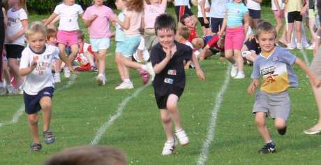

Last night it was sport's evening at the school my kids attend.  For 1 night only competitive sports were allowed, although there were hushed rumours that we weren't actually allowed to cheer too loudly in case the kids with less vocal parents felt left out.  Very silly.

===

Also silly were some of the races, including the 'dressing up' race and the obstacle race.   My son wanted no part of such forced silliness and whilst the other boys lined up quietly for their respective races, he shouted and cried angrily.  Rage against the machine indeed.  I failed to convince him that he looked far sillier having a tantrum than he would running down the track in an old shirt and a policeman's helmet.

He got his own way on this one of course, you can't actually force a child to enjoy themselves.  Unfortunately.

Eventually  we came to the 100m sprint (looking suspiciously like the 30m sprint to me) and my son happily lined up without complaint.  Nothing demeaning about this race it seemed.  Having saved his energy rather than wasting it in 'silly races'  he shot down the track like a streak of bones and attitude crossing the line first.

Although a pleasing end to the evening it did slightly dampen the "it's the taking part that's important" talk we were going to have.
