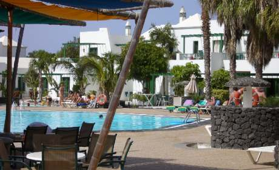

Once again booking online with Thomson has worked out beautifully.  This place is clean, spacious, well-equipped, lushly planted, quiet and not too crowded.  It's perfect for young families, and those with older kids would survive too as there are plenty of activities.  We are a 10 minute walk from Playa Dorada beach which unlike many of the Canary Islands has golden white sand, hence the name of the resort Playa Blanca.

===

I have never really liked booking at travel agents as I have always felt they are trying to sell me the holiday they want to sell me and get rid of rather than the holiday I actually want.

There are other advantages of booking online including reading all the reviews from previous holiday makers at the same resort, from various websites - not just the booking company one of course.  Its simple to find a thousand photos of your intended destination with just Google Images or Flickr, photos taken by regular people rather than pro photographers who can make hell look like heaven.

With such fabulous online mapping applications such as Google Earth you can also find the location of your accommodaton and discover its true position in relation to the coast, city centre etc. This also offers clues to any building work in progress (or maybe a couple of years old with Google Earth), as well as getting a true idea of how big the pool really is and where the main roads are, and whether they run through your bedroom or not.

This has all proved invaluable and insured success with booking the previous few holiday destinations.  I won't do things any other way now.  My in laws, however, seem to hold some kind of snobbery about using a travel agent on the high street as though a holiday bought online is some cut down version of the real thing. They talk as though these are second rate ebay purchases instead of the genuine article and I am foolish for using them.  But they are the foolish ones, not me, proven by the fact they weren't particularly happy with this years holiday accommodation.

One thing I didn't notice on the map though was our apartments link to the next door sister hotel.  I went for a wander last night and discovered four more swimming pools with beautiful, lush palm trees and cacti, a bowling alley, tennis courts, volley ball courts, mini golf, a kids play area and more restaurants.  None of this is mentioned anywhere in details, apart from a single line saying we may use the neighbouring hotel's facilities.

So I am a big fan of researching travel destinations online.  Of course there is a mass of information to wade through usually, but it is quite simple to filter out the nonsensical, invented or moronic comments from the useful key information.

I have just decided -and let this be a pledge to myself - that I will write some useful reviews when I get back.  I've never bothered before, but I think I should write more to be helpful for others like myself in the future.
