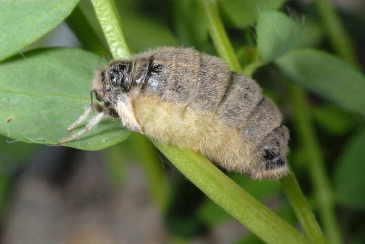

About a week ago, my beautiful caterpillar made itself a cocoon at the top of the jar I was keeping it in. At first I thought it had died and gone mouldy as the fine white hair around it resembled the fine filaments of some types of white mould. However, on close inspection it became obvious that the coloured hairs from the caterpillar had been shed into this fine white tapestry and metamorphosis was about to commence.

===

Well... today my caterpillar completed it's transfiguration. Oh dear.

I had read that this wasn't going to be the most exciting bio-genesis in the animal kingdom, but the realisation that this was the wingless female of this moth was more horrible in the flesh than I had imagined.  It looked like a fat, hairy grub.   It seemed hardly worth transforming for.  I mean, why bother with the mysterious and incredible process of metamorphosis if you are to transform from a slightly interesting flightless creature into a really very, very dull and ugly flightless creature. I hope it doesn't stumble across any mirrors in it's short final stage of life, but I guess it will just lay eggs and perish without worrying about it looks.

I take back any previous comments about Italian girls.  Even they don't transform into quite this much of a disappointment, and at least they can cook a great lasagne.
