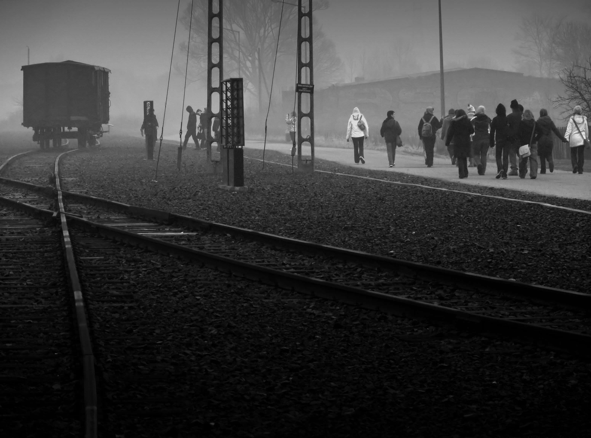

A thought provoking visit, on a foggy morning, to one of the most notorious places on Earth.

===

**Auschwitz II-Birkenau**

{.img-full}

{.img-full}

{.img-half-right}{.img-half-left}

**Auschwitz I**

{.img-full}

