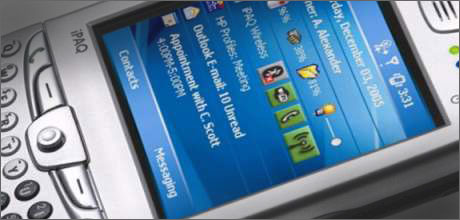

I hate the word 'blog'.  It makes me feel like a nerd.  I know I'm not a nerd because I have hobbies and interests that involve going outside now and then.

===

Six months later these have inevitably been lost, deleted or destroyed one way or another.

Anyway, I much prefer traditional words like 'diary' and 'journal' and 'log' these have historic resonance making the commitment of thoughts to medium seem almost worthwhile and noble.

Usually when I'm away on a trip abroad, I write a little diary now and then about a memorable day or event.

Six months later these have inevitably been lost, deleted or destroyed one way or another.   So I thought for my upcoming trip I would write random nonsense whilst sitting in the sun.

Using a piece of software called MobiBlogr running on my Ipaq I should be able to upload a few photos and accompanying text - if I can get a connection.

It will at least make some use of an expensive piece of gadgetry that I hardly ever use and make me feel justified at having paid so much for it.

